# Meta-Analysis: A Structural Equation Modeling Approach
Mike Cheung  
8 Apr 2016  


* This page collects the R code and Mplus input files used in Cheung (2015):
* Cheung, M. W.-L. (2015). *Meta-analysis: A structural equation modeling approach*. Chichester, West Sussex: [John Wiley & Sons, Ltd](http://www.wiley.com/WileyCDA/WileyTitle/productCd-1119993431.html).
* If you have any questions or comments, feel free to contact [me](http://courses.nus.edu.sg/course/psycwlm/Internet/).

# An erratum

## Equation 7.14
* $\hat{\Lambda}_{2,2}$ is 0, not 1, i.e., 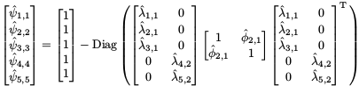 (thanks Tom Palmer).

# Chapter 3: Computing Effect Sizes for Meta-Analysis

## Repeated measures


```r
###################################################
### code chunk number 2: RM1
###################################################
## Library for the SEM
library("lavaan")

## Sample covariance matrix on pre- and post-test scores
lower <- '10
          8 12'
( Cov <- getCov(lower, diag=TRUE, names=c("x_pre","x_post")) )
```

```
##        x_pre x_post
## x_pre     10      8
## x_post     8     12
```

```r
## Sample means for the pre- and post-test scores
Mean <- c(10, 13)

## Sample size
N <- 50

model1 <- '# Label the sds with sd_pre and sd_post
           eta_pre =~ sd_pre*x_pre
           eta_post =~ sd_post*x_post
           # r: correlation betwen pre- and post-test
           eta_pre ~~ r*eta_post
           # Fix the error variances at 0
           x_pre ~~ 0*x_pre
           x_post ~~ 0*x_post
           # Label the means with m_pre and m_post 
           x_pre ~ m_pre*1
           x_post ~ m_post*1
           # Calculate the effect sizes
           # Diff: change score
           Diff := m_post - m_pre
           # SMD.cs sd on change score as the standardizer
           SMD.cs := (m_post - m_pre)/sqrt(sd_pre^2+sd_post^2
                      -2*sd_pre*sd_post*r)
           # SMD.pre: sd_pre as the standardizer
           SMD.pre := (m_post - m_pre)/sd_pre'

## Fit the model
fit1 <- cfa(model1, sample.cov=Cov, sample.mean=Mean, 
            sample.nobs=N, std.lv=TRUE, 
            sample.cov.rescale=FALSE)

## Display the summary
## summary(fit1)

## Display the selected output
parameterEstimates(fit1)[c(12,13,14), -c(1,2,3)]
```

```
##      label   est    se     z pvalue ci.lower ci.upper
## 12    Diff 3.000 0.346 8.660      0    2.321    3.679
## 13  SMD.cs 1.225 0.187 6.547      0    0.858    1.591
## 14 SMD.pre 0.949 0.145 6.547      0    0.665    1.233
```

```r
###################################################
### code chunk number 4: RM3
###################################################
model2 <- '# Label the common sd
           eta_pre =~ sd*x_pre
           eta_post =~ sd*x_post
           # r: correlation betwen pre- and post-test
           eta_pre ~~ r*eta_post
           # Fix the error variances at 0
           x_pre ~~ 0*x_pre
           x_post ~~ 0*x_post
           # Label the means with m_pre and m_post 
           x_pre ~ m_pre*1
           x_post ~ m_post*1
           # Calculate the effect sizes
           # Common sd
           SMD.common := (m_post-m_pre)/sd'

## Fit the model
fit2 <- cfa(model2, sample.cov=Cov, sample.mean=Mean, 
            sample.nobs=N, std.lv=TRUE, 
            sample.cov.rescale=FALSE)

## Display the selected output
parameterEstimates(fit2)[12, -c(1,2,3)]
```

```
##         label   est    se     z pvalue ci.lower ci.upper
## 12 SMD.common 0.905 0.131 6.904      0    0.648    1.161
```

## Multiple treatment studies

```r
###################################################
### code chunk number 6: MT1
###################################################
## Group 1 (control group): variance 
var1 <- matrix(10, dimnames=list("x","x"))
## Group 2 (treatment 1): variance 
var2 <- matrix(11, dimnames=list("x","x"))
## Group 3 (treatment 2): variance 
var3 <- matrix(12, dimnames=list("x","x"))

## Convert variances into a list
Var <- list(var1, var2, var3)

## Means for the groups
Mean <- list(5, 7, 9)

## Sample sizes for the groups
N <- c(50, 52, 53)

## Assuming homogeneity of variances by using the same label "s2"
model3 <- 'x ~~ c("s2", "s2", "s2")*x
           x ~ c("m1", "m2", "m3")*1
           # SMD for treatment 1
           MT1 := (m2-m1)/sqrt(s2)
           # SMD for treatment 2
           MT2 := (m3-m1)/sqrt(s2)'

fit3 <- sem(model3, sample.cov=Var, sample.mean=Mean, 
            sample.nobs=N, sample.cov.rescale=FALSE)

## Obtain the free parameters in the model
( x <- fit3@Fit@x )
```

```
## [1] 11.01935  5.00000 11.01935  7.00000 11.01935  9.00000
```

```r
## Obtain the sampling covariance matrix of the parameter estimates
( VCOV <- vcov(fit3) )
```

```
##    s2    m1    s2    m2    s2    m3   
## s2 1.567                              
## m1 0.000 0.220                        
## s2 1.567 0.000 1.567                  
## m2 0.000 0.000 0.000 0.212            
## s2 1.567 0.000 1.567 0.000 1.567      
## m3 0.000 0.000 0.000 0.000 0.000 0.208
```

```r
## Compute the multiple effect sizes
( MT <- fit3@Model@def.function(.x.=x) )
```

```
##       MT1       MT2 
## 0.6024929 1.2049857
```

```r
## Compute the jacobian for the 'defined parameters'
JAC <- lavaan:::lavJacobianD(func=fit3@Model@def.function, x=x)

## Compute the sampling covariance matrix using delta method
MT.VCOV <- JAC %*% VCOV %*% t(JAC)
## Add the variable names for ease of reference
dimnames(MT.VCOV) <- list(names(MT), names(MT))
MT.VCOV
```

```
##            MT1        MT2
## MT1 0.04040173 0.02234192
## MT2 0.02234192 0.04355176
```

## Multiple-endpoint studies

```r
###################################################
### code chunk number 7: ME1
###################################################
lower <- '11          
          5, 10'
## Convert a lower triangle data into a covariance matrix
Cov1 <- getCov(lower, diag=TRUE, names=c("x1", "x2"))

lower <- '12          
          6, 11'
## Convert a lower triangle data into a covariance matrix
Cov2 <- getCov(lower, diag=TRUE, names=c("x1", "x2"))

## Convert covariance matrices into a list
Cov <- list(Cov1, Cov2)

## Means for the two groups
Mean <- list(c(10,11), c(12,13))

## Sample sizes for the groups
N <- c(50, 50)

## Assuming homogeneity of covariance matrices by
## using the same labels: "sd1", "sd2", and "r"
model4 <- 'eta1 =~ c("sd1", "sd1")*x1
           eta2 =~ c("sd2", "sd2")*x2
           eta1 ~~ c("r", "r")*eta2
           x1 ~ c("m1_1", "m1_2")*1
           x2 ~ c("m2_1", "m2_2")*1     
           x1 ~~ 0*x1
           x2 ~~ 0*x2
           # Multiple endpoint effect size 1
           ME1 := (m1_2 - m1_1)/sd1
           # Multiple endpoint effect size 2
           ME2 := (m2_2 - m2_1)/sd2'

fit4 <- sem(model4, sample.cov=Cov, sample.mean=Mean, 
            sample.nobs=N, std.lv=TRUE, 
            sample.cov.rescale=FALSE)

## Obtain the free parameters in the model
( x <- fit4@Fit@x )
```

```
##  [1]  3.3911650  3.2403703  0.5005173 10.0000000 11.0000000  3.3911650
##  [7]  3.2403703  0.5005173 12.0000000 13.0000000
```

```r
## Obtain the sampling covariance matrix of the parameter estimates
( VCOV <- vcov(fit4) )
```

```
##      sd1   sd2   r     m1_1  m2_1  sd1   sd2   r     m1_2  m2_2 
## sd1  0.057                                                      
## sd2  0.014 0.052                                                
## r    0.006 0.006 0.006                                          
## m1_1 0.000 0.000 0.000 0.230                                    
## m2_1 0.000 0.000 0.000 0.110 0.210                              
## sd1  0.057 0.014 0.006 0.000 0.000 0.057                        
## sd2  0.014 0.052 0.006 0.000 0.000 0.014 0.052                  
## r    0.006 0.006 0.006 0.000 0.000 0.006 0.006 0.006            
## m1_2 0.000 0.000 0.000 0.000 0.000 0.000 0.000 0.000 0.230      
## m2_2 0.000 0.000 0.000 0.000 0.000 0.000 0.000 0.000 0.110 0.210
```

```r
## Compute the multivariate effect sizes
( ME <- fit4@Model@def.function(.x.=x) )
```

```
##       ME1       ME2 
## 0.5897678 0.6172134
```

```r
## Compute the jacobian for 'defined parameters'
JAC <- lavaan:::lavJacobianD(func=fit4@Model@def.function, x=x)

## Compute the sampling covariance matrix using delta method
ME.VCOV <- JAC %*% VCOV %*% t(JAC)
## Add the variable names for ease of reference
dimnames(ME.VCOV) <- list(names(ME), names(ME))
ME.VCOV
```

```
##            ME1        ME2
## ME1 0.04173913 0.02047665
## ME2 0.02047665 0.04190476
```

## Multiple treatment with multiple-endpoint studies


```r
###################################################
### code chunk number 8: ME_MT
###################################################
## Covariance matrix of the control group
lower <- '11          
          5, 10'
## Convert a lower triangle data into a covariance matrix
Cov1 <- getCov(lower, diag=TRUE, names=c("x1", "x2"))

## Covariance matrix of the treatment group 1
lower <- '12          
          6, 11'
Cov2 <- getCov(lower, diag=TRUE, names=c("x1", "x2"))

## Covariance matrix of the treatment group 2
lower <- '13          
          7, 12'
Cov3 <- getCov(lower, diag=TRUE, names=c("x1", "x2"))

## Convert covariance matrices into a list
Cov <- list(Cov1, Cov2, Cov3)

## Means for the three groups
## 10 and 11 are the means for variables 1 and 2
Mean <- list(c(10,11), c(12,13), c(13,14))

## Sample sizes for the groups
N <- c(50, 50, 50)

## Assuming homogeneity of covariance matrices
model5 <- 'eta1 =~ c("sd1", "sd1", "sd1")*x1
           eta2 =~ c("sd2", "sd2", "sd2")*x2
           eta1 ~~ c("r", "r", "r")*eta2
           ## The subscripts 0, 1 and 2 represent the means
           ##  of the control and two  treatment groups
           x1 ~ c("m1_0", "m1_1", "m1_2")*1
           x2 ~ c("m2_0", "m2_1", "m2_2")*1
           ## The measurement errors are fixed at 0
           x1 ~~ 0*x1
           x2 ~~ 0*x2
           ## Multiple endpoint effect size 1 for treatment group 1
           ES1_1 := (m1_1 - m1_0)/sd1
           ## Multiple endpoint effect size 2 for treatment group 1
           ES2_1 := (m2_1 - m2_0)/sd2
           ## Multiple endpoint effect size 1 for treatment group 2
           ES1_2 := (m1_2 - m1_0)/sd1
           ## Multiple endpoint effect size 2 for treatment group 2
           ES2_2 := (m2_2 - m2_0)/sd2'

fit5 <- sem(model5, sample.cov=Cov, sample.mean=Mean, 
            sample.nobs=N, std.lv=TRUE, 
            sample.cov.rescale=FALSE)

## Obtain the free parameters in the model
( x <- fit5@Fit@x )
```

```
##  [1]  3.464102  3.316625  0.522233 10.000000 11.000000  3.464102  3.316625
##  [8]  0.522233 12.000000 13.000000  3.464102  3.316625  0.522233 13.000000
## [15] 14.000000
```

```r
## Obtain the sampling covariance matrix of the parameter estimates
VCOV <- vcov(fit5)

## Compute the multivariate effect sizes
( ES <- fit5@Model@def.function(.x.=x) )
```

```
##     ES1_1     ES2_1     ES1_2     ES2_2 
## 0.5773503 0.6030227 0.8660254 0.9045340
```

```r
## Compute the jacobian for 'defined parameters'
JAC <- lavaan:::lavJacobianD(func=fit5@Model@def.function, x=x)

## Compute the sampling covariance matrix using delta method
ES.VCOV <- JAC %*% VCOV %*% t(JAC)
## Add the variable names for ease of reference
dimnames(ES.VCOV) <- list(names(ES), names(ES))
ES.VCOV
```

```
##            ES1_1      ES2_1      ES1_2      ES2_2
## ES1_1 0.04111111 0.02120582 0.02166667 0.01091942
## ES2_1 0.02120582 0.04121212 0.01091942 0.02181818
## ES1_2 0.02166667 0.01091942 0.04250000 0.02160145
## ES2_2 0.01091942 0.02181818 0.02160145 0.04272727
```

## Correlation matrix


```r
###################################################
### code chunk number 9: CM1
###################################################
library("metaSEM")

## Sample correlation matrix
( C1 <- matrix(c(1,0.5,0.4,0.5,1,0.2,0.4,0.2,1), ncol=3,
               dimnames=list(c("x1","x2","x3"), 
                             c("x1","x2","x3"))) )
```

```
##     x1  x2  x3
## x1 1.0 0.5 0.4
## x2 0.5 1.0 0.2
## x3 0.4 0.2 1.0
```

```r
###################################################
### code chunk number 10: CM2
###################################################
## Standard deviations
SD <- diag(c(1.2, 1.3, 1.4))

## Convert the correlation matrix to a covariance matrix
C2 <- SD %*% C1 %*% SD
dimnames(C2) <- list(c("x1","x2","x3"), 
                     c("x1","x2","x3"))
C2
```

```
##       x1    x2    x3
## x1 1.440 0.780 0.672
## x2 0.780 1.690 0.364
## x3 0.672 0.364 1.960
```

```r
###################################################
### code chunk number 11: CM3
###################################################
## Calculate the sampling covariance matrix of
## the correlation matrix with n=50
asyCov(C2, n=50)
```

```
##             x2x1        x3x1        x3x2
## x2x1 0.011250007 0.001260032 0.005130046
## x3x1 0.001260032 0.014111979 0.007560022
## x3x2 0.005130046 0.007560022 0.018432090
```

```r
###################################################
### code chunk number 12: CM4
###################################################
## Calculate the sampling covariance matrix of
## the covariance matrix with n=50
asyCov(C2, n=50, cor.analysis=FALSE)
```

```
##            x1x1        x2x1       x3x1        x2x2       x3x2        x3x3
## x1x1 0.07966019 0.043149980 0.03717630 0.023373566 0.02013896 0.017350041
## x2x1 0.04314998 0.058431956 0.02013809 0.050641108 0.02727001 0.009399169
## x3x1 0.03717630 0.020138092 0.06288819 0.010909501 0.03406575 0.050598986
## x2x2 0.02337357 0.050641108 0.01090950 0.109720183 0.02363492 0.005093361
## x3x2 0.02013896 0.027270012 0.03406575 0.023634923 0.06617070 0.027409126
## x3x3 0.01735004 0.009399169 0.05059899 0.005093361 0.02740913 0.147577806
```

# Chapter 4: Univariate Meta-Analysis

## Odds ratio of atrial fibril lation between bisphosphonate and non-bisphosphonate users


```r
###################################################
### code chunk number 2: Mak1
###################################################
## Display the full dataset
Mak09
```

```
##                Study type AF.BP Tot.BP AF.non.BP Tot.non.BP          yi
## 1       Black (2007)  RCT    94   3862        73       3852  0.25575041
## 2    Cummings (2007)  RCT    81   3236        71       3223  0.13081795
## 3       Karam (2007)  RCT   189  10018        94       5048  0.01331036
## 4       Lyles (2007)  RCT    29   1054        27       1057  0.07632515
## 5 Papapoulous (2008)  RCT    57   6830        18       1924 -0.11525781
## 6  Abrahamsen (2009)  Obs   797  14302      1280      28731  0.23558193
## 7    Heckbert (2008)  Obs    47     87       672       1598  0.48188404
## 8    Sorensen (2008)  Obs   724   3862     12862      77643  0.15018558
##            vi age.mean study.duration
## 1 0.024866941     73.0            3.0
## 2 0.027064402     69.3            3.6
## 3 0.016232900     73.5             NA
## 4 0.073466279     74.5            5.0
## 5 0.073771719     66.9            2.5
## 6 0.002146430     74.3           10.0
## 7 0.048844605     72.7            3.0
## 8 0.001793075     76.1            6.0
```

```r
###################################################
### code chunk number 3: Mak2 
###################################################
mak1 <- meta(y=yi, v=vi, data=Mak09)
summary(mak1)
```

```
## 
## Call:
## meta(y = yi, v = vi, data = Mak09)
## 
## 95% confidence intervals: z statistic approximation
## Coefficients:
##               Estimate   Std.Error      lbound      ubound z value
## Intercept1  1.8082e-01  2.8942e-02  1.2410e-01  2.3755e-01  6.2477
## Tau2_1_1    1.6561e-10  2.2166e-03 -4.3444e-03  4.3444e-03  0.0000
##             Pr(>|z|)    
## Intercept1 4.165e-10 ***
## Tau2_1_1           1    
## ---
## Signif. codes:  0 '***' 0.001 '**' 0.01 '*' 0.05 '.' 0.1 ' ' 1
## 
## Q statistic on the homogeneity of effect sizes: 7.159836
## Degrees of freedom of the Q statistic: 7
## P value of the Q statistic: 0.4124299
## 
## Heterogeneity indices (based on the estimated Tau2):
##                              Estimate
## Intercept1: I2 (Q statistic)        0
## 
## Number of studies (or clusters): 8
## Number of observed statistics: 8
## Number of estimated parameters: 2
## Degrees of freedom: 6
## -2 log likelihood: -10.26621 
## OpenMx status1: 0 ("0" or "1": The optimization is considered fine.
## Other values may indicate problems.)
```

```r
#### Alternative specification without storing the results
summary( meta(y=yi, v=vi, data=Mak09) )
```

```
## 
## Call:
## meta(y = yi, v = vi, data = Mak09)
## 
## 95% confidence intervals: z statistic approximation
## Coefficients:
##               Estimate   Std.Error      lbound      ubound z value
## Intercept1  1.8082e-01  2.8942e-02  1.2410e-01  2.3755e-01  6.2477
## Tau2_1_1    1.6561e-10  2.2166e-03 -4.3444e-03  4.3444e-03  0.0000
##             Pr(>|z|)    
## Intercept1 4.165e-10 ***
## Tau2_1_1           1    
## ---
## Signif. codes:  0 '***' 0.001 '**' 0.01 '*' 0.05 '.' 0.1 ' ' 1
## 
## Q statistic on the homogeneity of effect sizes: 7.159836
## Degrees of freedom of the Q statistic: 7
## P value of the Q statistic: 0.4124299
## 
## Heterogeneity indices (based on the estimated Tau2):
##                              Estimate
## Intercept1: I2 (Q statistic)        0
## 
## Number of studies (or clusters): 8
## Number of observed statistics: 8
## Number of estimated parameters: 2
## Degrees of freedom: 6
## -2 log likelihood: -10.26621 
## OpenMx status1: 0 ("0" or "1": The optimization is considered fine.
## Other values may indicate problems.)
```

```r
###################################################
### code chunk number 5: Mak4
###################################################
( mak2 <- summary(meta(y=yi, v=vi, data=Mak09, RE.constraints=0)) )
```

```
## 
## Call:
## meta(y = yi, v = vi, data = Mak09, RE.constraints = 0)
## 
## 95% confidence intervals: z statistic approximation
## Coefficients:
##            Estimate Std.Error   lbound   ubound z value  Pr(>|z|)    
## Intercept1 0.180822  0.028748 0.124477 0.237167  6.2899 3.177e-10 ***
## ---
## Signif. codes:  0 '***' 0.001 '**' 0.01 '*' 0.05 '.' 0.1 ' ' 1
## 
## Q statistic on the homogeneity of effect sizes: 7.159836
## Degrees of freedom of the Q statistic: 7
## P value of the Q statistic: 0.4124299
## 
## Heterogeneity indices (based on the estimated Tau2):
##                              Estimate
## Intercept1: I2 (Q statistic)        0
## 
## Number of studies (or clusters): 8
## Number of observed statistics: 8
## Number of estimated parameters: 1
## Degrees of freedom: 7
## -2 log likelihood: -10.26621 
## OpenMx status1: 0 ("0" or "1": The optimization is considered fine.
## Other values may indicate problems.)
```

```r
#### Alternative specification
( mak2 <- summary(meta(y=yi, v=vi, data=Mak09,
                   RE.constraints=matrix(0, ncol=1, nrow=1))) )
```

```
## 
## Call:
## meta(y = yi, v = vi, data = Mak09, RE.constraints = matrix(0, 
##     ncol = 1, nrow = 1))
## 
## 95% confidence intervals: z statistic approximation
## Coefficients:
##            Estimate Std.Error   lbound   ubound z value  Pr(>|z|)    
## Intercept1 0.180822  0.028748 0.124477 0.237167  6.2899 3.177e-10 ***
## ---
## Signif. codes:  0 '***' 0.001 '**' 0.01 '*' 0.05 '.' 0.1 ' ' 1
## 
## Q statistic on the homogeneity of effect sizes: 7.159836
## Degrees of freedom of the Q statistic: 7
## P value of the Q statistic: 0.4124299
## 
## Heterogeneity indices (based on the estimated Tau2):
##                              Estimate
## Intercept1: I2 (Q statistic)        0
## 
## Number of studies (or clusters): 8
## Number of observed statistics: 8
## Number of estimated parameters: 1
## Degrees of freedom: 7
## -2 log likelihood: -10.26621 
## OpenMx status1: 0 ("0" or "1": The optimization is considered fine.
## Other values may indicate problems.)
```

```r
###################################################
### code chunk number 7: Mak6
###################################################
## Get the estimate and its 95% CI
( Est <- mak2$coefficients["Intercept1", 
                          c("Estimate","lbound","ubound")] )
```

```
##             Estimate    lbound    ubound
## Intercept1 0.1808222 0.1244772 0.2371673
```

```r
## Convert them into odds ratio
exp(Est)
```

```
##            Estimate   lbound   ubound
## Intercept1 1.198202 1.132556 1.267653
```

## Correlation between organizational commitment and salesperson job performance


```r
###################################################
### code chunk number 8: Jaramillo1
###################################################
head(Jaramillo05)
```

```
##                        Author Sample_size    Sales Country IDV
## 1         Aryee et al. (2002)         179    mixed   India  48
## 2 Balfour and Wechsler (1991)         232 nonsales     USA  91
## 3     Bashaw and Grant (1994)         560    sales     USA  91
## 4             Benkhoff (1997)         181    sales Germany  67
## 5         Brett et al. (1995)         156    sales     USA  91
## 6         Brett et al. (1995)         180    sales     USA  91
##           OC_scale OC_alpha JP_alpha    r         r_v
## 1 Porter or Mowday     0.87     0.89 0.02 0.005582124
## 2            other     0.82       NA 0.12 0.004187101
## 3 Porter or Mowday     0.83     0.76 0.09 0.001756903
## 4 Porter or Mowday       NA     1.00 0.20 0.005091713
## 5 Porter or Mowday     0.83       NA 0.08 0.006328468
## 6 Porter or Mowday     0.83       NA 0.04 0.005537792
```

```r
###################################################
### code chunk number 9: Jaramillo2 (eval = FALSE)
###################################################
## z <- with( Jaramillo05, 0.5*log((1+r)/(1-r)) )
## z.v <- with( Jaramillo05, 1/(Sample.size-3) )


###################################################
### code chunk number 10: Jaramillo3
###################################################
summary( meta(y=r, v=r_v, data=Jaramillo05) )
```

```
## 
## Call:
## meta(y = r, v = r_v, data = Jaramillo05)
## 
## 95% confidence intervals: z statistic approximation
## Coefficients:
##             Estimate Std.Error    lbound    ubound z value  Pr(>|z|)    
## Intercept1 0.1866221 0.0193303 0.1487354 0.2245088  9.6544 < 2.2e-16 ***
## Tau2_1_1   0.0170341 0.0041352 0.0089292 0.0251389  4.1193 3.801e-05 ***
## ---
## Signif. codes:  0 '***' 0.001 '**' 0.01 '*' 0.05 '.' 0.1 ' ' 1
## 
## Q statistic on the homogeneity of effect sizes: 339.3886
## Degrees of freedom of the Q statistic: 60
## P value of the Q statistic: 0
## 
## Heterogeneity indices (based on the estimated Tau2):
##                              Estimate
## Intercept1: I2 (Q statistic)   0.8144
## 
## Number of studies (or clusters): 61
## Number of observed statistics: 61
## Number of estimated parameters: 2
## Degrees of freedom: 59
## -2 log likelihood: -55.44225 
## OpenMx status1: 0 ("0" or "1": The optimization is considered fine.
## Other values may indicate problems.)
```

```r
###################################################
### code chunk number 12: Jaramillo5
###################################################
summary( meta(y=r, v=r_v, data=Jaramillo05, intervals.type="LB") )
```

```
## 
## Call:
## meta(y = r, v = r_v, data = Jaramillo05, intervals.type = "LB")
## 
## 95% confidence intervals: Likelihood-based statistic
## Coefficients:
##            Estimate Std.Error   lbound   ubound z value Pr(>|z|)
## Intercept1 0.186622        NA 0.147975 0.225074      NA       NA
## Tau2_1_1   0.017034        NA 0.010596 0.026388      NA       NA
## 
## Q statistic on the homogeneity of effect sizes: 339.3886
## Degrees of freedom of the Q statistic: 60
## P value of the Q statistic: 0
## 
## Heterogeneity indices (I2) and their 95% likelihood-based CIs:
##                               lbound Estimate ubound
## Intercept1: I2 (Q statistic) 0.73193  0.81438 0.8767
## 
## Number of studies (or clusters): 61
## Number of observed statistics: 61
## Number of estimated parameters: 2
## Degrees of freedom: 59
## -2 log likelihood: -55.44225 
## OpenMx status1: 0 ("0" or "1": The optimization is considered fine.
## Other values may indicate problems.)
```

```r
###################################################
### code chunk number 14: Jaramillo7 
###################################################
## Center IND: scale(IND, scale=FALSE)
##  scale=TRUE: standardize the variable
##  scale=FALSE: not standardize the variable
model0 <- meta(y=r, v=r_v, x=scale(IDV, scale=FALSE), 
              data=Jaramillo05)

summary(model0)
```

```
## 
## Call:
## meta(y = r, v = r_v, x = scale(IDV, scale = FALSE), data = Jaramillo05)
## 
## 95% confidence intervals: z statistic approximation
## Coefficients:
##               Estimate   Std.Error      lbound      ubound z value
## Intercept1  0.18596328  0.01903036  0.14866446  0.22326210  9.7719
## Slope1_1   -0.00132138  0.00097695 -0.00323617  0.00059341 -1.3526
## Tau2_1_1    0.01634054  0.00402026  0.00846097  0.02422010  4.0645
##             Pr(>|z|)    
## Intercept1 < 2.2e-16 ***
## Slope1_1      0.1762    
## Tau2_1_1   4.813e-05 ***
## ---
## Signif. codes:  0 '***' 0.001 '**' 0.01 '*' 0.05 '.' 0.1 ' ' 1
## 
## Q statistic on the homogeneity of effect sizes: 339.3886
## Degrees of freedom of the Q statistic: 60
## P value of the Q statistic: 0
## 
## Explained variances (R2):
##                            y1
## Tau2 (no predictor)    0.0170
## Tau2 (with predictors) 0.0163
## R2                     0.0407
## 
## Number of studies (or clusters): 61
## Number of observed statistics: 61
## Number of estimated parameters: 3
## Degrees of freedom: 58
## -2 log likelihood: -57.24231 
## OpenMx status1: 0 ("0" or "1": The optimization is considered fine.
## Other values may indicate problems.)
```

```r
###################################################
### code chunk number 16: Jaramillo9 
###################################################
model1 <- meta(y=r, v=r_v, x=cbind(OC_alpha, JP_alpha), 
               data=Jaramillo05,
               model.name="Unequal coefficients")
summary(model1)
```

```
## 
## Call:
## meta(y = r, v = r_v, x = cbind(OC_alpha, JP_alpha), data = Jaramillo05, 
##     model.name = "Unequal coefficients")
## 
## 95% confidence intervals: z statistic approximation
## Coefficients:
##              Estimate  Std.Error     lbound     ubound z value  Pr(>|z|)
## Intercept1 -0.5755371  0.5015222 -1.5585026  0.4074284 -1.1476 0.2511418
## Slope1_1    0.1311033  0.4587248 -0.7679807  1.0301873  0.2858 0.7750317
## Slope1_2    0.8044184  0.4303887 -0.0391280  1.6479648  1.8691 0.0616158
## Tau2_1_1    0.0187312  0.0056537  0.0076503  0.0298122  3.3131 0.0009226
##               
## Intercept1    
## Slope1_1      
## Slope1_2   .  
## Tau2_1_1   ***
## ---
## Signif. codes:  0 '***' 0.001 '**' 0.01 '*' 0.05 '.' 0.1 ' ' 1
## 
## Q statistic on the homogeneity of effect sizes: 257.7036
## Degrees of freedom of the Q statistic: 34
## P value of the Q statistic: 0
## 
## Explained variances (R2):
##                            y1
## Tau2 (no predictor)    0.0170
## Tau2 (with predictors) 0.0187
## R2                     0.0000
## 
## Number of studies (or clusters): 35
## Number of observed statistics: 35
## Number of estimated parameters: 4
## Degrees of freedom: 31
## -2 log likelihood: -31.01205 
## OpenMx status1: 0 ("0" or "1": The optimization is considered fine.
## Other values may indicate problems.)
```

```r
###################################################
### code chunk number 18: Jaramillo11a
###################################################
( constraint <- matrix(c("0*Slope_equal", "0*Slope_equal"), 
                       nrow=1, ncol=2) )
```

```
##      [,1]            [,2]           
## [1,] "0*Slope_equal" "0*Slope_equal"
```

```r
###################################################
### code chunk number 19: Jaramillo11b
###################################################
model2 <- meta(y=r, v=r_v, x=cbind(OC_alpha, JP_alpha), 
               data=Jaramillo05, coef.constraints=constraint, 
               model.name="Equal coefficients")
summary(model2)
```

```
## 
## Call:
## meta(y = r, v = r_v, x = cbind(OC_alpha, JP_alpha), data = Jaramillo05, 
##     coef.constraints = constraint, model.name = "Equal coefficients")
## 
## 95% confidence intervals: z statistic approximation
## Coefficients:
##               Estimate  Std.Error     lbound     ubound z value  Pr(>|z|)
## Intercept1  -0.6036671  0.5074490 -1.5982488  0.3909146 -1.1896 0.2341991
## Slope_equal  0.4863010  0.2953055 -0.0924871  1.0650892  1.6468 0.0996048
## Tau2_1_1     0.0193743  0.0058239  0.0079596  0.0307890  3.3267 0.0008789
##                
## Intercept1     
## Slope_equal .  
## Tau2_1_1    ***
## ---
## Signif. codes:  0 '***' 0.001 '**' 0.01 '*' 0.05 '.' 0.1 ' ' 1
## 
## Q statistic on the homogeneity of effect sizes: 257.7036
## Degrees of freedom of the Q statistic: 34
## P value of the Q statistic: 0
## 
## Explained variances (R2):
##                            y1
## Tau2 (no predictor)    0.0170
## Tau2 (with predictors) 0.0194
## R2                     0.0000
## 
## Number of studies (or clusters): 35
## Number of observed statistics: 35
## Number of estimated parameters: 3
## Degrees of freedom: 32
## -2 log likelihood: -30.01779 
## OpenMx status1: 0 ("0" or "1": The optimization is considered fine.
## Other values may indicate problems.)
```

```r
###################################################
### code chunk number 21: Jaramillo11
###################################################
anova(model1, model2)
```

```
##                   base         comparison ep  minus2LL df       AIC
## 1 Unequal coefficients               <NA>  4 -31.01205 31 -93.01205
## 2 Unequal coefficients Equal coefficients  3 -30.01779 32 -94.01779
##      diffLL diffdf        p
## 1        NA     NA       NA
## 2 0.9942617      1 0.318703
```

```r
###################################################
### code chunk number 23: Jaramillo14
###################################################
table(Jaramillo05$Sales)
```

```
## 
##    mixed nonsales    sales 
##        6       27       28
```

```r
sales <- ifelse(Jaramillo05$Sales=="sales", yes=1, no=0)
nonsales <- ifelse(Jaramillo05$Sales=="nonsales", yes=1, no=0)
mixed <- ifelse(Jaramillo05$Sales=="mixed", yes=1, no=0)


###################################################
### code chunk number 24: Jaramillo15a
###################################################
( startvalues <- matrix(c("0*Slope1_1", "0*Slope1_2", 
                          "0*Slope1_3"), nrow=1, ncol=3) )
```

```
##      [,1]         [,2]         [,3]        
## [1,] "0*Slope1_1" "0*Slope1_2" "0*Slope1_3"
```

```r
###################################################
### code chunk number 25: Jaramillo15b
###################################################
model3 <- meta(y=r, v=r_v, x=cbind(sales, mixed, nonsales), 
               data=Jaramillo05, coef.constraints=startvalues,
               intercept.constraints=matrix(0, ncol=1, nrow=1),               
               model.name="Indicator variables")
summary(model3)
```

```
## 
## Call:
## meta(y = r, v = r_v, x = cbind(sales, mixed, nonsales), data = Jaramillo05, 
##     intercept.constraints = matrix(0, ncol = 1, nrow = 1), coef.constraints = startvalues, 
##     model.name = "Indicator variables")
## 
## 95% confidence intervals: z statistic approximation
## Coefficients:
##           Estimate Std.Error    lbound    ubound z value  Pr(>|z|)    
## Slope1_1 0.2282976 0.0275950 0.1742125 0.2823828  8.2732 2.220e-16 ***
## Slope1_2 0.1465871 0.0632760 0.0225685 0.2706057  2.3166   0.02052 *  
## Slope1_3 0.1519563 0.0279388 0.0971973 0.2067152  5.4389 5.361e-08 ***
## Tau2_1_1 0.0157300 0.0038524 0.0081793 0.0232806  4.0831 4.443e-05 ***
## ---
## Signif. codes:  0 '***' 0.001 '**' 0.01 '*' 0.05 '.' 0.1 ' ' 1
## 
## Q statistic on the homogeneity of effect sizes: 339.3886
## Degrees of freedom of the Q statistic: 60
## P value of the Q statistic: 0
## 
## Explained variances (R2):
##                            y1
## Tau2 (no predictor)    0.0170
## Tau2 (with predictors) 0.0157
## R2                     0.0766
## 
## Number of studies (or clusters): 61
## Number of observed statistics: 61
## Number of estimated parameters: 4
## Degrees of freedom: 57
## -2 log likelihood: -59.55628 
## OpenMx status1: 0 ("0" or "1": The optimization is considered fine.
## Other values may indicate problems.)
```

```r
###################################################
### code chunk number 27: Jaramillo17
###################################################
model4 <- meta(y=r, v=r_v, data=Jaramillo05)
anova(model3, model4)
```

```
##                  base            comparison ep  minus2LL df       AIC
## 1 Indicator variables                  <NA>  4 -59.55628 57 -173.5563
## 2 Indicator variables Meta analysis with ML  2 -55.44225 59 -173.4423
##     diffLL diffdf         p
## 1       NA     NA        NA
## 2 4.114024      2 0.1278354
```


# Chapter 5: Multivariate Meta-Analysis

## BCG vaccine for preventing tuberculosis


```r
###################################################
### code chunk number 2: BCG1
###################################################
#### Load the metaSEM library
library("metaSEM")
## Display the dataset
head(BCG)
```

```
##   Trial               Author Year  VD   VWD NVD  NVWD Latitude Allocation
## 1     1              Aronson 1948   4   119  11   128       44     random
## 2     2     Ferguson & Simes 1949   6   300  29   274       55     random
## 3     3      Rosenthal et al 1960   3   228  11   209       42     random
## 4     4    Hart & Sutherland 1977  62 13536 248 12619       52     random
## 5     5 Frimodt-Moller et al 1973  33  5036  47  5761       13  alternate
## 6     6      Stein & Aronson 1953 180  1361 372  1079       44  alternate
##        ln_OR     v_ln_OR  ln_Odd_V ln_Odd_NV  v_ln_Odd_V cov_V_NV
## 1 -0.9386941 0.357124952 -3.392829 -2.454135 0.258403361        0
## 2 -1.6661907 0.208132394 -3.912023 -2.245832 0.170000000        0
## 3 -1.3862944 0.433413078 -4.330733 -2.944439 0.337719298        0
## 4 -1.4564435 0.020314413 -5.385974 -3.929530 0.016202909        0
## 5 -0.2191411 0.051951777 -5.027860 -4.808719 0.030501601        0
## 6 -0.9581220 0.009905266 -2.023018 -1.064896 0.006290309        0
##   v_ln_Odd_NV
## 1 0.098721591
## 2 0.038132394
## 3 0.095693780
## 4 0.004111504
## 5 0.021450177
## 6 0.003614956
```

```r
###################################################
### code chunk number 3: BCG2
###################################################
## Covariance between the effect size is 0.
bcg1 <- meta(y=cbind(ln_Odd_V, ln_Odd_NV), 
             v=cbind(v_ln_Odd_V, cov_V_NV, v_ln_Odd_NV),
             data=BCG, model.name="Random effects model") 
summary(bcg1)
```

```
## 
## Call:
## meta(y = cbind(ln_Odd_V, ln_Odd_NV), v = cbind(v_ln_Odd_V, cov_V_NV, 
##     v_ln_Odd_NV), data = BCG, model.name = "Random effects model")
## 
## 95% confidence intervals: z statistic approximation
## Coefficients:
##            Estimate Std.Error   lbound   ubound  z value Pr(>|z|)    
## Intercept1 -4.83374   0.34020 -5.50052 -4.16697 -14.2086  < 2e-16 ***
## Intercept2 -4.09597   0.43474 -4.94806 -3.24389  -9.4216  < 2e-16 ***
## Tau2_1_1    1.43137   0.58304  0.28863  2.57411   2.4550  0.01409 *  
## Tau2_2_1    1.75733   0.72425  0.33782  3.17683   2.4264  0.01525 *  
## Tau2_2_2    2.40733   0.96742  0.51123  4.30344   2.4884  0.01283 *  
## ---
## Signif. codes:  0 '***' 0.001 '**' 0.01 '*' 0.05 '.' 0.1 ' ' 1
## 
## Q statistic on the homogeneity of effect sizes: 5270.386
## Degrees of freedom of the Q statistic: 24
## P value of the Q statistic: 0
## 
## Heterogeneity indices (based on the estimated Tau2):
##                              Estimate
## Intercept1: I2 (Q statistic)   0.9887
## Intercept2: I2 (Q statistic)   0.9955
## 
## Number of studies (or clusters): 13
## Number of observed statistics: 26
## Number of estimated parameters: 5
## Degrees of freedom: 21
## -2 log likelihood: 66.17587 
## OpenMx status1: 0 ("0" or "1": The optimization is considered fine.
## Other values may indicate problems.)
```

```r
###################################################
### code chunk number 5: BCG4
###################################################
bcg2 <- meta(y=cbind(ln_Odd_V, ln_Odd_NV), data=BCG,
             v=cbind(v_ln_Odd_V, cov_V_NV, v_ln_Odd_NV),
             intercept.constraints=c("0*Intercept","0*Intercept"),
             model.name="Equal intercepts") 
summary(bcg2)
```

```
## 
## Call:
## meta(y = cbind(ln_Odd_V, ln_Odd_NV), v = cbind(v_ln_Odd_V, cov_V_NV, 
##     v_ln_Odd_NV), data = BCG, intercept.constraints = c("0*Intercept", 
##     "0*Intercept"), model.name = "Equal intercepts")
## 
## 95% confidence intervals: z statistic approximation
## Coefficients:
##            Estimate Std.Error    lbound    ubound  z value Pr(>|z|)    
## Intercept -5.375013  0.458434 -6.273527 -4.476498 -11.7247  < 2e-16 ***
## Tau2_1_1   1.700312  0.855140  0.024269  3.376355   1.9883  0.04677 *  
## Tau2_2_1   2.455619  1.311343 -0.114566  5.025804   1.8726  0.06112 .  
## Tau2_2_2   4.108667  1.990284  0.207783  8.009551   2.0644  0.03898 *  
## ---
## Signif. codes:  0 '***' 0.001 '**' 0.01 '*' 0.05 '.' 0.1 ' ' 1
## 
## Q statistic on the homogeneity of effect sizes: 5270.386
## Degrees of freedom of the Q statistic: 24
## P value of the Q statistic: 0
## 
## Heterogeneity indices (based on the estimated Tau2):
##                              Estimate
## Intercept1: I2 (Q statistic)   0.9905
## Intercept2: I2 (Q statistic)   0.9974
## 
## Number of studies (or clusters): 13
## Number of observed statistics: 26
## Number of estimated parameters: 4
## Degrees of freedom: 22
## -2 log likelihood: 77.05836 
## OpenMx status1: 0 ("0" or "1": The optimization is considered fine.
## Other values may indicate problems.)
```

```r
###################################################
### code chunk number 7: BCG6
###################################################
anova(bcg1, bcg2)
```

```
##                   base       comparison ep minus2LL df      AIC  diffLL
## 1 Random effects model             <NA>  5 66.17587 21 24.17587      NA
## 2 Random effects model Equal intercepts  4 77.05836 22 33.05836 10.8825
##   diffdf            p
## 1     NA           NA
## 2      1 0.0009707732
```

```r
###################################################
### code chunk number 9: BCG7
###################################################
## Extract the coefficient table from the summary
Est <- summary(bcg1)$coefficients

## Only select the first 2 rows and the columns
## related to estimate, lbound, and ubound
## Convert them into odds
exp( Est[1:2, c("Estimate", "lbound", "ubound") ] )
```

```
##               Estimate      lbound     ubound
## Intercept1 0.007956678 0.004084650 0.01549918
## Intercept2 0.016639521 0.007097173 0.03901183
```

```r
###################################################
### code chunk number 10: BCG8
###################################################
## Extract the fixed effects 
( fixed <- coef(bcg1, select="fixed") )
```

```
## Intercept1 Intercept2 
##  -4.833744  -4.095975
```

```r
## Extract the sampling covariance matrix on the estimates
( omega <- vcov(bcg1)[c("Intercept1","Intercept2"), 
                      c("Intercept1","Intercept2")] )
```

```
##            Intercept1 Intercept2
## Intercept1  0.1157346  0.1359696
## Intercept2  0.1359696  0.1890030
```

```r
## Calculate the logarithm on the odds ratio
( log_OR <- fixed[1] - fixed[2] )
```

```
## Intercept1 
## -0.7377691
```

```r
## Calculate the standard error on log_OR
( se_log_OR <- sqrt(omega[1,1]+omega[2,2]-2*omega[2,1]) )
```

```
## [1] 0.1811031
```

```r
###################################################
### code chunk number 11: BCG9 
###################################################
summary( meta(y=ln_OR, v=v_ln_OR, data=BCG) )
```

```
## 
## Call:
## meta(y = ln_OR, v = v_ln_OR, data = BCG)
## 
## 95% confidence intervals: z statistic approximation
## Coefficients:
##              Estimate  Std.Error     lbound     ubound z value  Pr(>|z|)
## Intercept1 -0.7419668  0.1786345 -1.0920841 -0.3918496 -4.1535 3.274e-05
## Tau2_1_1    0.3024566  0.1566294 -0.0045315  0.6094446  1.9310   0.05348
##               
## Intercept1 ***
## Tau2_1_1   .  
## ---
## Signif. codes:  0 '***' 0.001 '**' 0.01 '*' 0.05 '.' 0.1 ' ' 1
## 
## Q statistic on the homogeneity of effect sizes: 163.1649
## Degrees of freedom of the Q statistic: 12
## P value of the Q statistic: 0
## 
## Heterogeneity indices (based on the estimated Tau2):
##                              Estimate
## Intercept1: I2 (Q statistic)   0.9123
## 
## Number of studies (or clusters): 13
## Number of observed statistics: 13
## Number of estimated parameters: 2
## Degrees of freedom: 11
## -2 log likelihood: 26.14552 
## OpenMx status1: 0 ("0" or "1": The optimization is considered fine.
## Other values may indicate problems.)
```

```r
###################################################
### code chunk number 13: BCG11
###################################################
bcg3 <- meta(y=cbind(ln_Odd_V, ln_Odd_NV), data=BCG,
             v=cbind(v_ln_Odd_V, cov_V_NV, v_ln_Odd_NV),
             RE.constraints=matrix(c("0.1*Tau2_Eq","0*Tau2_2_1",
                                     "0*Tau2_2_1","0.1*Tau2_Eq"),
                                   ncol=2, nrow=2),
             model.name="Equal variances")
summary(bcg3)
```

```
## 
## Call:
## meta(y = cbind(ln_Odd_V, ln_Odd_NV), v = cbind(v_ln_Odd_V, cov_V_NV, 
##     v_ln_Odd_NV), data = BCG, RE.constraints = matrix(c("0.1*Tau2_Eq", 
##     "0*Tau2_2_1", "0*Tau2_2_1", "0.1*Tau2_Eq"), ncol = 2, nrow = 2), 
##     model.name = "Equal variances")
## 
## 95% confidence intervals: z statistic approximation
## Coefficients:
##            Estimate Std.Error   lbound   ubound  z value  Pr(>|z|)    
## Intercept1 -4.83659   0.39241 -5.60569 -4.06748 -12.3254 < 2.2e-16 ***
## Intercept2 -4.08256   0.38911 -4.84520 -3.31991 -10.4920 < 2.2e-16 ***
## Tau2_Eq     1.91972   0.73759  0.47407  3.36536   2.6027  0.009249 ** 
## Tau2_2_1    1.76544   0.73886  0.31730  3.21358   2.3894  0.016875 *  
## ---
## Signif. codes:  0 '***' 0.001 '**' 0.01 '*' 0.05 '.' 0.1 ' ' 1
## 
## Q statistic on the homogeneity of effect sizes: 5270.386
## Degrees of freedom of the Q statistic: 24
## P value of the Q statistic: 0
## 
## Heterogeneity indices (based on the estimated Tau2):
##                              Estimate
## Intercept1: I2 (Q statistic)   0.9915
## Intercept2: I2 (Q statistic)   0.9944
## 
## Number of studies (or clusters): 13
## Number of observed statistics: 26
## Number of estimated parameters: 4
## Degrees of freedom: 22
## -2 log likelihood: 71.24705 
## OpenMx status1: 0 ("0" or "1": The optimization is considered fine.
## Other values may indicate problems.)
```

```r
###################################################
### code chunk number 15: BCG13
###################################################
anova(bcg1, bcg3)
```

```
##                   base      comparison ep minus2LL df      AIC   diffLL
## 1 Random effects model            <NA>  5 66.17587 21 24.17587       NA
## 2 Random effects model Equal variances  4 71.24705 22 27.24705 5.071183
##   diffdf          p
## 1     NA         NA
## 2      1 0.02432678
```

```r
###################################################
### code chunk number 17: BCG15
###################################################
( T2 <- vec2symMat(coef(bcg1, select="random")) )
```

```
##          [,1]     [,2]
## [1,] 1.431371 1.757327
## [2,] 1.757327 2.407333
```

```r
###################################################
### code chunk number 18: BCG16
###################################################
cov2cor(T2)
```

```
##           [,1]      [,2]
## [1,] 1.0000000 0.9466912
## [2,] 0.9466912 1.0000000
```

```r
###################################################
### code chunk number 19: BCG17
###################################################
bcg.cor <- cov2cor(T2)[2,1]

###################################################
### code chunk number 20: BCG18 
###################################################
plot(bcg1, xlim=c(-8,0), ylim=c(-8,0))
```

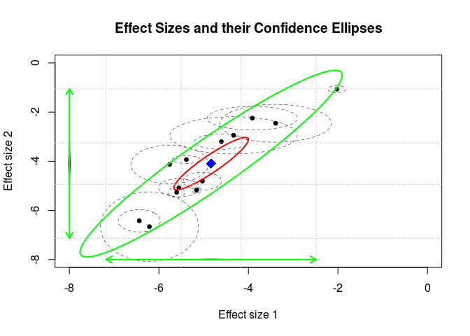


```r
###################################################
### code chunk number 21: BCG19
###################################################
## ## Load the metafor package
library("metafor")
plot(bcg1, xlim=c(-8,0), ylim=c(-8,0), diag.panel=TRUE)
## Forest plot for the vaccinated group
forest( rma(yi=ln_Odd_V, vi=v_ln_Odd_V, method="ML", data=BCG) )
title("Forest plot for the vaccinated group")
## Forest plot for the non-vaccinated group
forest( rma(yi=ln_Odd_NV, vi=v_ln_Odd_NV, method="ML", data=BCG) )
title("Forest plot for the non-vaccinated group")
```

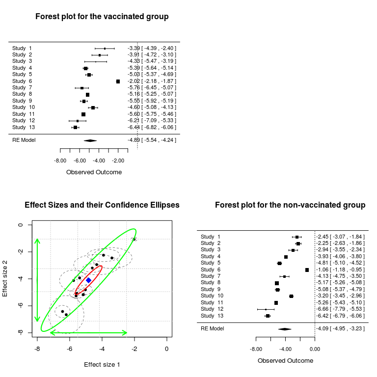

## Standardized mean differences between males and females on life satisfaction and life control


```r
###################################################
### code chunk number 22: wvs1
###################################################
## Display the dataset
head(wvs94a)
```

```
##     country      lifesat    lifecon lifesat_var   inter_cov lifecon_var
## 1 Argentina -0.032092632 0.05760759 0.004043047 0.001407526 0.004158255
## 2   Austria  0.080096043 0.00889294 0.002887624 0.000933741 0.002893639
## 3   Belarus  0.041978879 0.07408653 0.004009652 0.001335892 0.004010990
## 4   Belgium  0.007754997 0.12799510 0.001456405 0.000405010 0.001513248
## 5    Brazil  0.148138118 0.18210572 0.002266132 0.000789084 0.002290195
## 6   Britain  0.020047940 0.04445499 0.002723780 0.001185755 0.002746361
##     gnp
## 1  2370
## 2  4900
## 3  3110
## 4 15540
## 5  2680
## 6 16100
```

```r
###################################################
### code chunk number 23: wvs2 
###################################################
## Random-effects model
wvs1 <- meta(y=cbind(lifesat, lifecon),
             v=cbind(lifesat_var, inter_cov, lifecon_var), 
             data=wvs94a, model.name="Random effects model")
summary(wvs1)
```

```
## 
## Call:
## meta(y = cbind(lifesat, lifecon), v = cbind(lifesat_var, inter_cov, 
##     lifecon_var), data = wvs94a, model.name = "Random effects model")
## 
## 95% confidence intervals: z statistic approximation
## Coefficients:
##               Estimate   Std.Error      lbound      ubound z value
## Intercept1  0.00134985  0.01385628 -0.02580796  0.02850767  0.0974
## Intercept2  0.06882575  0.01681962  0.03585990  0.10179160  4.0920
## Tau2_1_1    0.00472726  0.00176156  0.00127465  0.00817986  2.6836
## Tau2_2_1    0.00393437  0.00168706  0.00062779  0.00724094  2.3321
## Tau2_2_2    0.00841361  0.00253727  0.00344064  0.01338657  3.3160
##             Pr(>|z|)    
## Intercept1 0.9223943    
## Intercept2 4.277e-05 ***
## Tau2_1_1   0.0072844 ** 
## Tau2_2_1   0.0196962 *  
## Tau2_2_2   0.0009131 ***
## ---
## Signif. codes:  0 '***' 0.001 '**' 0.01 '*' 0.05 '.' 0.1 ' ' 1
## 
## Q statistic on the homogeneity of effect sizes: 250.0303
## Degrees of freedom of the Q statistic: 82
## P value of the Q statistic: 0
## 
## Heterogeneity indices (based on the estimated Tau2):
##                              Estimate
## Intercept1: I2 (Q statistic)   0.6129
## Intercept2: I2 (Q statistic)   0.7345
## 
## Number of studies (or clusters): 42
## Number of observed statistics: 84
## Number of estimated parameters: 5
## Degrees of freedom: 79
## -2 log likelihood: -161.9216 
## OpenMx status1: 0 ("0" or "1": The optimization is considered fine.
## Other values may indicate problems.)
```

```r
###################################################
### code chunk number 25: wvs4
###################################################
## Extract the variance component of the random effects
( T2 <- vec2symMat(coef(wvs1, select="random")) )
```

```
##             [,1]        [,2]
## [1,] 0.004727256 0.003934366
## [2,] 0.003934366 0.008413607
```

```r
###################################################
### code chunk number 26: wvs5
###################################################
## Convert the covariance matrix to a correlation matrix
cov2cor(T2)
```

```
##           [,1]      [,2]
## [1,] 1.0000000 0.6238485
## [2,] 0.6238485 1.0000000
```

```r
###################################################
### code chunk number 27: wvs6
###################################################
wvs.cor <- cov2cor(T2)[2,1]


###################################################
### code chunk number 28: wvs7
###################################################
par(mfrow=c(1,1))
plot(wvs1, axis.labels=c("SMD on life satisfaction", 
                        "SMD on life control"),
    study.ellipse.plot=FALSE,
    xlim=c(-0.3, 0.2), ylim=c(-0.3,0.4))
```

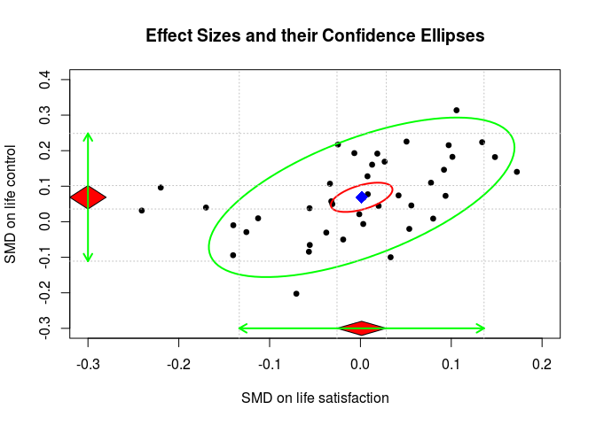

```r
###################################################
### code chunk number 29: wvs8
###################################################
## ## Random-effects model with both effect sizes fixed at 0
wvs2 <- meta(y=cbind(lifesat, lifecon),
             v=cbind(lifesat_var, inter_cov, lifecon_var), 
             data=wvs94a,
             intercept.constraints=matrix(0, nrow=1, ncol=2),
             model.name="Both effect sizes fixed at 0")
summary(wvs2)
```

```
## 
## Call:
## meta(y = cbind(lifesat, lifecon), v = cbind(lifesat_var, inter_cov, 
##     lifecon_var), data = wvs94a, intercept.constraints = matrix(0, 
##     nrow = 1, ncol = 2), model.name = "Both effect sizes fixed at 0")
## 
## 95% confidence intervals: z statistic approximation
## Coefficients:
##            Estimate  Std.Error     lbound     ubound z value  Pr(>|z|)    
## Tau2_1_1 0.00463198 0.00174390 0.00121400 0.00804996  2.6561 0.0079050 ** 
## Tau2_2_1 0.00413061 0.00192233 0.00036292 0.00789830  2.1488 0.0316538 *  
## Tau2_2_2 0.01308267 0.00355438 0.00611620 0.02004913  3.6807 0.0002326 ***
## ---
## Signif. codes:  0 '***' 0.001 '**' 0.01 '*' 0.05 '.' 0.1 ' ' 1
## 
## Q statistic on the homogeneity of effect sizes: 250.0303
## Degrees of freedom of the Q statistic: 82
## P value of the Q statistic: 0
## 
## Heterogeneity indices (based on the estimated Tau2):
##                              Estimate
## Intercept1: I2 (Q statistic)   0.6080
## Intercept2: I2 (Q statistic)   0.8114
## 
## Number of studies (or clusters): 42
## Number of observed statistics: 84
## Number of estimated parameters: 3
## Degrees of freedom: 81
## -2 log likelihood: -143.4727 
## OpenMx status1: 0 ("0" or "1": The optimization is considered fine.
## Other values may indicate problems.)
```

```r
###################################################
### code chunk number 31: wvs10
###################################################
## Compare the nested models
anova(wvs1, wvs2)
```

```
##                   base                   comparison ep  minus2LL df
## 1 Random effects model                         <NA>  5 -161.9216 79
## 2 Random effects model Both effect sizes fixed at 0  3 -143.4727 81
##         AIC   diffLL diffdf            p
## 1 -319.9216       NA     NA           NA
## 2 -305.4727 18.44885      2 9.860162e-05
```

```r
###################################################
### code chunk number 33: wvs12 
###################################################
## ## Mixed-effects model
## ## gnp is divided by 10000 and centered by using 
## ## scale(gnp/10000, scale=FALSE)
wvs3 <- meta(y=cbind(lifesat, lifecon),
             v=cbind(lifesat_var, inter_cov, lifecon_var),
             x=scale(gnp/10000, scale=FALSE), data=wvs94a,
             model.name="GNP as a predictor")
summary(wvs3)
```

```
## 
## Call:
## meta(y = cbind(lifesat, lifecon), v = cbind(lifesat_var, inter_cov, 
##     lifecon_var), x = scale(gnp/10000, scale = FALSE), data = wvs94a, 
##     model.name = "GNP as a predictor")
## 
## 95% confidence intervals: z statistic approximation
## Coefficients:
##               Estimate   Std.Error      lbound      ubound z value
## Intercept1  0.00129981  0.01457483 -0.02726634  0.02986596  0.0892
## Intercept2  0.07059120  0.01713638  0.03700450  0.10417789  4.1194
## Slope1_1   -0.02405128  0.01530535 -0.05404921  0.00594665 -1.5714
## Slope2_1   -0.03720440  0.01794815 -0.07238213 -0.00202666 -2.0729
## Tau2_1_1    0.00459976  0.00179776  0.00107621  0.00812331  2.5586
## Tau2_2_1    0.00359160  0.00168075  0.00029738  0.00688582  2.1369
## Tau2_2_2    0.00747895  0.00247139  0.00263510  0.01232279  3.0262
##             Pr(>|z|)    
## Intercept1  0.928938    
## Intercept2 3.799e-05 ***
## Slope1_1    0.116083    
## Slope2_1    0.038183 *  
## Tau2_1_1    0.010509 *  
## Tau2_2_1    0.032606 *  
## Tau2_2_2    0.002476 ** 
## ---
## Signif. codes:  0 '***' 0.001 '**' 0.01 '*' 0.05 '.' 0.1 ' ' 1
## 
## Q statistic on the homogeneity of effect sizes: 228.2571
## Degrees of freedom of the Q statistic: 72
## P value of the Q statistic: 0
## 
## Explained variances (R2):
##                               y1     y2
## Tau2 (no predictor)    0.0047273 0.0084
## Tau2 (with predictors) 0.0045998 0.0075
## R2                     0.0269705 0.1111
## 
## Number of studies (or clusters): 37
## Number of observed statistics: 74
## Number of estimated parameters: 7
## Degrees of freedom: 67
## -2 log likelihood: -146.9027 
## OpenMx status1: 0 ("0" or "1": The optimization is considered fine.
## Other values may indicate problems.)
```

## Mediation and moderation models


```r
###################################################
### code chunk number 35: reg1
###################################################
## Remove the missing values in gnp and exclude the first column "country"
my.df <- wvs94a[!is.na(wvs94a$gnp), -1]

## Center gnp and divide it by 10000 to 
## improve numerical stability
my.df$gnp <- scale(my.df$gnp, scale = FALSE)/10000

head(my.df)
```

```
##        lifesat    lifecon lifesat_var   inter_cov lifecon_var        gnp
## 1 -0.032092632 0.05760759 0.004043047 0.001407526 0.004158255 -0.8527838
## 2  0.080096043 0.00889294 0.002887624 0.000933741 0.002893639 -0.5997838
## 3  0.041978879 0.07408653 0.004009652 0.001335892 0.004010990 -0.7787838
## 4  0.007754997 0.12799510 0.001456405 0.000405010 0.001513248  0.4642162
## 5  0.148138118 0.18210572 0.002266132 0.000789084 0.002290195 -0.8217838
## 6  0.020047940 0.04445499 0.002723780 0.001185755 0.002746361  0.5202162
```

```r
###################################################
### code chunk number 36: reg2
###################################################
## A: asymmetric paths for regression coefficients
##    and factor loadings
A <- matrix(c(0, "0.5*beta1_2", 0, 0, 
              0, 0, 0, 0, 
              1, 0, 0, 0,
              0, 1, 0, 0), 
            ncol=4, nrow=4, byrow=TRUE)
dimnames(A) <- list(c("f_lifesat","f_lifecon","lifesat","lifecon"), 
                    c("f_lifesat","f_lifecon","lifesat","lifecon"))
## Show the content of A
A
```

```
##           f_lifesat f_lifecon     lifesat lifecon
## f_lifesat "0"       "0.5*beta1_2" "0"     "0"    
## f_lifecon "0"       "0"           "0"     "0"    
## lifesat   "1"       "0"           "0"     "0"    
## lifecon   "0"       "1"           "0"     "0"
```

```r
## Convert it into OpenMx matrix
A <- as.mxMatrix(A)


###################################################
### code chunk number 37: reg3
###################################################
## S: symmetric covariances and variances
S <- mxMatrix(type="Symm", nrow=4, ncol=4, byrow=TRUE, 
              free=c(TRUE, 
                     FALSE,TRUE, 
                     FALSE,FALSE,FALSE,
                     FALSE,FALSE,FALSE,FALSE), 
              values=c(0.01,
                       0,0.01,
                       0,0,0,
                       0,0,0,0),
              labels=c("tau2_1_1",
                       NA,"tau2_2_2",
                       NA,NA,"data.lifesat_var",
                       NA,NA,"data.inter_cov","data.lifecon_var"), 
              name = "S")
## Show the labels of S
S@labels
```

```
##      [,1]       [,2]       [,3]               [,4]              
## [1,] "tau2_1_1" NA         NA                 NA                
## [2,] NA         "tau2_2_2" NA                 NA                
## [3,] NA         NA         "data.lifesat_var" "data.inter_cov"  
## [4,] NA         NA         "data.inter_cov"   "data.lifecon_var"
```

```r
###################################################
### code chunk number 38: reg4
###################################################
## F: select observed variables
F <- matrix(c(0, 0, 1, 0, 
              0, 0, 0, 1), nrow = 2, ncol = 4, byrow = TRUE)
dimnames(F) <- list(c("lifesat","lifecon"), 
                    c("f_lifesat","f_lifecon","lifesat","lifecon"))
## Show the content of F
F
```

```
##         f_lifesat f_lifecon lifesat lifecon
## lifesat         0         0       1       0
## lifecon         0         0       0       1
```

```r
F <- as.mxMatrix(F)


###################################################
### code chunk number 39: reg5
###################################################
## M: intercepts or means
M <- matrix(c("0*beta1_0","0*beta2_0",0,0), nrow=1, ncol=4)
dimnames(M)[[2]] <- c("f_lifesat","f_lifecon","lifesat","lifecon")
M
```

```
##      f_lifesat   f_lifecon   lifesat lifecon
## [1,] "0*beta1_0" "0*beta2_0" "0"     "0"
```

```r
M <- as.mxMatrix(M)


###################################################
### code chunk number 40: reg6
###################################################
## Formula for R2
R2 <- mxAlgebra(beta1_2^2*tau2_2_2/(beta1_2^2*tau2_2_2 + tau2_1_1),
                name="R2")


###################################################
### code chunk number 41: reg7
###################################################
## Build the model
reg <- mxModel("Regression", 
               mxData(observed=my.df, type="raw"), 
               A, S, F, M, R2, mxCI("R2"),
               mxExpectationRAM(A="A", S="S", 
                              F="F", M="M",                               
               dimnames = c("f_lifesat","f_lifecon",
                            "lifesat","lifecon")),
               mxFitFunctionML())


###################################################
### code chunk number 42: reg8
###################################################
## Run the analysis
reg.fit <- mxRun(reg, intervals=TRUE)
```

```
## Running Regression with 5 parameters
```

```r
## Check the status of the results
reg.fit@output$status[[1]]
```

```
## [1] 0
```

```r
###################################################
### code chunk number 42: reg8
###################################################
## Rerun the analysis
reg.fit <- mxRun(reg.fit, intervals=TRUE, silent=TRUE)

## Check the status of the results
reg.fit@output$status[[1]]
```

```
## [1] 0
```

```r
###################################################
### code chunk number 44: reg10
###################################################
summary(reg.fit)
```

```
## Summary of Regression 
##  
## free parameters:
##       name matrix row       col     Estimate   Std.Error A
## 1  beta1_2      A   1         2  0.498820544 0.152612264  
## 2 tau2_1_1      S   1         1  0.002902210 0.001341338  
## 3 tau2_2_2      S   2         2  0.008731428 0.002771099  
## 4  beta1_0      M   1 f_lifesat -0.033950421 0.016492587  
## 5  beta2_0      M   1 f_lifecon  0.070644741 0.018110191  
## 
## confidence intervals:
##                        lbound  estimate    ubound note
## Regression.R2[1,1] 0.06619551 0.4281112 0.7727557     
## 
## observed statistics:  74 
## estimated parameters:  5 
## degrees of freedom:  69 
## fit value ( -2lnL units ):  -142.5132 
## number of observations:  37 
## Information Criteria: 
##       |  df Penalty  |  Parameters Penalty  |  Sample-Size Adjusted
## AIC:      -280.5132              -132.5132                       NA
## BIC:      -391.6665              -124.4586                -140.0856
## To get additional fit indices, see help(mxRefModels)
## timestamp: 2016-04-08 21:49:46 
## Wall clock time (HH:MM:SS.hh): 00:00:00.99 
## optimizer:  SLSQP 
## OpenMx version number: 2.5.2 
## Need help?  See help(mxSummary)
```

```r
###################################################
### code chunk number 46: med1
###################################################
A <- matrix(c(0,0,0,0,0,
              "0*gamma1",0,"0*beta1_2",0,0,
              "0*gamma2",0,0,0,0,
              0,1,0,0,0,
              0,0,1,0,0), ncol=5, nrow=5, byrow=TRUE)
dimnames(A) <- list(c("gnp","f_lifesat","f_lifecon",
                      "lifesat","lifecon"),
                    c("gnp","f_lifesat","f_lifecon",
                      "lifesat","lifecon"))
A
```

```
##           gnp        f_lifesat f_lifecon   lifesat lifecon
## gnp       "0"        "0"       "0"         "0"     "0"    
## f_lifesat "0*gamma1" "0"       "0*beta1_2" "0"     "0"    
## f_lifecon "0*gamma2" "0"       "0"         "0"     "0"    
## lifesat   "0"        "1"       "0"         "0"     "0"    
## lifecon   "0"        "0"       "1"         "0"     "0"
```

```r
A <- as.mxMatrix(A)


###################################################
### code chunk number 47: med2
###################################################
S <- mxMatrix(type="Symm", nrow=5, ncol=5, byrow=TRUE,
            free=c(TRUE,
                   FALSE,TRUE,
                   FALSE,FALSE,TRUE,
                   FALSE,FALSE,FALSE,FALSE,
                   FALSE,FALSE,FALSE,FALSE,FALSE),
            values=c(1,
                     0,0.01,
                     0,0,0.1,
                     0,0,0,0,
                     0,0,0,0,0),
            labels=c("sigma2_x",
                     NA,"tau2_1_1",
                     NA,NA,"tau2_2_2",
                     NA,NA,NA,"data.lifesat_var",
                     NA,NA,NA,"data.inter_cov","data.lifecon_var"),
            name="S")
S@labels
```

```
##      [,1]       [,2]       [,3]       [,4]              
## [1,] "sigma2_x" NA         NA         NA                
## [2,] NA         "tau2_1_1" NA         NA                
## [3,] NA         NA         "tau2_2_2" NA                
## [4,] NA         NA         NA         "data.lifesat_var"
## [5,] NA         NA         NA         "data.inter_cov"  
##      [,5]              
## [1,] NA                
## [2,] NA                
## [3,] NA                
## [4,] "data.inter_cov"  
## [5,] "data.lifecon_var"
```

```r
###################################################
### code chunk number 48: med3
###################################################
F <- matrix(c(1,0,0,0,0,
              0,0,0,1,0,
              0,0,0,0,1), nrow=3, ncol=5, byrow=TRUE)
dimnames(F) <- list(c("gnp","lifesat","lifecon"),
                    c("gnp","f_lifesat","f_lifecon",
                      "lifesat","lifecon"))
F
```

```
##         gnp f_lifesat f_lifecon lifesat lifecon
## gnp       1         0         0       0       0
## lifesat   0         0         0       1       0
## lifecon   0         0         0       0       1
```

```r
F <- as.mxMatrix(F)


###################################################
### code chunk number 49: med4
###################################################
M <- matrix(c("0*mu_x","0*beta1_0","0*beta2_0",0,0),
            nrow=1, ncol=5)
dimnames(M)[[2]] <- c("gnp", "f_lifesat","f_lifecon",
                      "lifesat","lifecon")
M
```

```
##      gnp      f_lifesat   f_lifecon   lifesat lifecon
## [1,] "0*mu_x" "0*beta1_0" "0*beta2_0" "0"     "0"
```

```r
M <- as.mxMatrix(M)


###################################################
### code chunk number 50: med5
###################################################
## Define the direct effect
direct <- mxAlgebra(gamma1, name="direct")

## Define the indirect effect
indirect <- mxAlgebra(gamma2*beta1_2, name="indirect")

## Define the total effect
total <- mxAlgebra(gamma1+gamma2*beta1_2, name="total")

med <- mxModel("Mediation",
               mxData(observed=my.df, type="raw"),
               A, S, F, M, direct, indirect, total,
               mxCI(c("direct","indirect","total")),
               mxExpectationRAM(A="A", S="S", F="F", M="M", 
               dimnames=c("gnp","f_lifesat","f_lifecon",
                          "lifesat","lifecon")),
               mxFitFunctionML()
)


###################################################
### code chunk number 51: med6a 
###################################################
med.fit <- mxRun(med, intervals=TRUE) 
```

```
## Running Mediation with 9 parameters
```

```r
###################################################
### code chunk number 53: med6c
###################################################
med.fit@output$status[[1]]
```

```
## [1] 0
```

```r
###################################################
### code chunk number 54: med6d 
###################################################
summary(med.fit)
```

```
## Summary of Mediation 
##  
## free parameters:
##       name matrix row       col      Estimate   Std.Error A
## 1   gamma1      A   2         1 -6.184698e-03 0.014694072  
## 2   gamma2      A   3         1 -3.720440e-02 0.017948153  
## 3  beta1_2      A   2         3  4.802276e-01 0.167965712  
## 4 sigma2_x      S   1         1  9.194660e-01 0.213770917  
## 5 tau2_1_1      S   2         2  2.874976e-03 0.001324283  
## 6 tau2_2_2      S   3         3  7.478947e-03 0.002471394  
## 7     mu_x      M   1       gnp  2.100776e-09 0.157640048  
## 8  beta1_0      M   1 f_lifesat -3.260003e-02 0.017158499  
## 9  beta2_0      M   1 f_lifecon  7.059120e-02 0.017136384  
## 
## confidence intervals:
##                              lbound     estimate        ubound note
## Mediation.direct[1,1]   -0.03607904 -0.006184698  0.0231960865     
## Mediation.indirect[1,1] -0.04481464 -0.017866579 -0.0005015193     
## Mediation.total[1,1]    -0.05505870 -0.024051277  0.0065105378     
## 
## observed statistics:  111 
## estimated parameters:  9 
## degrees of freedom:  102 
## fit value ( -2lnL units ):  -45.00786 
## number of observations:  37 
## Information Criteria: 
##       |  df Penalty  |  Parameters Penalty  |  Sample-Size Adjusted
## AIC:      -249.0079              -27.00786                       NA
## BIC:      -413.3215              -12.50960                -40.63829
## To get additional fit indices, see help(mxRefModels)
## timestamp: 2016-04-08 21:49:54 
## Wall clock time (HH:MM:SS.hh): 00:00:07.56 
## optimizer:  SLSQP 
## OpenMx version number: 2.5.2 
## Need help?  See help(mxSummary)
```

```r
###################################################
### code chunk number 56: mod1
###################################################
A <- matrix(c(0,0,0,0,0,0,
              "0*gamma1",0,"0*beta1_2",0,0,"0*omega1_2",
              0,0,0,0,0,0,
              0,1,0,0,0,0,
              0,0,1,0,0,0,
              0,0,"0*data_gnp",0,0,0),
            ncol=6,nrow=6,byrow=TRUE)

dimnames(A) <- list(c("gnp","f_lifesat","f_lifecon",
                      "lifesat","lifecon","P"),
                    c("gnp","f_lifesat","f_lifecon",
                      "lifesat","lifecon","P"))
A
```

```
##           gnp        f_lifesat f_lifecon    lifesat lifecon P           
## gnp       "0"        "0"       "0"          "0"     "0"     "0"         
## f_lifesat "0*gamma1" "0"       "0*beta1_2"  "0"     "0"     "0*omega1_2"
## f_lifecon "0"        "0"       "0"          "0"     "0"     "0"         
## lifesat   "0"        "1"       "0"          "0"     "0"     "0"         
## lifecon   "0"        "0"       "1"          "0"     "0"     "0"         
## P         "0"        "0"       "0*data_gnp" "0"     "0"     "0"
```

```r
###################################################
### code chunk number 57: mod2
###################################################
A <- as.mxMatrix(A)
## Change the elements related to the definition variable
## A[6,3] is fixed by the variable gnp in the data
A@labels[6,3] <- "data.gnp"
## A[6,3] is a fixed parameter
A@free[6,3] <- FALSE
A
```

```
## FullMatrix 'A' 
## 
## $labels
##      [,1]     [,2] [,3]       [,4] [,5] [,6]      
## [1,] NA       NA   NA         NA   NA   NA        
## [2,] "gamma1" NA   "beta1_2"  NA   NA   "omega1_2"
## [3,] NA       NA   NA         NA   NA   NA        
## [4,] NA       NA   NA         NA   NA   NA        
## [5,] NA       NA   NA         NA   NA   NA        
## [6,] NA       NA   "data.gnp" NA   NA   NA        
## 
## $values
##      [,1] [,2] [,3] [,4] [,5] [,6]
## [1,]    0    0    0    0    0    0
## [2,]    0    0    0    0    0    0
## [3,]    0    0    0    0    0    0
## [4,]    0    1    0    0    0    0
## [5,]    0    0    1    0    0    0
## [6,]    0    0    0    0    0    0
## 
## $free
##       [,1]  [,2]  [,3]  [,4]  [,5]  [,6]
## [1,] FALSE FALSE FALSE FALSE FALSE FALSE
## [2,]  TRUE FALSE  TRUE FALSE FALSE  TRUE
## [3,] FALSE FALSE FALSE FALSE FALSE FALSE
## [4,] FALSE FALSE FALSE FALSE FALSE FALSE
## [5,] FALSE FALSE FALSE FALSE FALSE FALSE
## [6,] FALSE FALSE FALSE FALSE FALSE FALSE
## 
## $lbound: No lower bounds assigned.
## 
## $ubound: No upper bounds assigned.
```

```r
###################################################
### code chunk number 58: mod3
###################################################
S <- mxMatrix(type="Symm", nrow=6, ncol=6, byrow=TRUE,
             free=c(TRUE,
                    FALSE,TRUE,
                    TRUE,FALSE,TRUE,
                    FALSE,FALSE,FALSE,FALSE,
                    FALSE,FALSE,FALSE,FALSE,FALSE,
                    FALSE,FALSE,FALSE,FALSE,FALSE,FALSE),
             values=c(1,
                      0,0.01,
                      0,0,0.1,
                      0,0,0,0,
                      0,0,0,0,0,
                      0,0,0,0,0,0),
             labels=c("sigma2_x",
                      NA,"tau2_1_1",
                      "cov_x_lifecon",NA,"tau2_2_2",
                      NA,NA,NA,"data.lifesat_var",
                      NA,NA,NA,"data.inter_cov","data.lifecon_var",
                      NA,NA,NA,NA,NA,NA),
             name="S")
S@labels
```

```
##      [,1]            [,2]       [,3]            [,4]              
## [1,] "sigma2_x"      NA         "cov_x_lifecon" NA                
## [2,] NA              "tau2_1_1" NA              NA                
## [3,] "cov_x_lifecon" NA         "tau2_2_2"      NA                
## [4,] NA              NA         NA              "data.lifesat_var"
## [5,] NA              NA         NA              "data.inter_cov"  
## [6,] NA              NA         NA              NA                
##      [,5]               [,6]
## [1,] NA                 NA  
## [2,] NA                 NA  
## [3,] NA                 NA  
## [4,] "data.inter_cov"   NA  
## [5,] "data.lifecon_var" NA  
## [6,] NA                 NA
```

```r
###################################################
### code chunk number 59: mod4
###################################################
F <- matrix(c(1,0,0,0,0,0,
              0,0,0,1,0,0,
              0,0,0,0,1,0), nrow=3, ncol=6, byrow=TRUE)
dimnames(F) <- list(c("gnp","lifesat","lifecon"),
                    c("gnp","f_lifesat","f_lifecon","lifesat",
                      "lifecon","P"))
F
```

```
##         gnp f_lifesat f_lifecon lifesat lifecon P
## gnp       1         0         0       0       0 0
## lifesat   0         0         0       1       0 0
## lifecon   0         0         0       0       1 0
```

```r
F <- as.mxMatrix(F)


###################################################
### code chunk number 60: mod5
###################################################
M <- matrix(c("0*mu_x","0*beta1_0","0*beta2_0",0,0,0),
            nrow=1, ncol=6)
dimnames(M)[[2]] <- c("gnp","f_lifesat","f_lifecon",
                    "lifesat","lifecon","P")
M
```

```
##      gnp      f_lifesat   f_lifecon   lifesat lifecon P  
## [1,] "0*mu_x" "0*beta1_0" "0*beta2_0" "0"     "0"     "0"
```

```r
M <- as.mxMatrix(M)


###################################################
### code chunk number 61: mod6
###################################################
mod <- mxModel("Moderator",
               mxData(observed=my.df, type="raw"),
               A, S, F, M,
               mxCI("omega1_2"),
               mxExpectationRAM(A="A", S="S", F="F", M="M",
                   dimnames=c("gnp","f_lifesat","f_lifecon",
                              "lifesat","lifecon","P")),
               mxFitFunctionML()
)


###################################################
### code chunk number 62: mod7
###################################################
mod.fit <- mxRun(mod, intervals=TRUE, silent=TRUE)
## Check the optimization status
mod.fit@output$status[[1]]
```

```
## [1] 0
```

```r
###################################################
### code chunk number 63: mod8 
###################################################
summary(mod.fit)
```

```
## Summary of Moderator 
##  
## free parameters:
##             name matrix row       col      Estimate   Std.Error A
## 1         gamma1      A   2         1 -1.021484e-02 0.017520541  
## 2        beta1_2      A   2         3  4.706925e-01 0.169706967  
## 3       omega1_2      A   2         6  7.284373e-02 0.171198776  
## 4       sigma2_x      S   1         1  9.194659e-01 0.213771947  
## 5       tau2_1_1      S   2         2  2.802731e-03 0.001321674  
## 6  cov_x_lifecon      S   1         3 -3.462763e-02 0.018332753  
## 7       tau2_2_2      S   3         3  8.719897e-03 0.002763914  
## 8           mu_x      M   1       gnp -1.721808e-08 0.157640182  
## 9        beta1_0      M   1 f_lifesat -2.930353e-02 0.018794630  
## 10       beta2_0      M   1 f_lifecon  7.044088e-02 0.018089235  
## 
## confidence intervals:
##          lbound   estimate    ubound note
## omega1_2     NA 0.07284373 0.4301635  !!!
##   To investigate missing CIs, run summary() again, with verbose=T, to see CI details. 
## 
## observed statistics:  111 
## estimated parameters:  10 
## degrees of freedom:  101 
## fit value ( -2lnL units ):  -45.18954 
## number of observations:  37 
## Information Criteria: 
##       |  df Penalty  |  Parameters Penalty  |  Sample-Size Adjusted
## AIC:      -247.1895             -25.189538                       NA
## BIC:      -409.8922              -9.080359                -40.33446
## To get additional fit indices, see help(mxRefModels)
## timestamp: 2016-04-08 21:49:55 
## Wall clock time (HH:MM:SS.hh): 00:00:00.81 
## optimizer:  SLSQP 
## OpenMx version number: 2.5.2 
## Need help?  See help(mxSummary)
```

# Chapter 6: Three-Level Meta-Analysis


```r
###################################################
### code chunk number 2: Bornmann1a
###################################################
## Show the first few cases in the data set
head(Bornmann07)
```

```
##   Id                       Study Cluster    logOR          v Year
## 1  1 Ackers (2000a; Marie Curie)       1 -0.40108 0.01391692 1996
## 2  2 Ackers (2000b; Marie Curie)       1 -0.05727 0.03428793 1996
## 3  3 Ackers (2000c; Marie Curie)       1 -0.29852 0.03391122 1996
## 4  4 Ackers (2000d; Marie Curie)       1  0.36094 0.03404025 1996
## 5  5 Ackers (2000e; Marie Curie)       1 -0.33336 0.01282103 1996
## 6  6 Ackers (2000f; Marie Curie)       1 -0.07173 0.01361189 1996
##         Type                 Discipline Country
## 1 Fellowship          Physical sciences  Europe
## 2 Fellowship          Physical sciences  Europe
## 3 Fellowship          Physical sciences  Europe
## 4 Fellowship          Physical sciences  Europe
## 5 Fellowship Social sciences/humanities  Europe
## 6 Fellowship          Physical sciences  Europe
```

```r
## Show the last few cases in the data set
## tail(Bornmann07)


###################################################
### code chunk number 3: Bornmann1b
###################################################
## Display the no. of effect sizes per cluster
t(aggregate(logOR~Cluster, data=Bornmann07, FUN=length))
```

```
##         [,1] [,2] [,3] [,4] [,5] [,6] [,7] [,8] [,9] [,10] [,11] [,12]
## Cluster    1    2    3    4    5    6    7    8    9    10    11    12
## logOR      7    7    1    1    5    3    1    3    2     4     1     8
##         [,13] [,14] [,15] [,16] [,17] [,18] [,19] [,20] [,21]
## Cluster    13    14    15    16    17    18    19    20    21
## logOR       1     1     2     3     1     1     1     4     9
```

```r
###################################################
### code chunk number 4: Bornmann2a
###################################################
## ## Model 0: Random-effects model 
summary( Model0 <- meta3(y=logOR, v=v, cluster=Cluster, 
                         data=Bornmann07, model.name="3 level") )
```

```
## 
## Call:
## meta3(y = logOR, v = v, cluster = Cluster, data = Bornmann07, 
##     model.name = "3 level")
## 
## 95% confidence intervals: z statistic approximation
## Coefficients:
##             Estimate  Std.Error     lbound     ubound z value Pr(>|z|)  
## Intercept -0.1007784  0.0401327 -0.1794371 -0.0221198 -2.5111  0.01203 *
## Tau2_2     0.0037965  0.0027210 -0.0015367  0.0091297  1.3952  0.16295  
## Tau2_3     0.0141352  0.0091445 -0.0037877  0.0320580  1.5458  0.12216  
## ---
## Signif. codes:  0 '***' 0.001 '**' 0.01 '*' 0.05 '.' 0.1 ' ' 1
## 
## Q statistic on the homogeneity of effect sizes: 221.2809
## Degrees of freedom of the Q statistic: 65
## P value of the Q statistic: 0
## 
## Heterogeneity indices (based on the estimated Tau2):
##                               Estimate
## I2_2 (Typical v: Q statistic)   0.1568
## I2_3 (Typical v: Q statistic)   0.5839
## 
## Number of studies (or clusters): 21
## Number of observed statistics: 66
## Number of estimated parameters: 3
## Degrees of freedom: 63
## -2 log likelihood: 25.80256 
## OpenMx status1: 0 ("0" or "1": The optimization is considered fine.
## Other values may indicate problems.)
```

```r
###################################################
### code chunk number 6: Bornmann2c 
###################################################
## ## Model 0: Random-effects model with LBCI
summary( meta3(y=logOR, v=v, cluster=Cluster, 
               data=Bornmann07, model.name="3 level",
               intervals.type="LB") )
```

```
## 
## Call:
## meta3(y = logOR, v = v, cluster = Cluster, data = Bornmann07, 
##     intervals.type = "LB", model.name = "3 level")
## 
## 95% confidence intervals: Likelihood-based statistic
## Coefficients:
##              Estimate Std.Error      lbound      ubound z value Pr(>|z|)
## Intercept -0.10077844        NA -0.18595425 -0.01656000      NA       NA
## Tau2_2     0.00379649        NA  0.00081683  0.00887600      NA       NA
## Tau2_3     0.01413516        NA  0.00339630  0.03175936      NA       NA
## 
## Q statistic on the homogeneity of effect sizes: 221.2809
## Degrees of freedom of the Q statistic: 65
## P value of the Q statistic: 0
## 
## Heterogeneity indices (I2) and their 95% likelihood-based CIs:
##                                 lbound Estimate ubound
## I2_2 (Typical v: Q statistic) 0.028784 0.156832 0.4905
## I2_3 (Typical v: Q statistic) 0.213603 0.583920 0.8434
## 
## Number of studies (or clusters): 21
## Number of observed statistics: 66
## Number of estimated parameters: 3
## Degrees of freedom: 63
## -2 log likelihood: 25.80256 
## OpenMx status1: 0 ("0" or "1": The optimization is considered fine.
## Other values may indicate problems.)
```

```r
###################################################
### code chunk number 8: Bornmann3a 
###################################################
## ## Model 1: Testing tau^2_3 = 0
Model1 <- meta3(logOR, v, cluster=Cluster, data=Bornmann07, 
                RE3.constraints=0, model.name="2 level")
## Alternative approach
## Model1 <- meta(logOR, v, data=Bornmann07, model.name="2 level")

anova(Model0, Model1)
```

```
##      base comparison ep minus2LL df        AIC   diffLL diffdf           p
## 1 3 level       <NA>  3 25.80256 63 -100.19744       NA     NA          NA
## 2 3 level    2 level  2 36.02279 64  -91.97721 10.22024      1 0.001389081
```

```r
###################################################
### code chunk number 10: Bornmann3c
###################################################
## ## Model 2: Testing tau^2_2 = 0
Model2 <- meta3(logOR, v, cluster=Cluster, data=Bornmann07, 
                RE2.constraints=0, model.name="tau2_2 EQ 0")

anova(Model0, Model2)
```

```
##      base  comparison ep minus2LL df        AIC   diffLL diffdf
## 1 3 level        <NA>  3 25.80256 63 -100.19744       NA     NA
## 2 3 level tau2_2 EQ 0  2 38.52121 64  -89.47879 12.71865      1
##              p
## 1           NA
## 2 0.0003620263
```

```r
###################################################
### code chunk number 12: Bornmann4a
###################################################
## ## Model 3: Testing tau^2_2 = tau^2_3
Model3 <- meta3(logOR, v, cluster=Cluster, data=Bornmann07, 
                RE2.constraints="0.1*Eq_tau2", 
                RE3.constraints="0.1*Eq_tau2", 
                model.name="Eq tau2")


###################################################
### code chunk number 14: Bornmann4c 
###################################################
anova(Model0, Model3)
```

```
##      base comparison ep minus2LL df       AIC   diffLL diffdf        p
## 1 3 level       <NA>  3 25.80256 63 -100.1974       NA     NA       NA
## 2 3 level    Eq tau2  2 27.16166 64 -100.8383 1.359103      1 0.243693
```

```r
###################################################
### code chunk number 16: Bornmann5a
###################################################
## Show the first 10 cases of Type
Bornmann07$Type[1:10]
```

```
##  [1] Fellowship Fellowship Fellowship Fellowship Fellowship Fellowship
##  [7] Fellowship Grant      Grant      Grant     
## Levels: Grant Fellowship
```

```r
###################################################
### code chunk number 17: Bornmann5b
###################################################
## Convert characters into a dummy variable
## Type2=0 (Grant); Type2=1 (Fellowship)   
Type2 <- ifelse(Bornmann07$Type=="Fellowship", yes=1, no=0)

## Show the first 10 cases of Type2
Type2[1:10]
```

```
##  [1] 1 1 1 1 1 1 1 0 0 0
```

```r
###################################################
### code chunk number 18: Bornmann5c 
###################################################
## ## Model 4: Type2 as the covariate  
summary( meta3(y=logOR, v=v, x=Type2, cluster=Cluster, 
               data=Bornmann07) )
```

```
## 
## Call:
## meta3(y = logOR, v = v, cluster = Cluster, x = Type2, data = Bornmann07)
## 
## 95% confidence intervals: z statistic approximation
## Coefficients:
##             Estimate  Std.Error     lbound     ubound z value  Pr(>|z|)
## Intercept -0.0066071  0.0371125 -0.0793462  0.0661320 -0.1780 0.8587001
## Slope_1   -0.1955869  0.0541649 -0.3017483 -0.0894256 -3.6110 0.0003051
## Tau2_2     0.0035335  0.0024306 -0.0012303  0.0082974  1.4538 0.1460058
## Tau2_3     0.0029079  0.0031183 -0.0032039  0.0090197  0.9325 0.3510704
##              
## Intercept    
## Slope_1   ***
## Tau2_2       
## Tau2_3       
## ---
## Signif. codes:  0 '***' 0.001 '**' 0.01 '*' 0.05 '.' 0.1 ' ' 1
## 
## Q statistic on the homogeneity of effect sizes: 221.2809
## Degrees of freedom of the Q statistic: 65
## P value of the Q statistic: 0
## 
## Explained variances (R2):
##                          Level 2 Level 3
## Tau2 (no predictor)    0.0037965  0.0141
## Tau2 (with predictors) 0.0035335  0.0029
## R2                     0.0692595  0.7943
## 
## Number of studies (or clusters): 21
## Number of observed statistics: 66
## Number of estimated parameters: 4
## Degrees of freedom: 62
## -2 log likelihood: 17.62569 
## OpenMx status1: 0 ("0" or "1": The optimization is considered fine.
## Other values may indicate problems.)
```

```r
###################################################
### code chunk number 20: Bornmann6a 
###################################################
## ## Model 5: Year and Year^2 as covariates
summary( Model5 <- meta3(y=logOR, v=v, 
                         x=cbind(scale(Year), scale(Year)^2), 
                         cluster=Cluster, data=Bornmann07,
                         model.name="Model 5") )
```

```
## 
## Call:
## meta3(y = logOR, v = v, cluster = Cluster, x = cbind(scale(Year), 
##     scale(Year)^2), data = Bornmann07, model.name = "Model 5")
## 
## 95% confidence intervals: z statistic approximation
## Coefficients:
##              Estimate   Std.Error      lbound      ubound z value Pr(>|z|)
## Intercept -0.08627312  0.04125581 -0.16713302 -0.00541321 -2.0912  0.03651
## Slope_1   -0.00095287  0.02365224 -0.04731040  0.04540467 -0.0403  0.96786
## Slope_2   -0.01176840  0.00659995 -0.02470407  0.00116727 -1.7831  0.07457
## Tau2_2     0.00287389  0.00206817 -0.00117965  0.00692744  1.3896  0.16466
## Tau2_3     0.01479446  0.00926095 -0.00335666  0.03294558  1.5975  0.11015
##            
## Intercept *
## Slope_1    
## Slope_2   .
## Tau2_2     
## Tau2_3     
## ---
## Signif. codes:  0 '***' 0.001 '**' 0.01 '*' 0.05 '.' 0.1 ' ' 1
## 
## Q statistic on the homogeneity of effect sizes: 221.2809
## Degrees of freedom of the Q statistic: 65
## P value of the Q statistic: 0
## 
## Explained variances (R2):
##                          Level 2 Level 3
## Tau2 (no predictor)    0.0037965  0.0141
## Tau2 (with predictors) 0.0028739  0.0148
## R2                     0.2430134  0.0000
## 
## Number of studies (or clusters): 21
## Number of observed statistics: 66
## Number of estimated parameters: 5
## Degrees of freedom: 61
## -2 log likelihood: 22.3836 
## OpenMx status1: 0 ("0" or "1": The optimization is considered fine.
## Other values may indicate problems.)
```

```r
###################################################
### code chunk number 22: Bornmann6c 
###################################################
## ## Testing H_0: beta_{Year} = beta_{Year^2}=0
anova(Model5, Model0)
```

```
##      base comparison ep minus2LL df       AIC   diffLL diffdf         p
## 1 Model 5       <NA>  5 22.38360 61  -99.6164       NA     NA        NA
## 2 Model 5    3 level  3 25.80256 63 -100.1974 3.418955      2 0.1809603
```

```r
###################################################
### code chunk number 24: Bornmann7ab
###################################################
## Create indicators for countries
USA <- ifelse(Bornmann07$Country=="United States", yes=1, no=0)
Aus <- ifelse(Bornmann07$Country=="Australia", yes=1, no=0)
Can <- ifelse(Bornmann07$Country=="Canada", yes=1, no=0)
Eur <- ifelse(Bornmann07$Country=="Europe", yes=1, no=0)
UK  <- ifelse(Bornmann07$Country=="United Kingdom", yes=1, no=0)


###################################################
### code chunk number 25: Bornmann7b 
###################################################
## ## Model 6: indicators for country as moderators
summary( Model6 <- meta3(y=logOR, v=v, intercept.constraint=0,
                         x=cbind(USA, Aus, Can, Eur, UK), 
                         cluster=Cluster, data=Bornmann07,
                         model.name="Model 6") )
```

```
## 
## Call:
## meta3(y = logOR, v = v, cluster = Cluster, x = cbind(USA, Aus, 
##     Can, Eur, UK), data = Bornmann07, intercept.constraints = 0, 
##     model.name = "Model 6")
## 
## 95% confidence intervals: z statistic approximation
## Coefficients:
##           Estimate  Std.Error     lbound     ubound z value  Pr(>|z|)    
## Slope_1  0.0025681  0.0597768 -0.1145923  0.1197285  0.0430    0.9657    
## Slope_2 -0.0214428  0.0926603 -0.2030538  0.1601681 -0.2314    0.8170    
## Slope_3 -0.1315119  0.1026488 -0.3326998  0.0696760 -1.2812    0.2001    
## Slope_4 -0.2185120  0.0500825 -0.3166718 -0.1203521 -4.3630 1.283e-05 ***
## Slope_5  0.0562932  0.0790467 -0.0986354  0.2112219  0.7122    0.4764    
## Tau2_2   0.0033376  0.0023492 -0.0012667  0.0079420  1.4208    0.1554    
## Tau2_3   0.0047979  0.0044818 -0.0039862  0.0135820  1.0705    0.2844    
## ---
## Signif. codes:  0 '***' 0.001 '**' 0.01 '*' 0.05 '.' 0.1 ' ' 1
## 
## Q statistic on the homogeneity of effect sizes: 221.2809
## Degrees of freedom of the Q statistic: 65
## P value of the Q statistic: 0
## 
## Explained variances (R2):
##                          Level 2 Level 3
## Tau2 (no predictor)    0.0037965  0.0141
## Tau2 (with predictors) 0.0033376  0.0048
## R2                     0.1208598  0.6606
## 
## Number of studies (or clusters): 21
## Number of observed statistics: 66
## Number of estimated parameters: 7
## Degrees of freedom: 59
## -2 log likelihood: 14.18259 
## OpenMx status1: 0 ("0" or "1": The optimization is considered fine.
## Other values may indicate problems.)
```

```r
###################################################
### code chunk number 27: Bornmann7d 
###################################################
## ## Testing H_0: all countries have the average effect sizes
anova(Model6, Model0)
```

```
##      base comparison ep minus2LL df       AIC   diffLL diffdf          p
## 1 Model 6       <NA>  7 14.18259 59 -103.8174       NA     NA         NA
## 2 Model 6    3 level  3 25.80256 63 -100.1974 11.61996      4 0.02041284
```

# Chapter 7: Meta-Analytic Structural Equation Modeling

## A higher-order confirmatory factor analytic model for the Big Five model


```r
###################################################
### code chunk number 3: Digman1
###################################################
## Display the first two correlation matrices
Digman97$data[1:2]
```

```
## $`Digman 1 (1994)`
##        A     C   ES     E    I
## A   1.00  0.62 0.41 -0.48 0.00
## C   0.62  1.00 0.59 -0.10 0.35
## ES  0.41  0.59 1.00  0.27 0.41
## E  -0.48 -0.10 0.27  1.00 0.37
## I   0.00  0.35 0.41  0.37 1.00
## 
## $`Digman 2 (1994)`
##        A    C   ES     E     I
## A   1.00 0.39 0.53 -0.30 -0.05
## C   0.39 1.00 0.59  0.07  0.44
## ES  0.53 0.59 1.00  0.09  0.22
## E  -0.30 0.07 0.09  1.00  0.45
## I  -0.05 0.44 0.22  0.45  1.00
```

```r
## Display the first two sample sizes
Digman97$n[1:2]
```

```
## [1] 102 149
```

```r
###################################################
### code chunk number 4: Digman2 
###################################################
fixed1 <- tssem1(Digman97$data, Digman97$n, method="FEM")
summary(fixed1)
```

```
## 
## Call:
## tssem1FEM(my.df = my.df, n = n, cor.analysis = cor.analysis, 
##     model.name = model.name, cluster = cluster, suppressWarnings = suppressWarnings, 
##     silent = silent, run = run)
## 
## Coefficients:
##        Estimate Std.Error z value  Pr(>|z|)    
## S[1,2] 0.363278  0.013368 27.1754 < 2.2e-16 ***
## S[1,3] 0.390375  0.012880 30.3075 < 2.2e-16 ***
## S[1,4] 0.103572  0.015048  6.8830 5.862e-12 ***
## S[1,5] 0.092286  0.015047  6.1331 8.618e-10 ***
## S[2,3] 0.416070  0.012520 33.2335 < 2.2e-16 ***
## S[2,4] 0.135148  0.014776  9.1463 < 2.2e-16 ***
## S[2,5] 0.141431  0.014866  9.5135 < 2.2e-16 ***
## S[3,4] 0.244459  0.014153 17.2723 < 2.2e-16 ***
## S[3,5] 0.138339  0.014834  9.3260 < 2.2e-16 ***
## S[4,5] 0.424566  0.012376 34.3068 < 2.2e-16 ***
## ---
## Signif. codes:  0 '***' 0.001 '**' 0.01 '*' 0.05 '.' 0.1 ' ' 1
## 
## Goodness-of-fit indices:
##                                      Value
## Sample size                      4496.0000
## Chi-square of target model       1505.4443
## DF of target model                130.0000
## p value of target model             0.0000
## Chi-square of independence model 4471.4242
## DF of independence model          140.0000
## RMSEA                               0.1815
## RMSEA lower 95% CI                  0.1736
## RMSEA upper 95% CI                  0.1901
## SRMR                                0.1621
## TLI                                 0.6580
## CFI                                 0.6824
## AIC                              1245.4443
## BIC                               412.0217
## OpenMx status1: 0 ("0" or "1": The optimization is considered fine.
## Other values may indicate problems.)
```

```r
## Alternative approach if you do not want to save "fixed1"
## summary( tssem1(Digman97$data, Digman97$n, method="FEM") )


###################################################
### code chunk number 6: Digman4
###################################################
coef(fixed1)
```

```
##             A         C        ES         E          I
## A  1.00000000 0.3632782 0.3903748 0.1035716 0.09228557
## C  0.36327824 1.0000000 0.4160695 0.1351477 0.14143058
## ES 0.39037483 0.4160695 1.0000000 0.2444593 0.13833895
## E  0.10357155 0.1351477 0.2444593 1.0000000 0.42456626
## I  0.09228557 0.1414306 0.1383390 0.4245663 1.00000000
```

```r
###################################################
### code chunk number 7: Digman5
###################################################
## Define the S matrix that includes both Phi and Psi
## Phi matrix: 2x2 correlation matrix between the latent factors
( Phi <- matrix(c(1,".3*cor",".3*cor",1), nrow=2, ncol=2) )
```

```
##      [,1]     [,2]    
## [1,] "1"      ".3*cor"
## [2,] ".3*cor" "1"
```

```r
## Psi matrix: 5x5 diagonal matrix of the error variances
( Psi <- Diag(c(".2*e1",".2*e2",".2*e3",".2*e4",".2*e5")) )
```

```
##      [,1]    [,2]    [,3]    [,4]    [,5]   
## [1,] ".2*e1" "0"     "0"     "0"     "0"    
## [2,] "0"     ".2*e2" "0"     "0"     "0"    
## [3,] "0"     "0"     ".2*e3" "0"     "0"    
## [4,] "0"     "0"     "0"     ".2*e4" "0"    
## [5,] "0"     "0"     "0"     "0"     ".2*e5"
```

```r
## Create a block diagonal matrix as the S matrix
S1 <- bdiagMat(list(Psi, Phi))

## This step is not necessary but useful 
## for inspecting the model.
dimnames(S1)[[1]] <- c("A","C","ES","E","I","f_Alpha","f_Beta") 
dimnames(S1)[[2]] <- dimnames(S1)[[1]] 
S1
```

```
##         A       C       ES      E       I       f_Alpha  f_Beta  
## A       ".2*e1" "0"     "0"     "0"     "0"     "0"      "0"     
## C       "0"     ".2*e2" "0"     "0"     "0"     "0"      "0"     
## ES      "0"     "0"     ".2*e3" "0"     "0"     "0"      "0"     
## E       "0"     "0"     "0"     ".2*e4" "0"     "0"      "0"     
## I       "0"     "0"     "0"     "0"     ".2*e5" "0"      "0"     
## f_Alpha "0"     "0"     "0"     "0"     "0"     "1"      ".3*cor"
## f_Beta  "0"     "0"     "0"     "0"     "0"     ".3*cor" "1"
```

```r
## Convert it into a MxMatrix class
S1 <- as.mxMatrix(S1)

## Lambda matrix: 5x2 factor loadings
## Arrange the data by row
( Lambda <- matrix(c(".3*Alpha_A", 0,
                   ".3*Alpha_C", 0,
                   ".3*Alpha_ES", 0,
                   0, ".3*Beta_E",
                   0, ".3*Beta_I"),
                   nrow=5, ncol=2, byrow=TRUE) )
```

```
##      [,1]          [,2]       
## [1,] ".3*Alpha_A"  "0"        
## [2,] ".3*Alpha_C"  "0"        
## [3,] ".3*Alpha_ES" "0"        
## [4,] "0"           ".3*Beta_E"
## [5,] "0"           ".3*Beta_I"
```

```r
## Create a 5x5 of zeros
( Zero5x5 <- matrix(0, nrow=5, ncol=5) )
```

```
##      [,1] [,2] [,3] [,4] [,5]
## [1,]    0    0    0    0    0
## [2,]    0    0    0    0    0
## [3,]    0    0    0    0    0
## [4,]    0    0    0    0    0
## [5,]    0    0    0    0    0
```

```r
## Create a 2x7 of zeros
( Zero2x7 <- matrix(0, nrow=2, ncol=7) )
```

```
##      [,1] [,2] [,3] [,4] [,5] [,6] [,7]
## [1,]    0    0    0    0    0    0    0
## [2,]    0    0    0    0    0    0    0
```

```r
## Define the A matrix
A1 <- rbind(cbind(Zero5x5, Lambda),
            Zero2x7)

## This step is useful for inspecting the model.
dimnames(A1)[[1]] <- c("A","C","ES","E","I","f_Alpha","f_Beta")
dimnames(A1)[[2]] <- dimnames(A1)[[1]]  
A1
```

```
##         A   C   ES  E   I   f_Alpha       f_Beta     
## A       "0" "0" "0" "0" "0" ".3*Alpha_A"  "0"        
## C       "0" "0" "0" "0" "0" ".3*Alpha_C"  "0"        
## ES      "0" "0" "0" "0" "0" ".3*Alpha_ES" "0"        
## E       "0" "0" "0" "0" "0" "0"           ".3*Beta_E"
## I       "0" "0" "0" "0" "0" "0"           ".3*Beta_I"
## f_Alpha "0" "0" "0" "0" "0" "0"           "0"        
## f_Beta  "0" "0" "0" "0" "0" "0"           "0"
```

```r
## Convert it into a MxMatrix class
A1 <- as.mxMatrix(A1)

## F matrix to select the observed variables
## First 5 elements are observed variables
## Last 2 elements are latent variables
F1 <- create.Fmatrix(c(1,1,1,1,1,0,0), name="F1", 
                     as.mxMatrix=FALSE)

## This step is useful for inspecting the model.
dimnames(F1)[[1]]  <- c("A","C","ES","E","I") 
dimnames(F1)[[2]]  <- c("A","C","ES","E","I","f_Alpha","f_Beta") 
F1
```

```
##    A C ES E I f_Alpha f_Beta
## A  1 0  0 0 0       0      0
## C  0 1  0 0 0       0      0
## ES 0 0  1 0 0       0      0
## E  0 0  0 1 0       0      0
## I  0 0  0 0 1       0      0
```

```r
## Convert it into a MxMatrix class
F1 <- as.mxMatrix(F1)


###################################################
### code chunk number 8: Digman6
###################################################
fixed2 <- tssem2(fixed1, Amatrix=A1, Smatrix=S1, Fmatrix=F1, 
                 diag.constraints=FALSE)
summary(fixed2) 
```

```
## 
## Call:
## wls(Cov = coef.tssem1FEM(tssem1.obj), asyCov = vcov.tssem1FEM(tssem1.obj), 
##     n = sum(tssem1.obj$n), Amatrix = Amatrix, Smatrix = Smatrix, 
##     Fmatrix = Fmatrix, diag.constraints = diag.constraints, cor.analysis = tssem1.obj$cor.analysis, 
##     intervals.type = intervals.type, mx.algebras = mx.algebras, 
##     model.name = model.name, suppressWarnings = suppressWarnings, 
##     silent = silent, run = run)
## 
## 95% confidence intervals: z statistic approximation
## Coefficients:
##          Estimate Std.Error   lbound   ubound z value  Pr(>|z|)    
## Alpha_A  0.562800  0.015380 0.532655 0.592944  36.593 < 2.2e-16 ***
## Alpha_C  0.605217  0.015324 0.575183 0.635252  39.495 < 2.2e-16 ***
## Alpha_ES 0.719201  0.015685 0.688458 0.749943  45.852 < 2.2e-16 ***
## Beta_E   0.781414  0.034244 0.714298 0.848530  22.819 < 2.2e-16 ***
## Beta_I   0.551373  0.026031 0.500354 0.602392  21.182 < 2.2e-16 ***
## cor      0.362678  0.022384 0.318807 0.406549  16.203 < 2.2e-16 ***
## ---
## Signif. codes:  0 '***' 0.001 '**' 0.01 '*' 0.05 '.' 0.1 ' ' 1
## 
## Goodness-of-fit indices:
##                                                Value
## Sample size                                4496.0000
## Chi-square of target model                   65.4527
## DF of target model                            4.0000
## p value of target model                       0.0000
## Number of constraints imposed on "Smatrix"    0.0000
## DF manually adjusted                          0.0000
## Chi-square of independence model           3112.5035
## DF of independence model                     10.0000
## RMSEA                                         0.0585
## RMSEA lower 95% CI                            0.0465
## RMSEA upper 95% CI                            0.0713
## SRMR                                          0.0284
## TLI                                           0.9505
## CFI                                           0.9802
## AIC                                          57.4527
## BIC                                          31.8089
## OpenMx status1: 0 ("0" or "1": The optimization is considered fine.
## Other values indicate problems.)
```

```r
###################################################
### code chunk number 10: Digman8
###################################################
## Display the original study characteristics
Digman97$cluster
```

```
##  [1] "Children"      "Children"      "Children"      "Children"     
##  [5] "Adolescents"   "Young adults"  "Young adults"  "Young adults" 
##  [9] "Mature adults" "Mature adults" "Mature adults" "Mature adults"
## [13] "Mature adults" "Mature adults"
```

```r
## Convert 3 clusters into 2 clusters
## Younger participants: "Children" and "Adolescents"
## Older participants: "Mature adults"
cluster <- ifelse(Digman97$cluster %in% c("Children","Adolescents"),
                 yes="Younger participants", 
                 no="Older participants")

## Show the recoded sample
cluster
```

```
##  [1] "Younger participants" "Younger participants" "Younger participants"
##  [4] "Younger participants" "Younger participants" "Older participants"  
##  [7] "Older participants"   "Older participants"   "Older participants"  
## [10] "Older participants"   "Older participants"   "Older participants"  
## [13] "Older participants"   "Older participants"
```

```r
###################################################
### code chunk number 11: Digman9 
###################################################
## Fixed-effects TSSEM with two clusters
fixed1.cluster <- tssem1(Digman97$data, Digman97$n, method="FEM", 
                         cluster=cluster)
summary(fixed1.cluster)
```

```
## $`Older participants`
## 
## Call:
## tssem1FEM(my.df = data.cluster[[i]], n = n.cluster[[i]], cor.analysis = cor.analysis, 
##     model.name = model.name, suppressWarnings = suppressWarnings)
## 
## Coefficients:
##        Estimate Std.Error z value  Pr(>|z|)    
## S[1,2] 0.297471  0.015436 19.2716 < 2.2e-16 ***
## S[1,3] 0.370248  0.014532 25.4773 < 2.2e-16 ***
## S[1,4] 0.137694  0.016403  8.3944 < 2.2e-16 ***
## S[1,5] 0.098061  0.016724  5.8637 4.528e-09 ***
## S[2,3] 0.393692  0.014146 27.8306 < 2.2e-16 ***
## S[2,4] 0.183045  0.016055 11.4009 < 2.2e-16 ***
## S[2,5] 0.092774  0.016643  5.5743 2.485e-08 ***
## S[3,4] 0.260753  0.015554 16.7645 < 2.2e-16 ***
## S[3,5] 0.096141  0.016573  5.8009 6.597e-09 ***
## S[4,5] 0.411756  0.013900 29.6226 < 2.2e-16 ***
## ---
## Signif. codes:  0 '***' 0.001 '**' 0.01 '*' 0.05 '.' 0.1 ' ' 1
## 
## Goodness-of-fit indices:
##                                      Value
## Sample size                      3658.0000
## Chi-square of target model        825.9826
## DF of target model                 80.0000
## p value of target model             0.0000
## Chi-square of independence model 3000.9731
## DF of independence model           90.0000
## RMSEA                               0.1515
## RMSEA lower 95% CI                  0.1424
## RMSEA upper 95% CI                  0.1611
## SRMR                                0.1459
## TLI                                 0.7117
## CFI                                 0.7437
## AIC                               665.9826
## BIC                               169.6088
## OpenMx status1: 0 ("0" or "1": The optimization is considered fine.
## Other values may indicate problems.)
## 
## $`Younger participants`
## 
## Call:
## tssem1FEM(my.df = data.cluster[[i]], n = n.cluster[[i]], cor.analysis = cor.analysis, 
##     model.name = model.name, suppressWarnings = suppressWarnings)
## 
## Coefficients:
##         Estimate Std.Error z value  Pr(>|z|)    
## S[1,2]  0.604330  0.022125 27.3140 < 2.2e-16 ***
## S[1,3]  0.465536  0.027493 16.9327 < 2.2e-16 ***
## S[1,4] -0.031381  0.035940 -0.8732   0.38258    
## S[1,5]  0.061508  0.034546  1.7805   0.07500 .  
## S[2,3]  0.501432  0.026348 19.0311 < 2.2e-16 ***
## S[2,4] -0.060678  0.034557 -1.7559   0.07911 .  
## S[2,5]  0.320987  0.031064 10.3331 < 2.2e-16 ***
## S[3,4]  0.175437  0.033675  5.2098 1.891e-07 ***
## S[3,5]  0.305149  0.031586  9.6610 < 2.2e-16 ***
## S[4,5]  0.478640  0.026883 17.8045 < 2.2e-16 ***
## ---
## Signif. codes:  0 '***' 0.001 '**' 0.01 '*' 0.05 '.' 0.1 ' ' 1
## 
## Goodness-of-fit indices:
##                                      Value
## Sample size                       838.0000
## Chi-square of target model        346.2810
## DF of target model                 40.0000
## p value of target model             0.0000
## Chi-square of independence model 1470.4511
## DF of independence model           50.0000
## RMSEA                               0.2139
## RMSEA lower 95% CI                  0.1939
## RMSEA upper 95% CI                  0.2355
## SRMR                                0.1411
## TLI                                 0.7305
## CFI                                 0.7844
## AIC                               266.2810
## BIC                                77.0402
## OpenMx status1: 0 ("0" or "1": The optimization is considered fine.
## Other values may indicate problems.)
```

```r
###################################################
### code chunk number 13: Digman11 
###################################################
fixed2.cluster <- tssem2(fixed1, Amatrix=A1, Smatrix=S1, 
                         Fmatrix=F1, diag.constraints=FALSE)
summary(fixed2.cluster)
```

```
## 
## Call:
## wls(Cov = coef.tssem1FEM(tssem1.obj), asyCov = vcov.tssem1FEM(tssem1.obj), 
##     n = sum(tssem1.obj$n), Amatrix = Amatrix, Smatrix = Smatrix, 
##     Fmatrix = Fmatrix, diag.constraints = diag.constraints, cor.analysis = tssem1.obj$cor.analysis, 
##     intervals.type = intervals.type, mx.algebras = mx.algebras, 
##     model.name = model.name, suppressWarnings = suppressWarnings, 
##     silent = silent, run = run)
## 
## 95% confidence intervals: z statistic approximation
## Coefficients:
##          Estimate Std.Error   lbound   ubound z value  Pr(>|z|)    
## Alpha_A  0.562800  0.015380 0.532655 0.592944  36.593 < 2.2e-16 ***
## Alpha_C  0.605217  0.015324 0.575183 0.635252  39.495 < 2.2e-16 ***
## Alpha_ES 0.719201  0.015685 0.688458 0.749943  45.852 < 2.2e-16 ***
## Beta_E   0.781414  0.034244 0.714298 0.848530  22.819 < 2.2e-16 ***
## Beta_I   0.551373  0.026031 0.500354 0.602392  21.182 < 2.2e-16 ***
## cor      0.362678  0.022384 0.318807 0.406549  16.203 < 2.2e-16 ***
## ---
## Signif. codes:  0 '***' 0.001 '**' 0.01 '*' 0.05 '.' 0.1 ' ' 1
## 
## Goodness-of-fit indices:
##                                                Value
## Sample size                                4496.0000
## Chi-square of target model                   65.4527
## DF of target model                            4.0000
## p value of target model                       0.0000
## Number of constraints imposed on "Smatrix"    0.0000
## DF manually adjusted                          0.0000
## Chi-square of independence model           3112.5035
## DF of independence model                     10.0000
## RMSEA                                         0.0585
## RMSEA lower 95% CI                            0.0465
## RMSEA upper 95% CI                            0.0713
## SRMR                                          0.0284
## TLI                                           0.9505
## CFI                                           0.9802
## AIC                                          57.4527
## BIC                                          31.8089
## OpenMx status1: 0 ("0" or "1": The optimization is considered fine.
## Other values indicate problems.)
```

```r
###################################################
### code chunk number 14: Digman12 (eval = FALSE)
###################################################
## ## Random-effects TSSEM
## ## There were errors in the analysis.
## random1 <- tssem1(Digman97$data, Digman97$n, method="REM")
## summary(random1)


###################################################
### code chunk number 15: Digman13 
###################################################
## Random-effects TSSEM with random effects on the diagonals
random1 <- tssem1(Digman97$data, Digman97$n, method="REM",
                  RE.type="Diag")
summary(random1)
```

```
## 
## Call:
## meta(y = ES, v = acovR, RE.constraints = Diag(x = paste(RE.startvalues, 
##     "*Tau2_", 1:no.es, "_", 1:no.es, sep = "")), RE.lbound = RE.lbound, 
##     I2 = I2, model.name = model.name, suppressWarnings = TRUE, 
##     silent = silent, run = run)
## 
## 95% confidence intervals: z statistic approximation
## Coefficients:
##                Estimate   Std.Error      lbound      ubound z value
## Intercept1   3.9460e-01  5.4212e-02  2.8835e-01  5.0085e-01  7.2789
## Intercept2   4.4005e-01  4.1241e-02  3.5922e-01  5.2088e-01 10.6702
## Intercept3   5.4510e-02  6.1730e-02 -6.6479e-02  1.7550e-01  0.8830
## Intercept4   9.8644e-02  4.6203e-02  8.0885e-03  1.8920e-01  2.1350
## Intercept5   4.2958e-01  4.0146e-02  3.5090e-01  5.0827e-01 10.7005
## Intercept6   1.2851e-01  4.0839e-02  4.8473e-02  2.0856e-01  3.1469
## Intercept7   2.0521e-01  4.9554e-02  1.0809e-01  3.0233e-01  4.1412
## Intercept8   2.3988e-01  3.1927e-02  1.7730e-01  3.0246e-01  7.5134
## Intercept9   1.8907e-01  4.2998e-02  1.0480e-01  2.7335e-01  4.3972
## Intercept10  4.4403e-01  3.2524e-02  3.8029e-01  5.0778e-01 13.6524
## Tau2_1_1     3.7222e-02  1.5000e-02  7.8227e-03  6.6621e-02  2.4815
## Tau2_2_2     2.0313e-02  8.4334e-03  3.7838e-03  3.6842e-02  2.4086
## Tau2_3_3     4.8285e-02  1.9739e-02  9.5973e-03  8.6972e-02  2.4462
## Tau2_4_4     2.4629e-02  1.0625e-02  3.8050e-03  4.5454e-02  2.3181
## Tau2_5_5     1.8744e-02  8.2473e-03  2.5795e-03  3.4908e-02  2.2727
## Tau2_6_6     1.8317e-02  8.8017e-03  1.0661e-03  3.5568e-02  2.0811
## Tau2_7_7     2.9412e-02  1.2252e-02  5.3989e-03  5.3424e-02  2.4006
## Tau2_8_8     9.6826e-03  4.8934e-03  9.1624e-05  1.9274e-02  1.9787
## Tau2_9_9     2.0950e-02  9.1284e-03  3.0588e-03  3.8842e-02  2.2951
## Tau2_10_10   1.1156e-02  5.0453e-03  1.2673e-03  2.1044e-02  2.2111
##              Pr(>|z|)    
## Intercept1  3.366e-13 ***
## Intercept2  < 2.2e-16 ***
## Intercept3    0.37722    
## Intercept4    0.03276 *  
## Intercept5  < 2.2e-16 ***
## Intercept6    0.00165 ** 
## Intercept7  3.456e-05 ***
## Intercept8  5.773e-14 ***
## Intercept9  1.097e-05 ***
## Intercept10 < 2.2e-16 ***
## Tau2_1_1      0.01308 *  
## Tau2_2_2      0.01601 *  
## Tau2_3_3      0.01444 *  
## Tau2_4_4      0.02044 *  
## Tau2_5_5      0.02304 *  
## Tau2_6_6      0.03743 *  
## Tau2_7_7      0.01637 *  
## Tau2_8_8      0.04785 *  
## Tau2_9_9      0.02173 *  
## Tau2_10_10    0.02703 *  
## ---
## Signif. codes:  0 '***' 0.001 '**' 0.01 '*' 0.05 '.' 0.1 ' ' 1
## 
## Q statistic on the homogeneity of effect sizes: 2390.062
## Degrees of freedom of the Q statistic: 130
## P value of the Q statistic: 0
## 
## Heterogeneity indices (based on the estimated Tau2):
##                               Estimate
## Intercept1: I2 (Q statistic)    0.9489
## Intercept2: I2 (Q statistic)    0.9085
## Intercept3: I2 (Q statistic)    0.9417
## Intercept4: I2 (Q statistic)    0.8898
## Intercept5: I2 (Q statistic)    0.9009
## Intercept6: I2 (Q statistic)    0.8545
## Intercept7: I2 (Q statistic)    0.9096
## Intercept8: I2 (Q statistic)    0.7726
## Intercept9: I2 (Q statistic)    0.8751
## Intercept10: I2 (Q statistic)   0.8437
## 
## Number of studies (or clusters): 14
## Number of observed statistics: 140
## Number of estimated parameters: 20
## Degrees of freedom: 120
## -2 log likelihood: -110.8763 
## OpenMx status1: 0 ("0" or "1": The optimization is considered fine.
## Other values may indicate problems.)
```

```r
###################################################
### code chunk number 17: Digman15
###################################################
## Extract the fixed-effects estimates
(est_fixed <- coef(random1, select="fixed"))
```

```
##  Intercept1  Intercept2  Intercept3  Intercept4  Intercept5  Intercept6 
##  0.39460033  0.44005217  0.05450989  0.09864387  0.42958365  0.12851481 
##  Intercept7  Intercept8  Intercept9 Intercept10 
##  0.20521032  0.23987995  0.18907166  0.44403366
```

```r
## Convert the estimated vector to a symmetrical matrix
## where the digonals are fixed at 1 (for a correlation matrix)
vec2symMat(est_fixed, diag=FALSE)
```

```
##            [,1]      [,2]      [,3]       [,4]       [,5]
## [1,] 1.00000000 0.3946003 0.4400522 0.05450989 0.09864387
## [2,] 0.39460033 1.0000000 0.4295837 0.12851481 0.20521032
## [3,] 0.44005217 0.4295837 1.0000000 0.23987995 0.18907166
## [4,] 0.05450989 0.1285148 0.2398800 1.00000000 0.44403366
## [5,] 0.09864387 0.2052103 0.1890717 0.44403366 1.00000000
```

```r
###################################################
### code chunk number 18: Digman16 
###################################################
random2 <- tssem2(random1, Amatrix=A1, Smatrix=S1, Fmatrix=F1, 
                  diag.constraints=FALSE)
summary(random2)
```

```
## 
## Call:
## wls(Cov = pooledS, asyCov = asyCov, n = tssem1.obj$total.n, Amatrix = Amatrix, 
##     Smatrix = Smatrix, Fmatrix = Fmatrix, diag.constraints = diag.constraints, 
##     cor.analysis = cor.analysis, intervals.type = intervals.type, 
##     mx.algebras = mx.algebras, model.name = model.name, suppressWarnings = suppressWarnings, 
##     silent = silent, run = run)
## 
## 95% confidence intervals: z statistic approximation
## Coefficients:
##          Estimate Std.Error   lbound   ubound z value  Pr(>|z|)    
## Alpha_A  0.572555  0.051594 0.471433 0.673678 11.0973 < 2.2e-16 ***
## Alpha_C  0.590130  0.051831 0.488543 0.691718 11.3856 < 2.2e-16 ***
## Alpha_ES 0.770295  0.061025 0.650688 0.889902 12.6226 < 2.2e-16 ***
## Beta_E   0.693290  0.074769 0.546746 0.839834  9.2724 < 2.2e-16 ***
## Beta_I   0.640073  0.068843 0.505144 0.775003  9.2976 < 2.2e-16 ***
## cor      0.393662  0.047549 0.300468 0.486856  8.2791  2.22e-16 ***
## ---
## Signif. codes:  0 '***' 0.001 '**' 0.01 '*' 0.05 '.' 0.1 ' ' 1
## 
## Goodness-of-fit indices:
##                                                Value
## Sample size                                4496.0000
## Chi-square of target model                    8.5068
## DF of target model                            4.0000
## p value of target model                       0.0747
## Number of constraints imposed on "Smatrix"    0.0000
## DF manually adjusted                          0.0000
## Chi-square of independence model            515.0256
## DF of independence model                     10.0000
## RMSEA                                         0.0158
## RMSEA lower 95% CI                            0.0000
## RMSEA upper 95% CI                            0.0308
## SRMR                                          0.0463
## TLI                                           0.9777
## CFI                                           0.9911
## AIC                                           0.5068
## BIC                                         -25.1369
## OpenMx status1: 0 ("0" or "1": The optimization is considered fine.
## Other values indicate problems.)
```


```r
## Load the library to plot the model
library("semPlot")
```

```
## Warning: no DISPLAY variable so Tk is not available
```

```r
## Convert the model to semPlotModel object
my.plot <- meta2semPlot(random2, latNames=c("Alpha","Beta"))

## Plot the model with labels
semPaths(my.plot, whatLabels="path", nCharEdges=10, nCharNodes=10, color="yellow")
```

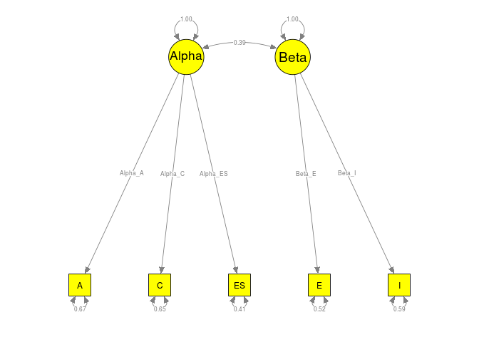

```r
## Plot the parameter estimates
semPaths(my.plot, whatLabels="est", nCharNodes=10, color="green")
```

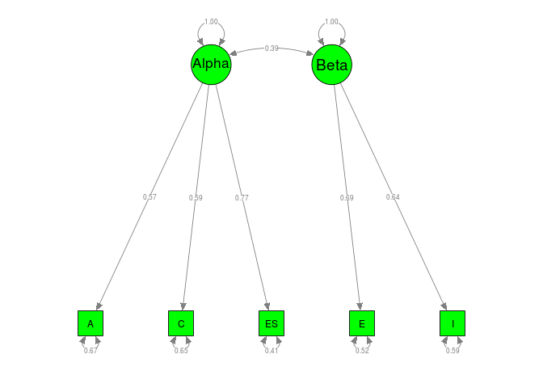

```r
###################################################
### code chunk number 20: Digman18
###################################################
## Alternative call: 
## Smatrix <- diag(random2$mx.fit@algebras$Smatrix@result)
## Sxtract and display the error variances
(Smatrix <- diag(mxEval(Smatrix, random2$mx.fit)))
```

```
## [1] 0.6721803 0.6517460 0.4066457 0.5193488 0.5903061 1.0000000 1.0000000
```

```r
## Calculate the R2 on the variables
1 - Smatrix
```

```
## [1] 0.3278197 0.3482540 0.5933543 0.4806512 0.4096939 0.0000000 0.0000000
```

## A regression model on SAT (Math)


```r
###################################################
### code chunk number 21: Becker1
###################################################
## Display the first two correlation matrices
Becker94$data[1:2]
```

```
## $`Becker (1978) Females`
##              SAT (Math) Spatial SAT (Verbal)
## SAT (Math)         1.00    0.47        -0.21
## Spatial            0.47    1.00        -0.15
## SAT (Verbal)      -0.21   -0.15         1.00
## 
## $`Becker (1978) Males`
##              SAT (Math) Spatial SAT (Verbal)
## SAT (Math)         1.00    0.28         0.19
## Spatial            0.28    1.00         0.18
## SAT (Verbal)       0.19    0.18         1.00
```

```r
## Display the first two sample sizes
Becker94$n[1:2]
```

```
## [1]  74 153
```

```r
## Display the first two sample types
Becker94$gender[1:2]
```

```
## [1] "Females" "Males"
```

```r
###################################################
### code chunk number 22: Becker2 
###################################################
fixed1 <- tssem1(Becker94$data, Becker94$n, method="FEM")
summary(fixed1)
```

```
## 
## Call:
## tssem1FEM(my.df = my.df, n = n, cor.analysis = cor.analysis, 
##     model.name = model.name, cluster = cluster, suppressWarnings = suppressWarnings, 
##     silent = silent, run = run)
## 
## Coefficients:
##        Estimate Std.Error z value  Pr(>|z|)    
## S[1,2] 0.379961  0.037124 10.2350 < 2.2e-16 ***
## S[1,3] 0.334562  0.039947  8.3751 < 2.2e-16 ***
## S[2,3] 0.176461  0.042334  4.1683 3.069e-05 ***
## ---
## Signif. codes:  0 '***' 0.001 '**' 0.01 '*' 0.05 '.' 0.1 ' ' 1
## 
## Goodness-of-fit indices:
##                                      Value
## Sample size                       538.0000
## Chi-square of target model         63.6553
## DF of target model                 27.0000
## p value of target model             0.0001
## Chi-square of independence model  207.7894
## DF of independence model           30.0000
## RMSEA                               0.1590
## RMSEA lower 95% CI                  0.1096
## RMSEA upper 95% CI                  0.2117
## SRMR                                0.1586
## TLI                                 0.7709
## CFI                                 0.7938
## AIC                                 9.6553
## BIC                              -106.1169
## OpenMx status1: 0 ("0" or "1": The optimization is considered fine.
## Other values may indicate problems.)
```

```r
###################################################
### code chunk number 24: Becker4
###################################################
## Fixed-effects TSSEM with two clusters
fixed.cluster <- tssem1(Becker94$data, Becker94$n, method="FEM", 
                        cluster=Becker94$gender)
summary(fixed.cluster)
```

```
## $Females
## 
## Call:
## tssem1FEM(my.df = data.cluster[[i]], n = n.cluster[[i]], cor.analysis = cor.analysis, 
##     model.name = model.name, suppressWarnings = suppressWarnings)
## 
## Coefficients:
##        Estimate Std.Error z value  Pr(>|z|)    
## S[1,2] 0.455896  0.051992  8.7685 < 2.2e-16 ***
## S[1,3] 0.341583  0.061943  5.5144 3.499e-08 ***
## S[2,3] 0.171931  0.064731  2.6561  0.007905 ** 
## ---
## Signif. codes:  0 '***' 0.001 '**' 0.01 '*' 0.05 '.' 0.1 ' ' 1
## 
## Goodness-of-fit indices:
##                                     Value
## Sample size                      235.0000
## Chi-square of target model        43.1898
## DF of target model                12.0000
## p value of target model            0.0000
## Chi-square of independence model 123.4399
## DF of independence model          15.0000
## RMSEA                              0.2357
## RMSEA lower 95% CI                 0.1637
## RMSEA upper 95% CI                 0.3161
## SRMR                               0.2141
## TLI                                0.6405
## CFI                                0.7124
## AIC                               19.1898
## BIC                              -22.3252
## OpenMx status1: 0 ("0" or "1": The optimization is considered fine.
## Other values may indicate problems.)
## 
## $Males
## 
## Call:
## tssem1FEM(my.df = data.cluster[[i]], n = n.cluster[[i]], cor.analysis = cor.analysis, 
##     model.name = model.name, suppressWarnings = suppressWarnings)
## 
## Coefficients:
##        Estimate Std.Error z value  Pr(>|z|)    
## S[1,2] 0.318051  0.051698  6.1521 7.646e-10 ***
## S[1,3] 0.328286  0.052226  6.2859 3.261e-10 ***
## S[2,3] 0.179549  0.055944  3.2094   0.00133 ** 
## ---
## Signif. codes:  0 '***' 0.001 '**' 0.01 '*' 0.05 '.' 0.1 ' ' 1
## 
## Goodness-of-fit indices:
##                                     Value
## Sample size                      303.0000
## Chi-square of target model        16.4819
## DF of target model                12.0000
## p value of target model            0.1701
## Chi-square of independence model  84.3496
## DF of independence model          15.0000
## RMSEA                              0.0786
## RMSEA lower 95% CI                 0.0000
## RMSEA upper 95% CI                 0.1643
## SRMR                               0.1025
## TLI                                0.9192
## CFI                                0.9354
## AIC                               -7.5181
## BIC                              -52.0829
## OpenMx status1: 0 ("0" or "1": The optimization is considered fine.
## Other values may indicate problems.)
```

```r
###################################################
### code chunk number 26: Becker6 (eval = FALSE)
###################################################
## ## Random-effects TSSEM
## ## The OpenMx status was 6.
## random1 <- tssem1(Becker94$data, Becker94$n, method="REM")
## summary(random1)


###################################################
### code chunk number 27: Becker7 
###################################################
## Random-effects TSSEM with random effects on the diagonals
random1 <- tssem1(Becker94$data, Becker94$n, method="REM",
                  RE.type="Diag")
summary(random1)
```

```
## 
## Call:
## meta(y = ES, v = acovR, RE.constraints = Diag(x = paste(RE.startvalues, 
##     "*Tau2_", 1:no.es, "_", 1:no.es, sep = "")), RE.lbound = RE.lbound, 
##     I2 = I2, model.name = model.name, suppressWarnings = TRUE, 
##     silent = silent, run = run)
## 
## 95% confidence intervals: z statistic approximation
## Coefficients:
##               Estimate   Std.Error      lbound      ubound z value
## Intercept1  3.7179e-01  3.6499e-02  3.0025e-01  4.4333e-01 10.1863
## Intercept2  4.3173e-01  7.7452e-02  2.7993e-01  5.8354e-01  5.5742
## Intercept3  2.0412e-01  4.6874e-02  1.1224e-01  2.9599e-01  4.3545
## Tau2_1_1    1.0000e-10  4.7098e-03 -9.2310e-03  9.2310e-03  0.0000
## Tau2_2_2    4.8060e-02  2.6340e-02 -3.5651e-03  9.9685e-02  1.8246
## Tau2_3_3    5.8429e-03  9.8463e-03 -1.3455e-02  2.5141e-02  0.5934
##             Pr(>|z|)    
## Intercept1 < 2.2e-16 ***
## Intercept2 2.486e-08 ***
## Intercept3 1.333e-05 ***
## Tau2_1_1     1.00000    
## Tau2_2_2     0.06806 .  
## Tau2_3_3     0.55290    
## ---
## Signif. codes:  0 '***' 0.001 '**' 0.01 '*' 0.05 '.' 0.1 ' ' 1
## 
## Q statistic on the homogeneity of effect sizes: 83.65853
## Degrees of freedom of the Q statistic: 27
## P value of the Q statistic: 1.041317e-07
## 
## Heterogeneity indices (based on the estimated Tau2):
##                              Estimate
## Intercept1: I2 (Q statistic)    0.000
## Intercept2: I2 (Q statistic)    0.811
## Intercept3: I2 (Q statistic)    0.254
## 
## Number of studies (or clusters): 10
## Number of observed statistics: 30
## Number of estimated parameters: 6
## Degrees of freedom: 24
## -2 log likelihood: -23.66611 
## OpenMx status1: 0 ("0" or "1": The optimization is considered fine.
## Other values may indicate problems.)
```

```r
###################################################
### code chunk number 29: Becker9
###################################################
vec2symMat( coef(random1, select="fixed"), diag=FALSE )
```

```
##           [,1]      [,2]      [,3]
## [1,] 1.0000000 0.3717905 0.4317340
## [2,] 0.3717905 1.0000000 0.2041152
## [3,] 0.4317340 0.2041152 1.0000000
```

```r
###################################################
### code chunk number 30: Becker9
###################################################
## Arrange the data by row
A2 <- create.mxMatrix(c(0, "0.2*Spatial2Math", "0.2*Verbal2Math",
                        0, 0, 0,
                        0, 0, 0), 
                      type="Full", nrow=3, ncol=3, 
                      byrow=TRUE, name="A2")
A2
```

```
## FullMatrix 'A2' 
## 
## $labels
##      [,1] [,2]           [,3]         
## [1,] NA   "Spatial2Math" "Verbal2Math"
## [2,] NA   NA             NA           
## [3,] NA   NA             NA           
## 
## $values
##      [,1] [,2] [,3]
## [1,]    0  0.2  0.2
## [2,]    0  0.0  0.0
## [3,]    0  0.0  0.0
## 
## $free
##       [,1]  [,2]  [,3]
## [1,] FALSE  TRUE  TRUE
## [2,] FALSE FALSE FALSE
## [3,] FALSE FALSE FALSE
## 
## $lbound: No lower bounds assigned.
## 
## $ubound: No upper bounds assigned.
```

```r
## Only the elements in the lower triangle are required
S2 <- create.mxMatrix(c("0.2*ErrVarMath",
                        0,1,
                        0,"0.2*CorMathVerbal",1),
                       type="Symm", byrow=TRUE, name="S2")
S2
```

```
## SymmMatrix 'S2' 
## 
## $labels
##      [,1]         [,2]            [,3]           
## [1,] "ErrVarMath" NA              NA             
## [2,] NA           NA              "CorMathVerbal"
## [3,] NA           "CorMathVerbal" NA             
## 
## $values
##      [,1] [,2] [,3]
## [1,]  0.2  0.0  0.0
## [2,]  0.0  1.0  0.2
## [3,]  0.0  0.2  1.0
## 
## $free
##       [,1]  [,2]  [,3]
## [1,]  TRUE FALSE FALSE
## [2,] FALSE FALSE  TRUE
## [3,] FALSE  TRUE FALSE
## 
## $lbound: No lower bounds assigned.
## 
## $ubound: No upper bounds assigned.
```

```r
###################################################
### code chunk number 31: Becker10 
###################################################
random2 <- tssem2(random1, Amatrix=A2, Smatrix=S2,  
                  diag.constraints=FALSE)
summary(random2)
```

```
## 
## Call:
## wls(Cov = pooledS, asyCov = asyCov, n = tssem1.obj$total.n, Amatrix = Amatrix, 
##     Smatrix = Smatrix, Fmatrix = Fmatrix, diag.constraints = diag.constraints, 
##     cor.analysis = cor.analysis, intervals.type = intervals.type, 
##     mx.algebras = mx.algebras, model.name = model.name, suppressWarnings = suppressWarnings, 
##     silent = silent, run = run)
## 
## 95% confidence intervals: z statistic approximation
## Coefficients:
##               Estimate Std.Error   lbound   ubound z value  Pr(>|z|)    
## Spatial2Math  0.295999  0.040243 0.217124 0.374875  7.3552 1.907e-13 ***
## Verbal2Math   0.371316  0.080805 0.212942 0.529690  4.5952 4.323e-06 ***
## CorMathVerbal 0.204115  0.046874 0.112244 0.295987  4.3545 1.333e-05 ***
## ---
## Signif. codes:  0 '***' 0.001 '**' 0.01 '*' 0.05 '.' 0.1 ' ' 1
## 
## Goodness-of-fit indices:
##                                             Value
## Sample size                                538.00
## Chi-square of target model                   0.00
## DF of target model                           0.00
## p value of target model                      0.00
## Number of constraints imposed on "Smatrix"   0.00
## DF manually adjusted                         0.00
## Chi-square of independence model           132.21
## DF of independence model                     3.00
## RMSEA                                        0.00
## RMSEA lower 95% CI                           0.00
## RMSEA upper 95% CI                           0.00
## SRMR                                         0.00
## TLI                                          -Inf
## CFI                                          1.00
## AIC                                          0.00
## BIC                                          0.00
## OpenMx status1: 0 ("0" or "1": The optimization is considered fine.
## Other values indicate problems.)
```


```r
## Load the library to plot the model
library("semPlot")

## Convert the model to semPlotModel object
my.plot <- meta2semPlot(random2)

## Plot the model with labels
semPaths(my.plot, whatLabels="path", nCharEdges=10, nCharNodes=10, color="yellow")
```

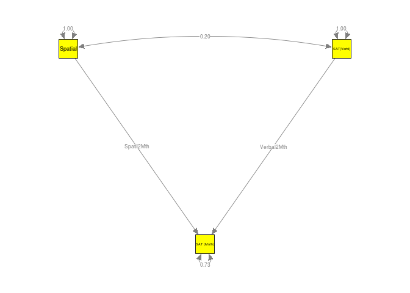

```r
## Plot the parameter estimates
semPaths(my.plot, whatLabels="est", nCharNodes=10, color="green")
```

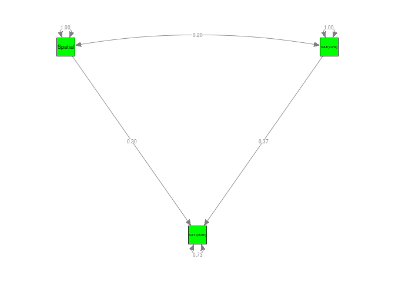

```r
###################################################
### code chunk number 33: Becker12
###################################################
## Display the content of the Smatrix
mxEval(Smatrix, random2$mx.fit)
```

```
##           [,1]      [,2]      [,3]
## [1,] 0.7296405 0.0000000 0.0000000
## [2,] 0.0000000 1.0000000 0.2041152
## [3,] 0.0000000 0.2041152 1.0000000
```

```r
## Error variance on SAT (Math)
## Select the element [1,1] correspondent to SAT (Math)
(Smatrix <- mxEval(Smatrix, random2$mx.fit)[1,1])
```

```
## [1] 0.7296405
```

```r
## R2 on SAT (Math)
1 - Smatrix
```

```
## [1] 0.2703595
```

## A path model for cognitive ability to supervisor rating


```r
###################################################
### code chunk number 35: Hunter1a
###################################################
## Display the correlation matrices
Hunter83$data[1:2]
```

```
## $`Campbell et al. (1973)`
##             Ability Knowledge Work sample Supervisor
## Ability        1.00      0.65        0.48       0.33
## Knowledge      0.65      1.00        0.52       0.40
## Work sample    0.48      0.52        1.00       0.23
## Supervisor     0.33      0.40        0.23       1.00
## 
## $`Corts et al. (1977)`
##             Ability Knowledge Work sample Supervisor
## Ability        1.00      0.53        0.50       0.03
## Knowledge      0.53      1.00        0.49       0.04
## Work sample    0.50      0.49        1.00       0.18
## Supervisor     0.03      0.04        0.18       1.00
```

```r
## Display the sample sizes
Hunter83$n[1:2]
```

```
## [1] 443 186
```

```r
## Show the missing data: show.na=TRUE
## Show the present data: show.na=FALSE
pattern.na(Hunter83$data, show.na=FALSE)
```

```
##             Ability Knowledge Work sample Supervisor
## Ability          13        11          11         12
## Knowledge        11        12          10         11
## Work sample      11        10          12         11
## Supervisor       12        11          11         13
```

```r
###################################################
### code chunk number 36: Hunter1b
###################################################
## Display the accumulative sample sizes for each correlation
pattern.n(Hunter83$data, Hunter83$n)
```

```
##             Ability Knowledge Work sample Supervisor
## Ability        3815      3372        3281       3605
## Knowledge      3372      3532        2998       3322
## Work sample    3281      2998        3441       3231
## Supervisor     3605      3322        3231       3765
```

```r
###################################################
### code chunk number 37: Hunter1c
###################################################
is.pd(Hunter83$data)
```

```
##      Campbell et al. (1973)         Corts et al. (1977) 
##                        TRUE                        TRUE 
## O'Leary and Trattner (1977)      Trattner rt al. (1977) 
##                        TRUE                        TRUE 
##  Vineberg and Taylor (1972)  Vineberg and Taylor (1972) 
##                        TRUE                        TRUE 
##  Vineberg and Taylor (1972)  Vineberg and Taylor (1972) 
##                        TRUE                        TRUE 
##       Campell et al. (1973)              Drauden (1978) 
##                        TRUE                        TRUE 
##      Campbell et al. (1973)        Boyles et al. (19??) 
##                        TRUE                        TRUE 
##               Schoon (1979)   van Rijn and Payne (1980) 
##                        TRUE                        TRUE
```

```r
###################################################
### code chunk number 38: Hunter2 
###################################################
fixed1 <- tssem1(Hunter83$data, Hunter83$n, method="FEM")
summary(fixed1)
```

```
## 
## Call:
## tssem1FEM(my.df = my.df, n = n, cor.analysis = cor.analysis, 
##     model.name = model.name, cluster = cluster, suppressWarnings = suppressWarnings, 
##     silent = silent, run = run)
## 
## Coefficients:
##        Estimate Std.Error z value  Pr(>|z|)    
## S[1,2] 0.510487  0.012703  40.186 < 2.2e-16 ***
## S[1,3] 0.427086  0.014082  30.327 < 2.2e-16 ***
## S[1,4] 0.207713  0.015931  13.038 < 2.2e-16 ***
## S[2,3] 0.522965  0.013112  39.886 < 2.2e-16 ***
## S[2,4] 0.284562  0.015769  18.045 < 2.2e-16 ***
## S[3,4] 0.243256  0.016267  14.954 < 2.2e-16 ***
## ---
## Signif. codes:  0 '***' 0.001 '**' 0.01 '*' 0.05 '.' 0.1 ' ' 1
## 
## Goodness-of-fit indices:
##                                      Value
## Sample size                      3975.0000
## Chi-square of target model        264.3980
## DF of target model                 60.0000
## p value of target model             0.0000
## Chi-square of independence model 2777.2830
## DF of independence model           66.0000
## RMSEA                               0.1096
## RMSEA lower 95% CI                  0.0964
## RMSEA upper 95% CI                  0.1234
## SRMR                                0.0918
## TLI                                 0.9171
## CFI                                 0.9246
## AIC                               144.3980
## BIC                              -232.8688
## OpenMx status1: 0 ("0" or "1": The optimization is considered fine.
## Other values may indicate problems.)
```

```r
###################################################
### code chunk number 40: Hunter4 
###################################################
random1 <- tssem1(Hunter83$data, Hunter83$n, method="REM", 
                  RE.type="Diag")
summary(random1)
```

```
## 
## Call:
## meta(y = ES, v = acovR, RE.constraints = Diag(x = paste(RE.startvalues, 
##     "*Tau2_", 1:no.es, "_", 1:no.es, sep = "")), RE.lbound = RE.lbound, 
##     I2 = I2, model.name = model.name, suppressWarnings = TRUE, 
##     silent = silent, run = run)
## 
## 95% confidence intervals: z statistic approximation
## Coefficients:
##               Estimate   Std.Error      lbound      ubound z value
## Intercept1  5.0580e-01  2.7908e-02  4.5110e-01  5.6050e-01 18.1236
## Intercept2  4.4707e-01  2.4788e-02  3.9849e-01  4.9566e-01 18.0356
## Intercept3  2.1230e-01  2.5240e-02  1.6283e-01  2.6177e-01  8.4111
## Intercept4  5.3063e-01  3.4724e-02  4.6257e-01  5.9869e-01 15.2814
## Intercept5  2.5914e-01  3.9491e-02  1.8174e-01  3.3654e-01  6.5621
## Intercept6  2.4111e-01  1.6891e-02  2.0800e-01  2.7421e-01 14.2743
## Tau2_1_1    6.3866e-03  3.5311e-03 -5.3424e-04  1.3308e-02  1.8087
## Tau2_2_2    4.4668e-03  3.1161e-03 -1.6407e-03  1.0574e-02  1.4334
## Tau2_3_3    4.3270e-03  2.8257e-03 -1.2112e-03  9.8652e-03  1.5313
## Tau2_4_4    1.0239e-02  5.4017e-03 -3.4859e-04  2.0826e-02  1.8954
## Tau2_5_5    1.3871e-02  7.3026e-03 -4.4238e-04  2.8183e-02  1.8994
## Tau2_6_6    2.2831e-05  1.2588e-03 -2.4443e-03  2.4900e-03  0.0181
##             Pr(>|z|)    
## Intercept1 < 2.2e-16 ***
## Intercept2 < 2.2e-16 ***
## Intercept3 < 2.2e-16 ***
## Intercept4 < 2.2e-16 ***
## Intercept5 5.305e-11 ***
## Intercept6 < 2.2e-16 ***
## Tau2_1_1     0.07050 .  
## Tau2_2_2     0.15173    
## Tau2_3_3     0.12569    
## Tau2_4_4     0.05804 .  
## Tau2_5_5     0.05751 .  
## Tau2_6_6     0.98553    
## ---
## Signif. codes:  0 '***' 0.001 '**' 0.01 '*' 0.05 '.' 0.1 ' ' 1
## 
## Q statistic on the homogeneity of effect sizes: 315.8605
## Degrees of freedom of the Q statistic: 60
## P value of the Q statistic: 0
## 
## Heterogeneity indices (based on the estimated Tau2):
##                              Estimate
## Intercept1: I2 (Q statistic)   0.7571
## Intercept2: I2 (Q statistic)   0.6463
## Intercept3: I2 (Q statistic)   0.5725
## Intercept4: I2 (Q statistic)   0.8354
## Intercept5: I2 (Q statistic)   0.8203
## Intercept6: I2 (Q statistic)   0.0070
## 
## Number of studies (or clusters): 14
## Number of observed statistics: 66
## Number of estimated parameters: 12
## Degrees of freedom: 54
## -2 log likelihood: -126.2826 
## OpenMx status1: 0 ("0" or "1": The optimization is considered fine.
## Other values may indicate problems.)
```

```r
###################################################
### code chunk number 42: Hunter6
###################################################
vec2symMat( coef(random1, select="fixed"), diag=FALSE)
```

```
##           [,1]      [,2]      [,3]      [,4]
## [1,] 1.0000000 0.5057978 0.4470731 0.2122977
## [2,] 0.5057978 1.0000000 0.5306289 0.2591422
## [3,] 0.4470731 0.5306289 1.0000000 0.2411076
## [4,] 0.2122977 0.2591422 0.2411076 1.0000000
```

```r
###################################################
### code chunk number 43: Hunter7
###################################################
## Arrange the elements by row
## Variables are arranged as: 
## Ability, Job knowledge, Work sample and Supervisor rating
(A3 <- create.mxMatrix(c(0, 0, 0, 0,
                         "0.1*A2J", 0, 0, 0,
                         "0.1*A2W", "0.1*J2W", 0, 0,
                         0, "0.1*J2S", "0.1*W2S", 0),
                        type="Full", nrow=4, ncol=4, byrow=TRUE))
```

```
## FullMatrix 'untitled1' 
## 
## $labels
##      [,1]  [,2]  [,3]  [,4]
## [1,] NA    NA    NA    NA  
## [2,] "A2J" NA    NA    NA  
## [3,] "A2W" "J2W" NA    NA  
## [4,] NA    "J2S" "W2S" NA  
## 
## $values
##      [,1] [,2] [,3] [,4]
## [1,]  0.0  0.0  0.0    0
## [2,]  0.1  0.0  0.0    0
## [3,]  0.1  0.1  0.0    0
## [4,]  0.0  0.1  0.1    0
## 
## $free
##       [,1]  [,2]  [,3]  [,4]
## [1,] FALSE FALSE FALSE FALSE
## [2,]  TRUE FALSE FALSE FALSE
## [3,]  TRUE  TRUE FALSE FALSE
## [4,] FALSE  TRUE  TRUE FALSE
## 
## $lbound: No lower bounds assigned.
## 
## $ubound: No upper bounds assigned.
```

```r
(S3 <- create.mxMatrix(c(1,"0.1*ErrVarJ", 
                        "0.1*ErrVarW", "0.1*ErrVarS"), 
                        type="Diag"))
```

```
## DiagMatrix 'untitled34' 
## 
## $labels
##      [,1] [,2]      [,3]      [,4]     
## [1,] NA   NA        NA        NA       
## [2,] NA   "ErrVarJ" NA        NA       
## [3,] NA   NA        "ErrVarW" NA       
## [4,] NA   NA        NA        "ErrVarS"
## 
## $values
##      [,1] [,2] [,3] [,4]
## [1,]    1  0.0  0.0  0.0
## [2,]    0  0.1  0.0  0.0
## [3,]    0  0.0  0.1  0.0
## [4,]    0  0.0  0.0  0.1
## 
## $free
##       [,1]  [,2]  [,3]  [,4]
## [1,] FALSE FALSE FALSE FALSE
## [2,] FALSE  TRUE FALSE FALSE
## [3,] FALSE FALSE  TRUE FALSE
## [4,] FALSE FALSE FALSE  TRUE
## 
## $lbound: No lower bounds assigned.
## 
## $ubound: No upper bounds assigned.
```

```r
###################################################
### code chunk number 44: Hunter8 
###################################################
random2 <- tssem2(random1, Amatrix=A3, Smatrix=S3, 
                  intervals.type="LB", 
                  diag.constraints=TRUE, mx.algebras=list(Ind=mxAlgebra(A2J*J2S+A2J*J2W*W2S+A2W*W2S, 
                 name="Ind")))
summary(random2)
```

```
## 
## Call:
## wls(Cov = pooledS, asyCov = asyCov, n = tssem1.obj$total.n, Amatrix = Amatrix, 
##     Smatrix = Smatrix, Fmatrix = Fmatrix, diag.constraints = diag.constraints, 
##     cor.analysis = cor.analysis, intervals.type = intervals.type, 
##     mx.algebras = mx.algebras, model.name = model.name, suppressWarnings = suppressWarnings, 
##     silent = silent, run = run)
## 
## 95% confidence intervals: Likelihood-based statistic
## Coefficients:
##            Estimate Std.Error      lbound      ubound z value Pr(>|z|)
## A2J      6.4861e-01        NA  6.4783e-02  9.6160e-01      NA       NA
## A2W     -8.5603e-02        NA -2.1184e+00 -8.5603e-02      NA       NA
## J2W      1.1538e+00        NA -1.0650e+00  2.6873e+00      NA       NA
## J2S     -1.8253e+00        NA          NA          NA      NA       NA
## W2S      1.8892e+00        NA          NA          NA      NA       NA
## ErrVarJ  4.4767e-01        NA  7.3550e-02  9.9580e-01      NA       NA
## ErrVarW  3.9249e-04        NA -3.1291e-01  9.7555e-01      NA       NA
## ErrVarS  1.0561e+00        NA -2.5014e+02          NA      NA       NA
## 
## mxAlgebras objects (and their 95% likelihood-based CIs):
##              lbound   Estimate    ubound
## Ind[1,1] -0.0963326 0.06816185 0.4402443
## 
## Goodness-of-fit indices:
##                                                Value
## Sample size                                3975.0000
## Chi-square of target model                  265.2085
## DF of target model                            1.0000
## p value of target model                       0.0000
## Number of constraints imposed on "Smatrix"    3.0000
## DF manually adjusted                          0.0000
## Chi-square of independence model            937.5538
## DF of independence model                      6.0000
## RMSEA                                         0.2578
## RMSEA lower 95% CI                            0.2322
## RMSEA upper 95% CI                            0.2844
## SRMR                                          0.2097
## TLI                                          -0.7017
## CFI                                           0.7164
## AIC                                         263.2085
## BIC                                         256.9208
## OpenMx status1: 6 ("0" or "1": The optimization is considered fine.
## Other values indicate problems.)
```


```r
## Load the library
library("semPlot")

## Convert the model to semPlotModel object
my.plot <- meta2semPlot(random2)

## Plot the model with labels
semPaths(my.plot, whatLabels="path", nCharEdges=10, nCharNodes=10, color="yellow")
```

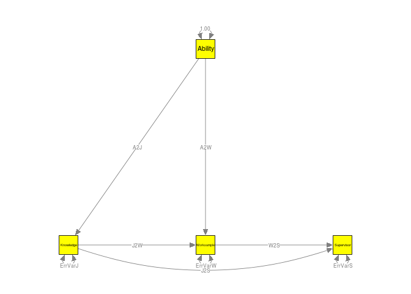

```r
## Plot the parameter estimates
semPaths(my.plot, whatLabels="est", nCharNodes=10, color="green")
```

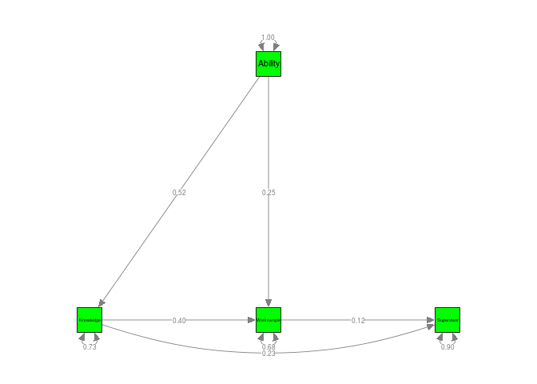

# Chapter 8: Advanced Topics in SEM-Based Meta-Analysis

## Restricted (or residual) maximum likelihood estimation


```r
###################################################
### code chunk number 2: Jaramillo1 
###################################################

## Request LBCI: intervals.type="LB"
summary( jaramillo1 <- reml(y=r, v=r_v, intervals.type="LB", 
                            data=Jaramillo05) )
```

```
## 
## Call:
## reml(y = r, v = r_v, data = Jaramillo05, intervals.type = "LB")
## 
## 95% confidence intervals: Likelihood-based statistic
## Coefficients:
##          Estimate Std.Error   lbound   ubound z value Pr(>|z|)
## Tau2_1_1 0.017427        NA 0.010833 0.028119      NA       NA
## 
## Number of studies (or clusters): 61
## Number of observed statistics: 60
## Number of estimated parameters: 1
## Degrees of freedom: 59
## -2 log likelihood: -159.6691 
## OpenMx status1: 0 ("0" or "1": The optimization is considered fine.
## Other values may indicate problems.)
```

```r
###################################################
### code chunk number 4: Jaramillo3 
###################################################
summary( meta(y=r, v=r_v, data=Jaramillo05,
              RE.constraints=coef(jaramillo1)) )
```

```
## 
## Call:
## meta(y = r, v = r_v, data = Jaramillo05, RE.constraints = coef(jaramillo1))
## 
## 95% confidence intervals: z statistic approximation
## Coefficients:
##            Estimate Std.Error   lbound   ubound z value  Pr(>|z|)    
## Intercept1 0.186592  0.019499 0.148375 0.224809  9.5694 < 2.2e-16 ***
## ---
## Signif. codes:  0 '***' 0.001 '**' 0.01 '*' 0.05 '.' 0.1 ' ' 1
## 
## Q statistic on the homogeneity of effect sizes: 339.3886
## Degrees of freedom of the Q statistic: 60
## P value of the Q statistic: 0
## 
## Heterogeneity indices (based on the estimated Tau2):
##                              Estimate
## Intercept1: I2 (Q statistic)   0.8178
## 
## Number of studies (or clusters): 61
## Number of observed statistics: 61
## Number of estimated parameters: 1
## Degrees of freedom: 60
## -2 log likelihood: -55.43342 
## OpenMx status1: 0 ("0" or "1": The optimization is considered fine.
## Other values may indicate problems.)
```

```r
###################################################
### code chunk number 6: wvs1 
###################################################
summary( wvs1 <- reml(y=cbind(lifesat, lifecon),
                     v=cbind(lifesat_var, inter_cov, lifecon_var), 
                     data=wvs94a, RE.lbound=NA) )
```

```
## 
## Call:
## reml(y = cbind(lifesat, lifecon), v = cbind(lifesat_var, inter_cov, 
##     lifecon_var), data = wvs94a, RE.lbound = NA)
## 
## 95% confidence intervals: z statistic approximation
## Coefficients:
##            Estimate  Std.Error     lbound     ubound z value  Pr(>|z|)    
## Tau2_1_1 0.00493568 0.00183139 0.00134623 0.00852514  2.6950 0.0070378 ** 
## Tau2_2_1 0.00406008 0.00175105 0.00062809 0.00749207  2.3187 0.0204134 *  
## Tau2_2_2 0.00869419 0.00263087 0.00353779 0.01385059  3.3047 0.0009508 ***
## ---
## Signif. codes:  0 '***' 0.001 '**' 0.01 '*' 0.05 '.' 0.1 ' ' 1
## 
## Number of studies (or clusters): 42
## Number of observed statistics: 82
## Number of estimated parameters: 3
## Degrees of freedom: 79
## -2 log likelihood: -299.2656 
## OpenMx status1: 0 ("0" or "1": The optimization is considered fine.
## Other values may indicate problems.)
```

```r
###################################################
### code chunk number 8: wvs3
###################################################
## Extract the variance component of the random effects
( RE <- vec2symMat(coef(wvs1)) )
```

```
##             [,1]        [,2]
## [1,] 0.004935684 0.004060081
## [2,] 0.004060081 0.008694193
```

```r
###################################################
### code chunk number 9: wvs4 
###################################################
summary( meta(y=cbind(lifesat, lifecon),
              v=cbind(lifesat_var, inter_cov, lifecon_var),
              RE.constraints=RE, data=wvs94a) )    
```

```
## 
## Call:
## meta(y = cbind(lifesat, lifecon), v = cbind(lifesat_var, inter_cov, 
##     lifecon_var), data = wvs94a, RE.constraints = RE)
## 
## 95% confidence intervals: z statistic approximation
## Coefficients:
##              Estimate  Std.Error     lbound     ubound z value  Pr(>|z|)
## Intercept1  0.0012379  0.0140132 -0.0262274  0.0287033  0.0883    0.9296
## Intercept2  0.0688461  0.0170098  0.0355076  0.1021846  4.0474 5.178e-05
##               
## Intercept1    
## Intercept2 ***
## ---
## Signif. codes:  0 '***' 0.001 '**' 0.01 '*' 0.05 '.' 0.1 ' ' 1
## 
## Q statistic on the homogeneity of effect sizes: 250.0303
## Degrees of freedom of the Q statistic: 82
## P value of the Q statistic: 0
## 
## Heterogeneity indices (based on the estimated Tau2):
##                              Estimate
## Intercept1: I2 (Q statistic)   0.6231
## Intercept2: I2 (Q statistic)   0.7409
## 
## Number of studies (or clusters): 42
## Number of observed statistics: 84
## Number of estimated parameters: 2
## Degrees of freedom: 82
## -2 log likelihood: -161.896 
## OpenMx status1: 0 ("0" or "1": The optimization is considered fine.
## Other values may indicate problems.)
```

```r
###################################################
### code chunk number 11: Bornmann1 
###################################################
Bornmann1 <- reml3(y=logOR, v=v, cluster=Cluster, data=Bornmann07)

## The OpenMx status1 is 6. We rerun the model.
summary( Bornmann2 <- rerun(Bornmann1) )
```

```
## 
## Begin fit attempt 1 of at maximum 11 tries
```

```
## 
##  Lowest minimum so far:  -89.1038197463656
```

```
## 
## Solution found
```

```
## 
## Call:
## reml3(y = logOR, v = v, cluster = Cluster, data = Bornmann07)
## 
## 95% confidence intervals: z statistic approximation
## Coefficients:
##          Estimate  Std.Error     lbound     ubound z value Pr(>|z|)
## Tau2_2  0.0037528  0.0026831 -0.0015060  0.0090116  1.3987   0.1619
## Tau2_3  0.0160846  0.0104008 -0.0043005  0.0364698  1.5465   0.1220
## 
## Number of studies (or clusters): 66
## Number of observed statistics: 65
## Number of estimated parameters: 2
## Degrees of freedom: 63
## -2 log likelihood: -89.10382 
## OpenMx status1: 0 ("0" or "1": The optimization is considered fine.
## Other values may indicate problems.)
```

```r
###################################################
### code chunk number 13: Bornmann3
###################################################
## Extract the level-2 and level-3 heterogeneity variances
( RE <- coef(Bornmann2) )
```

```
##      Tau2_2      Tau2_3 
## 0.003752792 0.016084641
```

```r
###################################################
### code chunk number 14: Bornmann4 
###################################################
summary(meta3(y=logOR, v=v, cluster=Cluster, data=Bornmann07, 
              RE2.constraints=RE[1], RE3.constraints=RE[2]))
```

```
## 
## Call:
## meta3(y = logOR, v = v, cluster = Cluster, data = Bornmann07, 
##     RE2.constraints = RE[1], RE3.constraints = RE[2])
## 
## 95% confidence intervals: z statistic approximation
## Coefficients:
##            Estimate Std.Error    lbound    ubound z value Pr(>|z|)  
## Intercept -0.100987  0.041737 -0.182790 -0.019185 -2.4196  0.01554 *
## ---
## Signif. codes:  0 '***' 0.001 '**' 0.01 '*' 0.05 '.' 0.1 ' ' 1
## 
## Q statistic on the homogeneity of effect sizes: 221.2809
## Degrees of freedom of the Q statistic: 65
## P value of the Q statistic: 0
## 
## Heterogeneity indices (based on the estimated Tau2):
##                               Estimate
## I2_2 (Typical v: Q statistic)   0.1437
## I2_3 (Typical v: Q statistic)   0.6160
## 
## Number of studies (or clusters): 21
## Number of observed statistics: 66
## Number of estimated parameters: 1
## Degrees of freedom: 65
## -2 log likelihood: 25.84332 
## OpenMx status1: 0 ("0" or "1": The optimization is considered fine.
## Other values may indicate problems.)
```

## Missing values in the moderators


```r
###################################################
### code chunk number 16: Jaramillo11
###################################################

## Set seed for replication
set.seed(1000000)

## Create a copy of data
my.df1 <- Jaramillo05[, c("r", "r_v", "IDV")]

## Create 20 missing values out of 61 studies with MCAR
my.df1$IDV[sample(1:61, 20)] <- NA

## Center the moderator
my.df1$IDV <- scale(my.df1$IDV, scale=FALSE)

my.df1$IDV
```

```
##             [,1]
##  [1,] -33.878049
##  [2,]         NA
##  [3,]   9.121951
##  [4,] -14.878049
##  [5,]   9.121951
##  [6,]   9.121951
##  [7,]         NA
##  [8,] -28.878049
##  [9,]   9.121951
## [10,]         NA
## [11,]   9.121951
## [12,]         NA
## [13,] -35.878049
## [14,] -63.878049
## [15,]   9.121951
## [16,]   9.121951
## [17,]         NA
## [18,]   7.121951
## [19,]         NA
## [20,]         NA
## [21,]  -1.878049
## [22,]         NA
## [23,]   9.121951
## [24,]   9.121951
## [25,]         NA
## [26,]   9.121951
## [27,]   9.121951
## [28,]         NA
## [29,]         NA
## [30,]         NA
## [31,] -61.878049
## [32,]         NA
## [33,]   9.121951
## [34,]   8.121951
## [35,]   9.121951
## [36,]         NA
## [37,]   9.121951
## [38,]         NA
## [39,]  -1.878049
## [40,]   9.121951
## [41,]   9.121951
## [42,]   7.121951
## [43,]   9.121951
## [44,]   9.121951
## [45,]   9.121951
## [46,]   9.121951
## [47,]   9.121951
## [48,]   9.121951
## [49,]   9.121951
## [50,]   9.121951
## [51,]         NA
## [52,]   9.121951
## [53,]   9.121951
## [54,]         NA
## [55,]   9.121951
## [56,]         NA
## [57,] -43.878049
## [58,]   9.121951
## [59,]         NA
## [60,]   9.121951
## [61,]         NA
## attr(,"scaled:center")
## [1] 81.87805
```

```r
###################################################
### code chunk number 17: Jaramillo12
###################################################
## ## Run the analysis by using the listwise deletion (the default)
summary( meta(y=r, v=r_v, x=IDV, data=my.df1) )
```

```
## 
## Call:
## meta(y = r, v = r_v, x = IDV, data = my.df1)
## 
## 95% confidence intervals: z statistic approximation
## Coefficients:
##               Estimate   Std.Error      lbound      ubound z value
## Intercept1  0.18084800  0.02431564  0.13319022  0.22850577  7.4375
## Slope1_1   -0.00170233  0.00120088 -0.00405600  0.00065134 -1.4176
## Tau2_1_1    0.01778873  0.00537321  0.00725742  0.02832003  3.3106
##             Pr(>|z|)    
## Intercept1 1.026e-13 ***
## Slope1_1   0.1563155    
## Tau2_1_1   0.0009309 ***
## ---
## Signif. codes:  0 '***' 0.001 '**' 0.01 '*' 0.05 '.' 0.1 ' ' 1
## 
## Q statistic on the homogeneity of effect sizes: 245.1197
## Degrees of freedom of the Q statistic: 40
## P value of the Q statistic: 0
## 
## Explained variances (R2):
##                            y1
## Tau2 (no predictor)    0.0170
## Tau2 (with predictors) 0.0178
## R2                     0.0000
## 
## Number of studies (or clusters): 41
## Number of observed statistics: 41
## Number of estimated parameters: 3
## Degrees of freedom: 38
## -2 log likelihood: -34.79062 
## OpenMx status1: 0 ("0" or "1": The optimization is considered fine.
## Other values may indicate problems.)
```

```r
###################################################
### code chunk number 19: Jaramillo14
###################################################
## Create an A matrix for the asymmetric paths
A1 <- matrix(c(0,0,1,0,
               0,0,0,1,
               0,0,0,"0*Slope1_1",
               0,0,0,0), byrow=TRUE, ncol=4)

dimnames(A1) <- list(c("r","IDV","f","eta"), 
                     c("r","IDV","f", "eta"))
A1
```

```
##     r   IDV f   eta         
## r   "0" "0" "1" "0"         
## IDV "0" "0" "0" "1"         
## f   "0" "0" "0" "0*Slope1_1"
## eta "0" "0" "0" "0"
```

```r
###################################################
### code chunk number 20: Jaramillo15
###################################################
## Convert the A matrix into mxMatrix class
A1 <- as.mxMatrix(A1)

## Create an S matrix for the covariance matrix among variables
S1 <- mxMatrix("Symm", nrow=4, ncol=4, values=0, byrow=TRUE,
               free=c(FALSE,
                      FALSE, FALSE,
                      FALSE, FALSE, TRUE,
                      FALSE, FALSE, FALSE, TRUE),
               labels=c("data.r_v",
                      NA, NA,
                      NA, NA, "Tau2_1_1",
                      NA, NA, NA, "VarIDV"),
               name="S1")
S1@labels
```

```
##      [,1]       [,2] [,3]       [,4]    
## [1,] "data.r_v" NA   NA         NA      
## [2,] NA         NA   NA         NA      
## [3,] NA         NA   "Tau2_1_1" NA      
## [4,] NA         NA   NA         "VarIDV"
```

```r
###################################################
### code chunk number 21: Jaramillo16
###################################################
## Create an M matrix for the means
M1 <- matrix(c(0,0,"0*Intercept1","300*MeanIDV"), nrow=1)
dimnames(M1)[[2]] <- c("r","IDV","f","eta")
M1
```

```
##      r   IDV f              eta          
## [1,] "0" "0" "0*Intercept1" "300*MeanIDV"
```

```r
###################################################
### code chunk number 22: Jaramillo17
###################################################
M1 <- as.mxMatrix(M1)

## Create an F matrix to selecting the observed variables
F1 <- create.Fmatrix(c(1,1,0,0), name="F", as.mxMatrix=FALSE)
dimnames(F1) <- list(c("r","IDV"), c("r","IDV","f","eta"))
F1
```

```
##     r IDV f eta
## r   1   0 0   0
## IDV 0   1 0   0
```

```r
###################################################
### code chunk number 23: Jaramillo18
###################################################
F1 <- as.mxMatrix(F1)

## Create an mx model
uni.MCAR <- mxModel("MCAR",                      
                    mxData(my.df1, type="raw"),
                    A1, S1, F1, M1,
                    mxExpectationRAM("A1","S1","F1","M1", 
                                  dimnames=c("r","IDV","f","eta")),
                    mxFitFunctionML())


###################################################
### code chunk number 24: Jaramillo19 
###################################################
## Run the analysis
summary(mxRun(uni.MCAR))
```

```
## Running MCAR with 5 parameters
```

```
## Summary of MCAR 
##  
## free parameters:
##         name matrix row col      Estimate    Std.Error A
## 1   Slope1_1     A1   3   4  -0.001577785  0.001102654  
## 2   Tau2_1_1     S1   3   3   0.016008942  0.004029076  
## 3     VarIDV     S1   4   4 386.805740689 85.149655980  
## 4 Intercept1     M1   1   f   0.185984062  0.019106576  
## 5    MeanIDV     M1   1 eta  -0.134299513  3.052880690  
## 
## observed statistics:  102 
## estimated parameters:  5 
## degrees of freedom:  97 
## fit value ( -2lnL units ):  303.3621 
## number of observations:  61 
## Information Criteria: 
##       |  df Penalty  |  Parameters Penalty  |  Sample-Size Adjusted
## AIC:      109.36208               313.3621                       NA
## BIC:      -95.39269               323.9164                 308.1875
## To get additional fit indices, see help(mxRefModels)
## timestamp: 2016-04-08 21:50:15 
## Wall clock time (HH:MM:SS.hh): 00:00:00.23 
## optimizer:  SLSQP 
## OpenMx version number: 2.5.2 
## Need help?  See help(mxSummary)
```

```r
###################################################
### code chunk number 26: wvs11
###################################################
## Create a copy of the original data by excluding the country
my.df2 <- wvs94a[, -1]

## Center the predictor
my.df2$gnp <- scale(my.df2$gnp/10000, scale=FALSE)

## Create the matrix for regression coefficients
A2 <- matrix(c(0,0,0,1,0,0,
               0,0,0,0,1,0,
               0,0,0,0,0,1,
               0,0,0,0,0,"0*Slope1_1",
               0,0,0,0,0,"0*Slope2_1",
               0,0,0,0,0,0), byrow=TRUE, ncol=6)
dimnames(A2) <- list(c("lifesat","lifecon","gnp","f1","f2","eta"), 
                     c("lifesat","lifecon","gnp","f1","f2","eta"))

## Display the content of A2
A2
```

```
##         lifesat lifecon gnp f1  f2  eta         
## lifesat "0"     "0"     "0" "1" "0" "0"         
## lifecon "0"     "0"     "0" "0" "1" "0"         
## gnp     "0"     "0"     "0" "0" "0" "1"         
## f1      "0"     "0"     "0" "0" "0" "0*Slope1_1"
## f2      "0"     "0"     "0" "0" "0" "0*Slope2_1"
## eta     "0"     "0"     "0" "0" "0" "0"
```

```r
###################################################
### code chunk number 27: wvs12
###################################################
## Convert A2 into mxMatrix class
A2 <- as.mxMatrix(A2)

## Symmetric matrix for the variables
S2 <- mxMatrix("Symm", nrow=6, ncol=6, byrow=TRUE, values=0,
               free=c(FALSE,
                      FALSE,FALSE,
                      FALSE,FALSE,FALSE,
                      FALSE,FALSE,FALSE,TRUE,
                      FALSE,FALSE,FALSE,TRUE,TRUE,
                      FALSE,FALSE,FALSE,FALSE,FALSE,TRUE),
               labels=c("data.lifesat_var",
                        "data.inter_cov","data.lifecon_var",
                        NA,NA,NA,
                        NA,NA,NA,"Tau2_1_1",
                        NA,NA,NA,"Tau2_2_1","Tau2_2_2",
                        NA,NA,NA,NA,NA,"VarGNP"), 
               name="S2")
S2@labels
```

```
##      [,1]               [,2]               [,3] [,4]       [,5]      
## [1,] "data.lifesat_var" "data.inter_cov"   NA   NA         NA        
## [2,] "data.inter_cov"   "data.lifecon_var" NA   NA         NA        
## [3,] NA                 NA                 NA   NA         NA        
## [4,] NA                 NA                 NA   "Tau2_1_1" "Tau2_2_1"
## [5,] NA                 NA                 NA   "Tau2_2_1" "Tau2_2_2"
## [6,] NA                 NA                 NA   NA         NA        
##      [,6]    
## [1,] NA      
## [2,] NA      
## [3,] NA      
## [4,] NA      
## [5,] NA      
## [6,] "VarGNP"
```

```r
###################################################
### code chunk number 28: wvs13
###################################################
## Create the vector for means
M2 <- matrix(c(0,0,0,"0*Intercept1","0*Intercept2","0*MeanGNP"),
             nrow=1)
dimnames(M2)[[2]] <- c("lifesat","lifecon","gnp","f1","f2","eta")
M2
```

```
##      lifesat lifecon gnp f1             f2             eta        
## [1,] "0"     "0"     "0" "0*Intercept1" "0*Intercept2" "0*MeanGNP"
```

```r
###################################################
### code chunk number 29: wvs14
###################################################
M2 <- as.mxMatrix(M2)

## Create a selection matrix
F2 <- create.Fmatrix(c(1,1,1,0,0,0), name="F2", as.mxMatrix=FALSE)
dimnames(F2) <- list(c("lifesat","lifecon","gnp"), 
                     c("lifesat","lifecon","gnp","f1","f2","eta"))
F2
```

```
##         lifesat lifecon gnp f1 f2 eta
## lifesat       1       0   0  0  0   0
## lifecon       0       1   0  0  0   0
## gnp           0       0   1  0  0   0
```

```r
###################################################
### code chunk number 30: wvs15
###################################################
F2 <- as.mxMatrix(F2)

## Create a model
multi.MCAR <- mxModel("MCAR",                      
                      mxData(my.df2, type="raw"),
                      A2, S2, F2, M2,
                      mxExpectationRAM("A2","S2","F2","M2", 
                      dimnames=c("lifesat","lifecon","gnp",
                                 "f1","f2","eta")),
                      mxFitFunctionML())


###################################################
### code chunk number 31: wvs16 
###################################################
summary(mxRun(multi.MCAR))
```

```
## Running MCAR with 9 parameters
```

```
## Summary of MCAR 
##  
## free parameters:
##         name matrix row col     Estimate   Std.Error A
## 1   Slope1_1     A2   4   6 -0.022599520 0.014734191  
## 2   Slope2_1     A2   5   6 -0.035985759 0.017493599  
## 3   Tau2_1_1     S2   4   4  0.004311477 0.001653938  
## 4   Tau2_2_1     S2   4   5  0.003244233 0.001535503  
## 5   Tau2_2_2     S2   5   5  0.007247479 0.002298119  
## 6     VarGNP     S2   6   6  0.915137448 0.211776622  
## 7 Intercept1     M2   1  f1  0.001467334 0.013532403  
## 8 Intercept2     M2   1  f2  0.068945704 0.016057619  
## 9    MeanGNP     M2   1 eta  0.004476775 0.156339018  
## 
## observed statistics:  121 
## estimated parameters:  9 
## degrees of freedom:  112 
## fit value ( -2lnL units ):  -64.39937 
## number of observations:  42 
## Information Criteria: 
##       |  df Penalty  |  Parameters Penalty  |  Sample-Size Adjusted
## AIC:      -288.3994              -46.39937                       NA
## BIC:      -483.0184              -30.76034                -58.94415
## To get additional fit indices, see help(mxRefModels)
## timestamp: 2016-04-08 21:50:16 
## Wall clock time (HH:MM:SS.hh): 00:00:00.39 
## optimizer:  SLSQP 
## OpenMx version number: 2.5.2 
## Need help?  See help(mxSummary)
```

```r
###################################################
### code chunk number 33: Bornmann11
###################################################
## Set seed for replication
set.seed(1000000)

## Create a copy of Type
## "Fellowship": 1; "Grant": 0
Type_MCAR <- ifelse(Bornmann07$Type=="Fellowship", yes=1, no=0)

## Create 17 missing values out of 66 studies with MCAR
Type_MCAR[sample(1:66, 17)] <- NA
## Display the content
Type_MCAR
```

```
##  [1]  1 NA  1  1  1  1 NA  0  0  0 NA  0 NA  0  0  1  1 NA NA  1 NA  1  0
## [24] NA  1  0  1  1  1  1 NA  1 NA  1 NA NA  0  0 NA  0  0 NA  0  0  0  1
## [47]  1  1  0  0  1  0  1  0  0 NA  0 NA  0  0  0  0  0  0  0 NA
```

```r
###################################################
### code chunk number 34: Bornmann12 
###################################################
summary( meta3(y=logOR, v=v, cluster=Cluster, x=Type_MCAR, 
               data=Bornmann07) )
```

```
## 
## Call:
## meta3(y = logOR, v = v, cluster = Cluster, x = Type_MCAR, data = Bornmann07)
## 
## 95% confidence intervals: z statistic approximation
## Coefficients:
##              Estimate   Std.Error      lbound      ubound z value
## Intercept -0.00484542  0.03934429 -0.08195880  0.07226797 -0.1232
## Slope_1   -0.21090081  0.05346221 -0.31568482 -0.10611680 -3.9449
## Tau2_2     0.00446788  0.00549282 -0.00629784  0.01523361  0.8134
## Tau2_3     0.00092884  0.00336491 -0.00566625  0.00752394  0.2760
##            Pr(>|z|)    
## Intercept    0.9020    
## Slope_1   7.985e-05 ***
## Tau2_2       0.4160    
## Tau2_3       0.7825    
## ---
## Signif. codes:  0 '***' 0.001 '**' 0.01 '*' 0.05 '.' 0.1 ' ' 1
## 
## Q statistic on the homogeneity of effect sizes: 151.643
## Degrees of freedom of the Q statistic: 48
## P value of the Q statistic: 1.115552e-12
## 
## Explained variances (R2):
##                          Level 2 Level 3
## Tau2 (no predictor)    0.0042664  0.0145
## Tau2 (with predictors) 0.0044679  0.0009
## R2                     0.0000000  0.9361
## 
## Number of studies (or clusters): 20
## Number of observed statistics: 49
## Number of estimated parameters: 4
## Degrees of freedom: 45
## -2 log likelihood: 13.13954 
## OpenMx status1: 0 ("0" or "1": The optimization is considered fine.
## Other values may indicate problems.)
```

```r
###################################################
### code chunk number 36: Bornmann14 
###################################################
summary( meta3X(y=logOR, v=v, cluster=Cluster, x2=Type_MCAR, 
                data=Bornmann07) )
```

```
## 
## Call:
## meta3X(y = logOR, v = v, cluster = Cluster, x2 = Type_MCAR, data = Bornmann07)
## 
## 95% confidence intervals: z statistic approximation
## Coefficients:
##             Estimate  Std.Error     lbound     ubound z value Pr(>|z|)   
## Intercept -0.0106318  0.0397685 -0.0885766  0.0673131 -0.2673 0.789207   
## SlopeX2_1 -0.1753249  0.0582619 -0.2895162 -0.0611336 -3.0093 0.002619 **
## Tau2_2     0.0030338  0.0026839 -0.0022266  0.0082941  1.1304 0.258324   
## Tau2_3     0.0036839  0.0042817 -0.0047082  0.0120759  0.8604 0.389586   
## ---
## Signif. codes:  0 '***' 0.001 '**' 0.01 '*' 0.05 '.' 0.1 ' ' 1
## 
## Explained variances (R2):
##                          Level 2 Level 3
## Tau2 (no predictor)    0.0037965  0.0141
## Tau2 (with predictors) 0.0030338  0.0037
## R2                     0.2009069  0.7394
## 
## Number of studies (or clusters): 21
## Number of observed statistics: 115
## Number of estimated parameters: 7
## Degrees of freedom: 108
## -2 log likelihood: 49.76372 
## OpenMx status1: 0 ("0" or "1": The optimization is considered fine.
## Other values may indicate problems.)
```

# Chapter 9: Conducting Meta-Analysis with Mplus


## Data sets used in Mplus
* [Bornmann07](./Mplus/Bornmann07.dat)
* [Jaramillo05](./Mplus/Jaramillo05.dat)
* [wvs94a](./Mplus/wvs94a.dat)

## Univariate meta-analysis
[Univariate fixed-effects meta-analysis](./Mplus/uni_fixed.inp)
```
TITLE:  Fixed-effects model
DATA:   FILE IS Jaramillo05.dat;	
VARIABLE: NAMES id r r_v IDV OC_alpha JP_alpha;
        USEVARIABLES ARE r w2;  ! Use both r and w2 in the analysis
        MISSING ARE *;          ! Define missing values

DEFINE: w2 = SQRT(r_v**(-1));   ! Weight for transformation           
        r = w2*r;               ! Transformed r

MODEL:
        [r@0.0];                ! Intercept fixed at 0
        r@1.0;                  ! Error variance fixed at 1
        r ON w2;                ! Common effect estimate beta_F

OUTPUT: SAMPSTAT;
        CINTERVAL(symmetric);   ! Wald CI
```
[Mplus output file](./Mplus/uni_fixed.out)
```
Mplus VERSION 7.31 (Linux)
MUTHEN & MUTHEN
09/19/2015   5:11 PM

INPUT INSTRUCTIONS

  TITLE:  Fixed-effects model
  DATA:   FILE IS Jaramillo05.dat;	
  VARIABLE: NAMES id r r_v IDV OC_alpha JP_alpha;
          USEVARIABLES ARE r w2;  ! Use both r and w2 in the analysis
          MISSING ARE *;          ! Define missing values

  DEFINE: w2 = SQRT(r_v**(-1));   ! Weight for transformation
          r = w2*r;               ! Transformed r

  MODEL:
          [r@0.0];                ! Intercept fixed at 0
          r@1.0;                  ! Error variance fixed at 1
          r ON w2;                ! Common effect estimate beta_F

  OUTPUT: SAMPSTAT;
          CINTERVAL(symmetric);   ! Wald CI


INPUT READING TERMINATED NORMALLY


Fixed-effects model

SUMMARY OF ANALYSIS

Number of groups                                                 1
Number of observations                                          61

Number of dependent variables                                    1
Number of independent variables                                  1
Number of continuous latent variables                            0

Observed dependent variables

  Continuous
   R

Observed independent variables
   W2


Estimator                                                       ML
Information matrix                                        OBSERVED
Maximum number of iterations                                  1000
Convergence criterion                                    0.500D-04
Maximum number of steepest descent iterations                   20
Maximum number of iterations for H1                           2000
Convergence criterion for H1                             0.100D-03

Input data file(s)
  Jaramillo05.dat

Input data format  FREE


SUMMARY OF DATA

     Number of missing data patterns             1


COVARIANCE COVERAGE OF DATA

Minimum covariance coverage value   0.100

     PROPORTION OF DATA PRESENT

           Covariance Coverage
              R             W2
              ________      ________
 R              1.000
 W2             1.000         1.000


SAMPLE STATISTICS

     ESTIMATED SAMPLE STATISTICS

           Means
              R             W2
              ________      ________
      1         2.833        15.065

           Covariances
              R             W2
              ________      ________
 R              7.322
 W2             7.809        33.574

           Correlations
              R             W2
              ________      ________
 R              1.000
 W2             0.498         1.000

     MAXIMUM LOG-LIKELIHOOD VALUE FOR THE UNRESTRICTED (H1) MODEL IS -332.306


UNIVARIATE SAMPLE STATISTICS

     UNIVARIATE HIGHER-ORDER MOMENT DESCRIPTIVE STATISTICS

         Variable/         Mean/     Skewness/   Minimum/ % with                Percentiles
        Sample Size      Variance    Kurtosis    Maximum  Min/Max      20%/60%    40%/80%    Median

     R                     2.833       1.989      -1.114    1.64%       0.629      1.854      2.321
              61.000       7.322       6.934      15.860    1.64%       2.803      4.590
     W2                   15.065       1.050       6.505    1.64%      10.193     13.107     13.915
              61.000      33.574       1.295      35.244    1.64%      15.454     19.254


THE MODEL ESTIMATION TERMINATED NORMALLY


MODEL FIT INFORMATION

Number of Free Parameters                        1

Loglikelihood

          H0 Value                        -225.750
          H1 Value                        -138.581

Information Criteria

          Akaike (AIC)                     453.499
          Bayesian (BIC)                   455.610
          Sample-Size Adjusted BIC         452.464
            (n* = (n + 2) / 24)

Chi-Square Test of Model Fit

          Value                            174.337
          Degrees of Freedom                     2
          P-Value                           0.0000

RMSEA (Root Mean Square Error Of Approximation)

          Estimate                           1.189
          90 Percent C.I.                    1.043  1.341
          Probability RMSEA <= .05           0.000

CFI/TLI

          CFI                                0.000
          TLI                               -4.256

Chi-Square Test of Model Fit for the Baseline Model

          Value                             17.393
          Degrees of Freedom                     1
          P-Value                           0.0000

SRMR (Standardized Root Mean Square Residual)

          Value                              0.518


MODEL RESULTS

                                                    Two-Tailed
                    Estimate       S.E.  Est./S.E.    P-Value

 R        ON
    W2                 0.194      0.008     24.428      0.000

 Intercepts
    R                  0.000      0.000    999.000    999.000

 Residual Variances
    R                  1.000      0.000    999.000    999.000


QUALITY OF NUMERICAL RESULTS

     Condition Number for the Information Matrix              0.100E+01
       (ratio of smallest to largest eigenvalue)


CONFIDENCE INTERVALS OF MODEL RESULTS

                  Lower .5%  Lower 2.5%    Lower 5%    Estimate    Upper 5%  Upper 2.5%   Upper .5%

 R        ON
    W2               0.173       0.178       0.181       0.194       0.207       0.209       0.214

 Intercepts
    R                0.000       0.000       0.000       0.000       0.000       0.000       0.000

 Residual Variances
    R                1.000       1.000       1.000       1.000       1.000       1.000       1.000

     Beginning Time:  17:11:40
        Ending Time:  17:11:40
       Elapsed Time:  00:00:00


MUTHEN & MUTHEN
3463 Stoner Ave.
Los Angeles, CA  90066

Tel: (310) 391-9971
Fax: (310) 391-8971
Web: www.StatModel.com
Support: Support@StatModel.com

Copyright (c) 1998-2015 Muthen & Muthen
```
[Univariate random-effects meta-analysis (single level approach)](./Mplus/uni_rand1.inp)
```
TITLE:  Random-effects model: Single level approach
DATA:   FILE IS Jaramillo05.dat;	
VARIABLE: NAMES id r r_v IDV OC_alpha JP_alpha;
        USEVARIABLES ARE r w2;  ! Use both r and w2 in the analysis
        MISSING ARE *;

DEFINE: w2 = SQRT(r_v**(-1));   ! Weight for transformation           
        r = w2*r;               ! Transformed r

ANALYSIS: TYPE=RANDOM;          ! Use random slopes analysis
          ESTIMATOR=ML;         ! Use ML estimation

MODEL:	
        [r@0.0];                ! Intercept fixed at 0
        r@1.0;                  ! Error variance fixed at 1
        f | r ON w2;            ! f: Study specific random effects
        f*;                     ! var(f): tau^2
        [f*];                   ! mean(f): Average effect size beta_R

OUTPUT: SAMPSTAT;
        CINTERVAL(symmetric);   ! Wald CI
```
[Mplus output file](./Mplus/uni_rand1.out)
```
Mplus VERSION 7.31 (Linux)
MUTHEN & MUTHEN
09/19/2015   5:11 PM

INPUT INSTRUCTIONS

  TITLE:  Random-effects model: Single level approach
  DATA:   FILE IS Jaramillo05.dat;	
  VARIABLE: NAMES id r r_v IDV OC_alpha JP_alpha;
          USEVARIABLES ARE r w2;  ! Use both r and w2 in the analysis
          MISSING ARE *;

  DEFINE: w2 = SQRT(r_v**(-1));   ! Weight for transformation
          r = w2*r;               ! Transformed r

  ANALYSIS: TYPE=RANDOM;          ! Use random slopes analysis
            ESTIMATOR=ML;         ! Use ML estimation

  MODEL:	
          [r@0.0];                ! Intercept fixed at 0
          r@1.0;                  ! Error variance fixed at 1
          f | r ON w2;            ! f: Study specific random effects
          f*;                     ! var(f): tau^2
          [f*];                   ! mean(f): Average effect size beta_R

  OUTPUT: SAMPSTAT;
          CINTERVAL(symmetric);   ! Wald CI


INPUT READING TERMINATED NORMALLY


Random-effects model: Single level approach

SUMMARY OF ANALYSIS

Number of groups                                                 1
Number of observations                                          61

Number of dependent variables                                    1
Number of independent variables                                  1
Number of continuous latent variables                            1

Observed dependent variables

  Continuous
   R

Observed independent variables
   W2

Continuous latent variables
   F


Estimator                                                       ML
Information matrix                                        OBSERVED
Maximum number of iterations                                   100
Convergence criterion                                    0.100D-05
Maximum number of EM iterations                                500
Convergence criteria for the EM algorithm
  Loglikelihood change                                   0.100D-02
  Relative loglikelihood change                          0.100D-05
  Derivative                                             0.100D-03
Minimum variance                                         0.100D-03
Maximum number of steepest descent iterations                   20
Maximum number of iterations for H1                           2000
Convergence criterion for H1                             0.100D-03
Optimization algorithm                                         EMA

Input data file(s)
  Jaramillo05.dat
Input data format  FREE


SUMMARY OF DATA

     Number of missing data patterns             1


COVARIANCE COVERAGE OF DATA

Minimum covariance coverage value   0.100

     PROPORTION OF DATA PRESENT

           Covariance Coverage
              R             W2
              ________      ________
 R              1.000
 W2             1.000         1.000


SAMPLE STATISTICS

     ESTIMATED SAMPLE STATISTICS

           Means
              R             W2
              ________      ________
 1              2.833        15.065

           Covariances
              R             W2
              ________      ________
 R              7.322
 W2             7.809        33.574

           Correlations
              R             W2
              ________      ________
 R              1.000
 W2             0.498         1.000

     MAXIMUM LOG-LIKELIHOOD VALUE FOR THE UNRESTRICTED (H1) MODEL IS -332.306


UNIVARIATE SAMPLE STATISTICS

     UNIVARIATE HIGHER-ORDER MOMENT DESCRIPTIVE STATISTICS

         Variable/         Mean/     Skewness/   Minimum/ % with                Percentiles
        Sample Size      Variance    Kurtosis    Maximum  Min/Max      20%/60%    40%/80%    Median

     R                     2.833       1.989      -1.114    1.64%       0.629      1.854      2.321
              61.000       7.322       6.934      15.860    1.64%       2.803      4.590
     W2                   15.065       1.050       6.505    1.64%      10.193     13.107     13.915
              61.000      33.574       1.295      35.244    1.64%      15.454     19.254


THE MODEL ESTIMATION TERMINATED NORMALLY


MODEL FIT INFORMATION

Number of Free Parameters                        2

Loglikelihood

          H0 Value                        -133.494

Information Criteria

          Akaike (AIC)                     270.987
          Bayesian (BIC)                   275.209
          Sample-Size Adjusted BIC         268.917
            (n* = (n + 2) / 24)


MODEL RESULTS

                                                    Two-Tailed
                    Estimate       S.E.  Est./S.E.    P-Value

 Means
    F                  0.187      0.019      9.654      0.000

 Intercepts
    R                  0.000      0.000    999.000    999.000

 Variances
    F                  0.017      0.004      4.119      0.000

 Residual Variances
    R                  1.000      0.000    999.000    999.000


QUALITY OF NUMERICAL RESULTS

     Condition Number for the Information Matrix              0.293E-01
       (ratio of smallest to largest eigenvalue)


CONFIDENCE INTERVALS OF MODEL RESULTS

                  Lower .5%  Lower 2.5%    Lower 5%    Estimate    Upper 5%  Upper 2.5%   Upper .5%

 Means
    F                0.137       0.149       0.155       0.187       0.218       0.225       0.236

 Intercepts
    R                0.000       0.000       0.000       0.000       0.000       0.000       0.000

 Variances
    F                0.006       0.009       0.010       0.017       0.024       0.025       0.028

 Residual Variances
    R                1.000       1.000       1.000       1.000       1.000       1.000       1.000

     Beginning Time:  17:11:40
        Ending Time:  17:11:40
       Elapsed Time:  00:00:00


MUTHEN & MUTHEN
3463 Stoner Ave.
Los Angeles, CA  90066

Tel: (310) 391-9971
Fax: (310) 391-8971
Web: www.StatModel.com
Support: Support@StatModel.com

Copyright (c) 1998-2015 Muthen & Muthen
```
[Univariate random-effects meta-analysis (two-level approach)](./Mplus/uni_rand2.inp)
```
TITLE:  Random-effects model: Two-level approach
DATA:   FILE IS Jaramillo05.dat;	
VARIABLE: NAMES id r r_v IDV OC_alpha JP_alpha;
        USEVARIABLES ARE r w2;  ! Use both r and w2 in the analysis
        MISSING ARE *;
        WITHIN=ALL;             ! All variables are within
        CLUSTER=id;             ! id is the cluster label

DEFINE: w2 = SQRT(r_v**(-1));   ! Weight for transformation           
        r = w2*r;               ! Transformed r

ANALYSIS: TYPE=TWOLEVEL RANDOM; ! Use random slopes analysis
                                ! Use two-level model
          ESTIMATOR=ML;         ! Use ML estimation

MODEL:	

        %WITHIN%                ! Within model
        [r@0.0];                ! Intercept fixed at 0
        r@1.0;                  ! Error variance fixed at 1
        f | r ON w2;            ! f: Study specific random effects

        %BETWEEN%               ! Between model
        f*;                     ! var(f): tau^2
        [f*];                   ! mean(f): Average effect size beta_R

OUTPUT: SAMPSTAT;
        CINTERVAL(symmetric);   ! Wald CI
```
[Mplus output file](./Mplus/uni_rand2.out)
```
Mplus VERSION 7.31 (Linux)
MUTHEN & MUTHEN
09/19/2015   5:11 PM

INPUT INSTRUCTIONS

  TITLE:  Random-effects model: Two-level approach
  DATA:   FILE IS Jaramillo05.dat;	
  VARIABLE: NAMES id r r_v IDV OC_alpha JP_alpha;
          USEVARIABLES ARE r w2;  ! Use both r and w2 in the analysis
          MISSING ARE *;
          WITHIN=ALL;             ! All variables are within
          CLUSTER=id;             ! id is the cluster label

  DEFINE: w2 = SQRT(r_v**(-1));   ! Weight for transformation
          r = w2*r;               ! Transformed r

  ANALYSIS: TYPE=TWOLEVEL RANDOM; ! Use random slopes analysis
                                  ! Use two-level model
            ESTIMATOR=ML;         ! Use ML estimation

  MODEL:	

          %WITHIN%                ! Within model
          [r@0.0];                ! Intercept fixed at 0
          r@1.0;                  ! Error variance fixed at 1
          f | r ON w2;            ! f: Study specific random effects

          %BETWEEN%               ! Between model
          f*;                     ! var(f): tau^2
          [f*];                   ! mean(f): Average effect size beta_R

  OUTPUT: SAMPSTAT;
          CINTERVAL(symmetric);   ! Wald CI


*** WARNING in MODEL command
  Variable on the left-hand side of an ON statement in a | statement is a
  WITHIN variable.  The intercept for this variable is not random.
  Variable:  R
   1 WARNING(S) FOUND IN THE INPUT INSTRUCTIONS


Random-effects model: Two-level approach

SUMMARY OF ANALYSIS

Number of groups                                                 1
Number of observations                                          61

Number of dependent variables                                    1
Number of independent variables                                  1
Number of continuous latent variables                            1

Observed dependent variables

  Continuous
   R

Observed independent variables
   W2

Continuous latent variables
   F

Variables with special functions

  Cluster variable      ID

  Within variables
   R           W2


Estimator                                                       ML
Information matrix                                        OBSERVED
Maximum number of iterations                                   100
Convergence criterion                                    0.100D-05
Maximum number of EM iterations                                500
Convergence criteria for the EM algorithm
  Loglikelihood change                                   0.100D-02
  Relative loglikelihood change                          0.100D-05
  Derivative                                             0.100D-03
Minimum variance                                         0.100D-03
Maximum number of steepest descent iterations                   20
Maximum number of iterations for H1                           2000
Convergence criterion for H1                             0.100D-03
Optimization algorithm                                         EMA

Input data file(s)
  Jaramillo05.dat
Input data format  FREE


SUMMARY OF DATA

     Number of missing data patterns             1
     Number of clusters                         61

     Average cluster size        1.000

     Estimated Intraclass Correlations for the Y Variables

                Intraclass              Intraclass
     Variable  Correlation   Variable  Correlation

     R            0.000


COVARIANCE COVERAGE OF DATA

Minimum covariance coverage value   0.100

     PROPORTION OF DATA PRESENT

           Covariance Coverage
              R             W2
              ________      ________
 R              1.000
 W2             1.000         1.000


SAMPLE STATISTICS

NOTE:  The sample statistics for within and between refer to the
       maximum-likelihood estimated within and between covariance
       matrices, respectively.

     ESTIMATED SAMPLE STATISTICS FOR WITHIN

           Means
              R             W2
              ________      ________
 1              2.833        15.065

           Covariances
              R             W2
              ________      ________
 R              7.322
 W2             7.809        33.574

           Correlations
              R             W2
              ________      ________
 R              1.000
 W2             0.498         1.000

     ESTIMATED SAMPLE STATISTICS FOR BETWEEN

           Means
              R             W2
              ________      ________
 1              0.000         0.000

           Covariances
              R             W2
              ________      ________
 R              0.000
 W2             0.000         0.000

           Correlations
              R             W2
              ________      ________
 R              0.000
 W2             0.000         0.000

     MAXIMUM LOG-LIKELIHOOD VALUE FOR THE UNRESTRICTED (H1) MODEL IS -138.581


UNIVARIATE SAMPLE STATISTICS

     UNIVARIATE HIGHER-ORDER MOMENT DESCRIPTIVE STATISTICS

         Variable/         Mean/     Skewness/   Minimum/ % with                Percentiles
        Sample Size      Variance    Kurtosis    Maximum  Min/Max      20%/60%    40%/80%    Median

     R                     2.833       1.989      -1.114    1.64%       0.629      1.854      2.321
              61.000       7.322       6.934      15.860    1.64%       2.803      4.590
     W2                   15.065       1.050       6.505    1.64%      10.193     13.107     13.915
              61.000      33.574       1.295      35.244    1.64%      15.454     19.254


THE MODEL ESTIMATION TERMINATED NORMALLY


MODEL FIT INFORMATION

Number of Free Parameters                        2

Loglikelihood

          H0 Value                        -133.494

Information Criteria

          Akaike (AIC)                     270.987
          Bayesian (BIC)                   275.209
          Sample-Size Adjusted BIC         268.917
            (n* = (n + 2) / 24)


MODEL RESULTS

                                                    Two-Tailed
                    Estimate       S.E.  Est./S.E.    P-Value

Within Level

 Intercepts
    R                  0.000      0.000    999.000    999.000

 Residual Variances
    R                  1.000      0.000    999.000    999.000

Between Level

 Means
    F                  0.187      0.019      9.654      0.000

 Variances
    F                  0.017      0.004      4.119      0.000


QUALITY OF NUMERICAL RESULTS

     Condition Number for the Information Matrix              0.293E-01
       (ratio of smallest to largest eigenvalue)


CONFIDENCE INTERVALS OF MODEL RESULTS

                  Lower .5%  Lower 2.5%    Lower 5%    Estimate    Upper 5%  Upper 2.5%   Upper .5%

Within Level

 Intercepts
    R                0.000       0.000       0.000       0.000       0.000       0.000       0.000

 Residual Variances
    R                1.000       1.000       1.000       1.000       1.000       1.000       1.000

Between Level

 Means
    F                0.137       0.149       0.155       0.187       0.218       0.225       0.236

 Variances
    F                0.006       0.009       0.010       0.017       0.024       0.025       0.028

     Beginning Time:  17:11:40
        Ending Time:  17:11:40
       Elapsed Time:  00:00:00


MUTHEN & MUTHEN
3463 Stoner Ave.
Los Angeles, CA  90066

Tel: (310) 391-9971
Fax: (310) 391-8971
Web: www.StatModel.com
Support: Support@StatModel.com

Copyright (c) 1998-2015 Muthen & Muthen
```
[Calculations of Q statistic and I2](./Mplus/uni_indices.inp)
```
TITLE: Calculate the Q statistic and the heterogeneity indices
DATA:   FILE IS Jaramillo05.dat;	
VARIABLE: NAMES id r r_v IDV OC_alpha JP_alpha;
        USEVARIABLES ARE r w2;
        MISSING ARE *;

DEFINE: w2 = SQRT(r_v**(-1));   ! Weight for transformation           
        r = w2*r;               ! Transformed r

ANALYSIS: ESTIMATOR=ML;         ! Use ML estimation
 
Model:		            
        r ON w2;
        [r@0.0];	            ! Intercept fixed at 0
        r (var);                ! Estimated error variance

MODEL CONSTRAINT:
        NEW(Q I2);              ! Define functions of parameters
                                ! There are 61 studies.
        Q = 61*var;             ! Q statistic
        I2 = 1-60/Q;            ! I2 index
OUTPUT: SAMPSTAT;        
        CINTERVAL(symmetric); 	! Wald CI
```
[Mplus output file](./Mplus/uni_indices.out)
```
Mplus VERSION 7.31 (Linux)
MUTHEN & MUTHEN
09/19/2015   5:11 PM

INPUT INSTRUCTIONS

  TITLE: Calculate the Q statistic and the heterogeneity indices
  DATA:   FILE IS Jaramillo05.dat;	
  VARIABLE: NAMES id r r_v IDV OC_alpha JP_alpha;
          USEVARIABLES ARE r w2;
          MISSING ARE *;

  DEFINE: w2 = SQRT(r_v**(-1));   ! Weight for transformation
          r = w2*r;               ! Transformed r

  ANALYSIS: ESTIMATOR=ML;         ! Use ML estimation

  Model:		
          r ON w2;
          [r@0.0];	            ! Intercept fixed at 0
          r (var);                ! Estimated error variance

  MODEL CONSTRAINT:
          NEW(Q I2);              ! Define functions of parameters
                                  ! There are 61 studies.
          Q = 61*var;             ! Q statistic
          I2 = 1-60/Q;            ! I2 index
  OUTPUT: SAMPSTAT;
          CINTERVAL(symmetric); 	! Wald CI


INPUT READING TERMINATED NORMALLY


Calculate the Q statistic and the heterogeneity indices

SUMMARY OF ANALYSIS

Number of groups                                                 1
Number of observations                                          61

Number of dependent variables                                    1
Number of independent variables                                  1
Number of continuous latent variables                            0

Observed dependent variables

  Continuous
   R

Observed independent variables
   W2


Estimator                                                       ML
Information matrix                                        OBSERVED
Maximum number of iterations                                  1000
Convergence criterion                                    0.500D-04
Maximum number of steepest descent iterations                   20
Maximum number of iterations for H1                           2000
Convergence criterion for H1                             0.100D-03

Input data file(s)
  Jaramillo05.dat

Input data format  FREE


SUMMARY OF DATA

     Number of missing data patterns             1


COVARIANCE COVERAGE OF DATA

Minimum covariance coverage value   0.100

     PROPORTION OF DATA PRESENT

           Covariance Coverage
              R             W2
              ________      ________
 R              1.000
 W2             1.000         1.000


SAMPLE STATISTICS

     ESTIMATED SAMPLE STATISTICS

           Means
              R             W2
              ________      ________
      1         2.833        15.065

           Covariances
              R             W2
              ________      ________
 R              7.322
 W2             7.809        33.574

           Correlations
              R             W2
              ________      ________
 R              1.000
 W2             0.498         1.000

     MAXIMUM LOG-LIKELIHOOD VALUE FOR THE UNRESTRICTED (H1) MODEL IS -332.306


UNIVARIATE SAMPLE STATISTICS

     UNIVARIATE HIGHER-ORDER MOMENT DESCRIPTIVE STATISTICS

         Variable/         Mean/     Skewness/   Minimum/ % with                Percentiles
        Sample Size      Variance    Kurtosis    Maximum  Min/Max      20%/60%    40%/80%    Median

     R                     2.833       1.989      -1.114    1.64%       0.629      1.854      2.321
              61.000       7.322       6.934      15.860    1.64%       2.803      4.590
     W2                   15.065       1.050       6.505    1.64%      10.193     13.107     13.915
              61.000      33.574       1.295      35.244    1.64%      15.454     19.254


THE MODEL ESTIMATION TERMINATED NORMALLY


MODEL FIT INFORMATION

Number of Free Parameters                        2

Loglikelihood

          H0 Value                        -138.902
          H1 Value                        -138.581

Information Criteria

          Akaike (AIC)                     281.803
          Bayesian (BIC)                   286.025
          Sample-Size Adjusted BIC         279.733
            (n* = (n + 2) / 24)

Chi-Square Test of Model Fit

          Value                              0.641
          Degrees of Freedom                     1
          P-Value                           0.4235

RMSEA (Root Mean Square Error Of Approximation)

          Estimate                           0.000
          90 Percent C.I.                    0.000  0.312
          Probability RMSEA <= .05           0.458

CFI/TLI

          CFI                                1.000
          TLI                                1.022

Chi-Square Test of Model Fit for the Baseline Model

          Value                             17.393
          Degrees of Freedom                     1
          P-Value                           0.0000

SRMR (Standardized Root Mean Square Residual)

          Value                              0.053


MODEL RESULTS

                                                    Two-Tailed
                    Estimate       S.E.  Est./S.E.    P-Value

 R        ON
    W2                 0.194      0.019     10.356      0.000

 Intercepts
    R                  0.000      0.000    999.000    999.000

 Residual Variances
    R                  5.564      1.007      5.523      0.000

New/Additional Parameters
    Q                339.389     61.454      5.523      0.000
    I2                 0.823      0.032     25.716      0.000


QUALITY OF NUMERICAL RESULTS

     Condition Number for the Information Matrix              0.347E-04
       (ratio of smallest to largest eigenvalue)


CONFIDENCE INTERVALS OF MODEL RESULTS

                  Lower .5%  Lower 2.5%    Lower 5%    Estimate    Upper 5%  Upper 2.5%   Upper .5%

 R        ON
    W2               0.146       0.157       0.163       0.194       0.225       0.230       0.242

 Intercepts
    R                0.000       0.000       0.000       0.000       0.000       0.000       0.000

 Residual Variances
    R                2.969       3.589       3.907       5.564       7.221       7.538       8.159

New/Additional Parameters
    Q              181.096     218.940     238.297     339.389     440.480     459.838     497.681
    I2               0.741       0.760       0.771       0.823       0.876       0.886       0.906

     Beginning Time:  17:11:40
        Ending Time:  17:11:40
       Elapsed Time:  00:00:00


MUTHEN & MUTHEN
3463 Stoner Ave.
Los Angeles, CA  90066

Tel: (310) 391-9971
Fax: (310) 391-8971
Web: www.StatModel.com
Support: Support@StatModel.com

Copyright (c) 1998-2015 Muthen & Muthen
```
[Univariate mixed-effects meta-analysis with two predictors](./Mplus/uni_mixed1.inp)
```
TITLE:  Mixed-effects model: OC_alpha and JP_alpha as the predictors
DATA:   FILE IS Jaramillo05.dat;	
VARIABLE: NAMES id r r_v IDV OC_alpha JP_alpha;
        USEVARIABLES ARE r OC_alpha JP_alpha w2;
        MISSING ARE *;

DEFINE: w2 = SQRT(r_v**(-1));   ! Weight for transformation           
        r = w2*r;               ! Transformed r

ANALYSIS: TYPE=RANDOM;          ! Use random slope analysis
        ESTIMATOR=ML;           ! Use ML estimation

MODEL:	
        [r@0.0];                ! Intercept fixed at 0
        r@1.0;                  ! Error variance fixed at 1
        f | r ON w2;            ! f: Study specific random effects
        f*;                     ! var(f): tau^2
        [f*];                   ! beta_0
        f ON OC_alpha JP_alpha; ! beta_1 and beta_2

OUTPUT: SAMPSTAT;
        CINTERVAL(symmetric);   ! Wald CI
```
[Mplus output file](./Mplus/uni_mixed1.out)
```
Mplus VERSION 7.31 (Linux)
MUTHEN & MUTHEN
09/19/2015   5:11 PM

INPUT INSTRUCTIONS

  TITLE:  Mixed-effects model: OC_alpha and JP_alpha as the predictors
  DATA:   FILE IS Jaramillo05.dat;	
  VARIABLE: NAMES id r r_v IDV OC_alpha JP_alpha;
          USEVARIABLES ARE r OC_alpha JP_alpha w2;
          MISSING ARE *;

  DEFINE: w2 = SQRT(r_v**(-1));   ! Weight for transformation
          r = w2*r;               ! Transformed r

  ANALYSIS: TYPE=RANDOM;          ! Use random slope analysis
          ESTIMATOR=ML;           ! Use ML estimation

  MODEL:	
          [r@0.0];                ! Intercept fixed at 0
          r@1.0;                  ! Error variance fixed at 1
          f | r ON w2;            ! f: Study specific random effects
          f*;                     ! var(f): tau^2
          [f*];                   ! beta_0
          f ON OC_alpha JP_alpha; ! beta_1 and beta_2

  OUTPUT: SAMPSTAT;
          CINTERVAL(symmetric);   ! Wald CI


*** WARNING
  Data set contains cases with missing on x-variables.
  These cases were not included in the analysis.
  Number of cases with missing on x-variables:  26
   1 WARNING(S) FOUND IN THE INPUT INSTRUCTIONS


Mixed-effects model: OC_alpha and JP_alpha as the predictors

SUMMARY OF ANALYSIS

Number of groups                                                 1
Number of observations                                          35

Number of dependent variables                                    1
Number of independent variables                                  3
Number of continuous latent variables                            1

Observed dependent variables

  Continuous
   R

Observed independent variables
   OC_ALPHA    JP_ALPHA    W2

Continuous latent variables
   F


Estimator                                                       ML
Information matrix                                        OBSERVED
Maximum number of iterations                                   100
Convergence criterion                                    0.100D-05
Maximum number of EM iterations                                500
Convergence criteria for the EM algorithm
  Loglikelihood change                                   0.100D-02
  Relative loglikelihood change                          0.100D-05
  Derivative                                             0.100D-03
Minimum variance                                         0.100D-03
Maximum number of steepest descent iterations                   20
Maximum number of iterations for H1                           2000
Convergence criterion for H1                             0.100D-03
Optimization algorithm                                         EMA

Input data file(s)
  Jaramillo05.dat
Input data format  FREE


SUMMARY OF DATA

     Number of missing data patterns             1


COVARIANCE COVERAGE OF DATA

Minimum covariance coverage value   0.100

     PROPORTION OF DATA PRESENT

           Covariance Coverage
              R             OC_ALPHA      JP_ALPHA      W2
              ________      ________      ________      ________
 R              1.000
 OC_ALPHA       1.000         1.000
 JP_ALPHA       1.000         1.000         1.000
 W2             1.000         1.000         1.000         1.000


SAMPLE STATISTICS

     ESTIMATED SAMPLE STATISTICS

           Means
              R             OC_ALPHA      JP_ALPHA      W2
              ________      ________      ________      ________
 1              3.698         0.852         0.865        16.226

           Covariances
              R             OC_ALPHA      JP_ALPHA      W2
              ________      ________      ________      ________
 R              9.115
 OC_ALPHA      -0.003         0.004
 JP_ALPHA       0.036         0.001         0.004
 W2             7.498        -0.053        -0.052        32.075

           Correlations
              R             OC_ALPHA      JP_ALPHA      W2
              ________      ________      ________      ________
 R              1.000
 OC_ALPHA      -0.018         1.000
 JP_ALPHA       0.203         0.144         1.000
 W2             0.439        -0.154        -0.153         1.000

     MAXIMUM LOG-LIKELIHOOD VALUE FOR THE UNRESTRICTED (H1) MODEL IS -94.374


UNIVARIATE SAMPLE STATISTICS

     UNIVARIATE HIGHER-ORDER MOMENT DESCRIPTIVE STATISTICS

         Variable/         Mean/     Skewness/   Minimum/ % with                Percentiles
        Sample Size      Variance    Kurtosis    Maximum  Min/Max      20%/60%    40%/80%    Median

     R                     3.698       1.811      -0.826    2.86%       1.389      2.661      3.568
              35.000       9.115       5.332      15.860    2.86%       3.702      4.890
     OC_ALPHA              0.852      -1.286       0.660    2.86%       0.810      0.860      0.870
              35.000       0.004       1.494       0.930    2.86%       0.870      0.900
     JP_ALPHA              0.865      -0.325       0.740    2.86%       0.810      0.840      0.870
              35.000       0.004      -0.758       0.980    2.86%       0.890      0.910
     W2                   16.226       1.190       7.901    2.86%      11.949     13.915     14.977
              35.000      32.075       1.766      35.244    2.86%      15.661     19.542


THE MODEL ESTIMATION TERMINATED NORMALLY


MODEL FIT INFORMATION

Number of Free Parameters                        4

Loglikelihood

          H0 Value                         -80.082

Information Criteria

          Akaike (AIC)                     168.164
          Bayesian (BIC)                   174.385
          Sample-Size Adjusted BIC         161.895
            (n* = (n + 2) / 24)


MODEL RESULTS

                                                    Two-Tailed
                    Estimate       S.E.  Est./S.E.    P-Value

 F          ON
    OC_ALPHA           0.131      0.459      0.286      0.775
    JP_ALPHA           0.804      0.430      1.869      0.062

 Intercepts
    R                  0.000      0.000    999.000    999.000
    F                 -0.576      0.502     -1.148      0.251

 Residual Variances
    R                  1.000      0.000    999.000    999.000
    F                  0.019      0.006      3.313      0.001


QUALITY OF NUMERICAL RESULTS

     Condition Number for the Information Matrix              0.754E-04
       (ratio of smallest to largest eigenvalue)


CONFIDENCE INTERVALS OF MODEL RESULTS

                  Lower .5%  Lower 2.5%    Lower 5%    Estimate    Upper 5%  Upper 2.5%   Upper .5%

 F        ON
    OC_ALPHA        -1.050      -0.768      -0.623       0.131       0.886       1.030       1.313
    JP_ALPHA        -0.304      -0.039       0.096       0.804       1.512       1.648       1.913

 Intercepts
    R                0.000       0.000       0.000       0.000       0.000       0.000       0.000
    F               -1.867      -1.559      -1.401      -0.576       0.249       0.407       0.716

 Residual Variances
    R                1.000       1.000       1.000       1.000       1.000       1.000       1.000
    F                0.004       0.008       0.009       0.019       0.028       0.030       0.033

     Beginning Time:  17:11:40
        Ending Time:  17:11:40
       Elapsed Time:  00:00:00


MUTHEN & MUTHEN
3463 Stoner Ave.
Los Angeles, CA  90066

Tel: (310) 391-9971
Fax: (310) 391-8971
Web: www.StatModel.com
Support: Support@StatModel.com

Copyright (c) 1998-2015 Muthen & Muthen
```
[Univariate mixed-effects meta-analysis with equal regression coefficients on two predictors](./Mplus/uni_mixed2.inp)
```
TITLE:  Mixed-effects model: OC_alpha and JP_alpha with equal coefficients
DATA:   FILE IS Jaramillo05.dat;	
VARIABLE: NAMES id r r_v IDV OC_alpha JP_alpha;
        USEVARIABLES ARE r OC_alpha JP_alpha w2;
        MISSING ARE *;

DEFINE: w2 = SQRT(r_v**(-1));   ! Weight for transformation           
        r = w2*r;               ! Transformed r

ANALYSIS: TYPE=RANDOM;          ! Use random slope analysis
        ESTIMATOR=ML;           ! Use ML estimation

MODEL:	
        [r@0.0];                ! Intercept fixed at 0
        r@1.0;                  ! Error variance fixed at 1
        f | r ON w2;            ! f: Study specific random effects
        f*;                     ! var(f): tau^2
        [f*];                   ! beta_0
        f ON OC_alpha (1);      ! beta_1=beta_2
        f ON JP_alpha (1);  
                        
OUTPUT: SAMPSTAT;
        CINTERVAL(symmetric);   ! Wald CI  

```
[Mplus output file](./Mplus/uni_mixed2.out)
```
Mplus VERSION 7.31 (Linux)
MUTHEN & MUTHEN
09/19/2015   5:11 PM

INPUT INSTRUCTIONS

  TITLE:  Mixed-effects model: OC_alpha and JP_alpha with equal coefficients
  DATA:   FILE IS Jaramillo05.dat;	
  VARIABLE: NAMES id r r_v IDV OC_alpha JP_alpha;
          USEVARIABLES ARE r OC_alpha JP_alpha w2;
          MISSING ARE *;

  DEFINE: w2 = SQRT(r_v**(-1));   ! Weight for transformation
          r = w2*r;               ! Transformed r

  ANALYSIS: TYPE=RANDOM;          ! Use random slope analysis
          ESTIMATOR=ML;           ! Use ML estimation

  MODEL:	
          [r@0.0];                ! Intercept fixed at 0
          r@1.0;                  ! Error variance fixed at 1
          f | r ON w2;            ! f: Study specific random effects
          f*;                     ! var(f): tau^2
          [f*];                   ! beta_0
          f ON OC_alpha (1);      ! beta_1=beta_2
          f ON JP_alpha (1);

  OUTPUT: SAMPSTAT;
          CINTERVAL(symmetric);   ! Wald CI


*** WARNING
  Data set contains cases with missing on x-variables.
  These cases were not included in the analysis.
  Number of cases with missing on x-variables:  26
   1 WARNING(S) FOUND IN THE INPUT INSTRUCTIONS


Mixed-effects model: OC_alpha and JP_alpha with equal coefficients

SUMMARY OF ANALYSIS

Number of groups                                                 1
Number of observations                                          35

Number of dependent variables                                    1
Number of independent variables                                  3
Number of continuous latent variables                            1

Observed dependent variables

  Continuous
   R

Observed independent variables
   OC_ALPHA    JP_ALPHA    W2

Continuous latent variables
   F


Estimator                                                       ML
Information matrix                                        OBSERVED
Maximum number of iterations                                   100
Convergence criterion                                    0.100D-05
Maximum number of EM iterations                                500
Convergence criteria for the EM algorithm
  Loglikelihood change                                   0.100D-02
  Relative loglikelihood change                          0.100D-05
  Derivative                                             0.100D-03
Minimum variance                                         0.100D-03
Maximum number of steepest descent iterations                   20
Maximum number of iterations for H1                           2000
Convergence criterion for H1                             0.100D-03
Optimization algorithm                                         EMA

Input data file(s)
  Jaramillo05.dat
Input data format  FREE


SUMMARY OF DATA

     Number of missing data patterns             1


COVARIANCE COVERAGE OF DATA

Minimum covariance coverage value   0.100

     PROPORTION OF DATA PRESENT

           Covariance Coverage
              R             OC_ALPHA      JP_ALPHA      W2
              ________      ________      ________      ________
 R              1.000
 OC_ALPHA       1.000         1.000
 JP_ALPHA       1.000         1.000         1.000
 W2             1.000         1.000         1.000         1.000


SAMPLE STATISTICS

     ESTIMATED SAMPLE STATISTICS

           Means
              R             OC_ALPHA      JP_ALPHA      W2
              ________      ________      ________      ________
 1              3.698         0.852         0.865        16.226

           Covariances
              R             OC_ALPHA      JP_ALPHA      W2
              ________      ________      ________      ________
 R              9.115
 OC_ALPHA      -0.003         0.004
 JP_ALPHA       0.036         0.001         0.004
 W2             7.498        -0.053        -0.052        32.075

           Correlations
              R             OC_ALPHA      JP_ALPHA      W2
              ________      ________      ________      ________
 R              1.000
 OC_ALPHA      -0.018         1.000
 JP_ALPHA       0.203         0.144         1.000
 W2             0.439        -0.154        -0.153         1.000

     MAXIMUM LOG-LIKELIHOOD VALUE FOR THE UNRESTRICTED (H1) MODEL IS -94.374


UNIVARIATE SAMPLE STATISTICS

     UNIVARIATE HIGHER-ORDER MOMENT DESCRIPTIVE STATISTICS

         Variable/         Mean/     Skewness/   Minimum/ % with                Percentiles
        Sample Size      Variance    Kurtosis    Maximum  Min/Max      20%/60%    40%/80%    Median

     R                     3.698       1.811      -0.826    2.86%       1.389      2.661      3.568
              35.000       9.115       5.332      15.860    2.86%       3.702      4.890
     OC_ALPHA              0.852      -1.286       0.660    2.86%       0.810      0.860      0.870
              35.000       0.004       1.494       0.930    2.86%       0.870      0.900
     JP_ALPHA              0.865      -0.325       0.740    2.86%       0.810      0.840      0.870
              35.000       0.004      -0.758       0.980    2.86%       0.890      0.910
     W2                   16.226       1.190       7.901    2.86%      11.949     13.915     14.977
              35.000      32.075       1.766      35.244    2.86%      15.661     19.542


THE MODEL ESTIMATION TERMINATED NORMALLY


MODEL FIT INFORMATION

Number of Free Parameters                        3

Loglikelihood

          H0 Value                         -80.579

Information Criteria

          Akaike (AIC)                     167.158
          Bayesian (BIC)                   171.824
          Sample-Size Adjusted BIC         162.456
            (n* = (n + 2) / 24)


MODEL RESULTS

                                                    Two-Tailed
                    Estimate       S.E.  Est./S.E.    P-Value

 F          ON
    OC_ALPHA           0.486      0.295      1.647      0.100
    JP_ALPHA           0.486      0.295      1.647      0.100

 Intercepts
    R                  0.000      0.000    999.000    999.000
    F                 -0.604      0.507     -1.190      0.234

 Residual Variances
    R                  1.000      0.000    999.000    999.000
    F                  0.019      0.006      3.327      0.001


QUALITY OF NUMERICAL RESULTS

     Condition Number for the Information Matrix              0.984E-04
       (ratio of smallest to largest eigenvalue)


CONFIDENCE INTERVALS OF MODEL RESULTS

                  Lower .5%  Lower 2.5%    Lower 5%    Estimate    Upper 5%  Upper 2.5%   Upper .5%

 F        ON
    OC_ALPHA        -0.274      -0.093       0.001       0.486       0.972       1.065       1.247
    JP_ALPHA        -0.274      -0.093       0.001       0.486       0.972       1.065       1.247

 Intercepts
    R                0.000       0.000       0.000       0.000       0.000       0.000       0.000
    F               -1.911      -1.598      -1.438      -0.604       0.231       0.391       0.703

 Residual Variances
    R                1.000       1.000       1.000       1.000       1.000       1.000       1.000
    F                0.004       0.008       0.010       0.019       0.029       0.031       0.034

     Beginning Time:  17:11:40
        Ending Time:  17:11:40
       Elapsed Time:  00:00:00


MUTHEN & MUTHEN
3463 Stoner Ave.
Los Angeles, CA  90066

Tel: (310) 391-9971
Fax: (310) 391-8971
Web: www.StatModel.com
Support: Support@StatModel.com

Copyright (c) 1998-2015 Muthen & Muthen
```
[Univariate mixed-effects meta-analysis with FIML estimation on missing values in predictors](./Mplus/uni_miss.inp)
```
TITLE:  Mixed-effects model: OC_alpha and JP_alpha as the predictors
DATA:   FILE IS Jaramillo05.dat;	
VARIABLE: NAMES id r r_v IDV OC_alpha JP_alpha;
        USEVARIABLES ARE r OC_alpha JP_alpha w2;
        MISSING ARE *;

DEFINE: w2 = SQRT(r_v**(-1));   ! Weight for transformation           
        r = w2*r;               ! Transformed r

ANALYSIS: TYPE=RANDOM;          ! Use random slope analysis
        ESTIMATOR=ML;           ! Use ML estimation

MODEL:	
        [r@0.0];                ! Intercept fixed at 0
        r@1.0;                  ! Error variance fixed at 1
        f | r ON w2;            ! f: Study specific random effects
        f*;                     ! var(f): tau^2
        [f*];                   ! beta_0
        f ON OC_alpha JP_alpha; ! beta1 and beta2

        ! Treat OC_alpha and JP_alpha as observed variables
        ! by estimating their variances
        [OC_alpha*];
        [JP_alpha*]; 
                        
OUTPUT: SAMPSTAT;
        CINTERVAL(symmetric);   ! Wald CI  

```
[Mplus output file](./Mplus/uni_miss.out)
```
Mplus VERSION 7.31 (Linux)
MUTHEN & MUTHEN
09/19/2015   5:11 PM

INPUT INSTRUCTIONS

  TITLE:  Mixed-effects model: OC_alpha and JP_alpha as the predictors
  DATA:   FILE IS Jaramillo05.dat;	
  VARIABLE: NAMES id r r_v IDV OC_alpha JP_alpha;
          USEVARIABLES ARE r OC_alpha JP_alpha w2;
          MISSING ARE *;

  DEFINE: w2 = SQRT(r_v**(-1));   ! Weight for transformation
          r = w2*r;               ! Transformed r

  ANALYSIS: TYPE=RANDOM;          ! Use random slope analysis
          ESTIMATOR=ML;           ! Use ML estimation

  MODEL:	
          [r@0.0];                ! Intercept fixed at 0
          r@1.0;                  ! Error variance fixed at 1
          f | r ON w2;            ! f: Study specific random effects
          f*;                     ! var(f): tau^2
          [f*];                   ! beta_0
          f ON OC_alpha JP_alpha; ! beta1 and beta2

          ! Treat OC_alpha and JP_alpha as observed variables
          ! by estimating their variances
          [OC_alpha*];
          [JP_alpha*];

  OUTPUT: SAMPSTAT;
          CINTERVAL(symmetric);   ! Wald CI


INPUT READING TERMINATED NORMALLY


Mixed-effects model: OC_alpha and JP_alpha as the predictors

SUMMARY OF ANALYSIS

Number of groups                                                 1
Number of observations                                          61

Number of dependent variables                                    1
Number of independent variables                                  3
Number of continuous latent variables                            1

Observed dependent variables

  Continuous
   R

Observed independent variables
   OC_ALPHA    JP_ALPHA    W2

Continuous latent variables
   F


Estimator                                                       ML
Information matrix                                        OBSERVED
Maximum number of iterations                                   100
Convergence criterion                                    0.100D-05
Maximum number of EM iterations                                500
Convergence criteria for the EM algorithm
  Loglikelihood change                                   0.100D-02
  Relative loglikelihood change                          0.100D-05
  Derivative                                             0.100D-03
Minimum variance                                         0.100D-03
Maximum number of steepest descent iterations                   20
Maximum number of iterations for H1                           2000
Convergence criterion for H1                             0.100D-03
Optimization algorithm                                         EMA

Input data file(s)
  Jaramillo05.dat
Input data format  FREE


SUMMARY OF DATA

     Number of missing data patterns             4


COVARIANCE COVERAGE OF DATA

Minimum covariance coverage value   0.100

     PROPORTION OF DATA PRESENT

           Covariance Coverage
              R             OC_ALPHA      JP_ALPHA      W2
              ________      ________      ________      ________
 R              1.000
 OC_ALPHA       0.885         0.885
 JP_ALPHA       0.590         0.574         0.590
 W2             1.000         0.885         0.590         1.000


SAMPLE STATISTICS

     ESTIMATED SAMPLE STATISTICS

           Means
              R             OC_ALPHA      JP_ALPHA      W2
              ________      ________      ________      ________
 1              2.833         0.850         0.866        15.065

           Covariances
              R             OC_ALPHA      JP_ALPHA      W2
              ________      ________      ________      ________
 R              7.322
 OC_ALPHA       0.005         0.003
 JP_ALPHA       0.022         0.000         0.004
 W2             7.809        -0.024        -0.060        33.574

           Correlations
              R             OC_ALPHA      JP_ALPHA      W2
              ________      ________      ________      ________
 R              1.000
 OC_ALPHA       0.030         1.000
 JP_ALPHA       0.130         0.134         1.000
 W2             0.498        -0.073        -0.165         1.000

     MAXIMUM LOG-LIKELIHOOD VALUE FOR THE UNRESTRICTED (H1) MODEL IS -203.867


UNIVARIATE SAMPLE STATISTICS

     UNIVARIATE HIGHER-ORDER MOMENT DESCRIPTIVE STATISTICS

         Variable/         Mean/     Skewness/   Minimum/ % with                Percentiles
        Sample Size      Variance    Kurtosis    Maximum  Min/Max      20%/60%    40%/80%    Median

     R                     2.833       1.989      -1.114    1.64%       0.629      1.854      2.321
              61.000       7.322       6.934      15.860    1.64%       2.803      4.590
     OC_ALPHA              0.849      -1.128       0.660    1.85%       0.800      0.860      0.870
              54.000       0.003       1.002       0.930    1.85%       0.870      0.890
     JP_ALPHA              0.869      -0.173       0.740    2.78%       0.810      0.840      0.880
              36.000       0.004      -0.620       1.000    2.78%       0.900      0.920
     W2                   15.065       1.050       6.505    1.64%      10.193     13.107     13.915
              61.000      33.574       1.295      35.244    1.64%      15.454     19.254


THE MODEL ESTIMATION TERMINATED NORMALLY


MODEL FIT INFORMATION

Number of Free Parameters                        9

Loglikelihood

          H0 Value                          -5.369

Information Criteria

          Akaike (AIC)                      28.739
          Bayesian (BIC)                    47.737
          Sample-Size Adjusted BIC          19.424
            (n* = (n + 2) / 24)


MODEL RESULTS

                                                    Two-Tailed
                    Estimate       S.E.  Est./S.E.    P-Value

 F          ON
    OC_ALPHA           0.243      0.361      0.672      0.501
    JP_ALPHA           0.579      0.348      1.664      0.096

 JP_ALPHA WITH
    OC_ALPHA           0.001      0.001      0.876      0.381

 Means
    OC_ALPHA           0.849      0.008    108.032      0.000
    JP_ALPHA           0.864      0.011     81.220      0.000

 Intercepts
    R                  0.000      0.000    999.000    999.000
    F                 -0.519      0.392     -1.326      0.185

 Variances
    OC_ALPHA           0.003      0.001      5.195      0.000
    JP_ALPHA           0.004      0.001      4.277      0.000

 Residual Variances
    R                  1.000      0.000    999.000    999.000
    F                  0.015      0.004      3.976      0.000


QUALITY OF NUMERICAL RESULTS

     Condition Number for the Information Matrix              0.319E-04
       (ratio of smallest to largest eigenvalue)


CONFIDENCE INTERVALS OF MODEL RESULTS

                  Lower .5%  Lower 2.5%    Lower 5%    Estimate    Upper 5%  Upper 2.5%   Upper .5%

 F        ON
    OC_ALPHA        -0.687      -0.465      -0.351       0.243       0.836       0.950       1.172
    JP_ALPHA        -0.317      -0.103       0.007       0.579       1.152       1.261       1.476

 JP_ALPHA WITH
    OC_ALPHA        -0.001      -0.001       0.000       0.001       0.002       0.002       0.002

 Means
    OC_ALPHA         0.829       0.834       0.836       0.849       0.862       0.865       0.869
    JP_ALPHA         0.836       0.843       0.846       0.864       0.881       0.885       0.891

 Intercepts
    R                0.000       0.000       0.000       0.000       0.000       0.000       0.000
    F               -1.528      -1.287      -1.164      -0.519       0.125       0.248       0.489

 Variances
    OC_ALPHA         0.002       0.002       0.002       0.003       0.004       0.005       0.005
    JP_ALPHA         0.002       0.002       0.002       0.004       0.005       0.006       0.006

 Residual Variances
    R                1.000       1.000       1.000       1.000       1.000       1.000       1.000
    F                0.005       0.008       0.009       0.015       0.022       0.023       0.025

     Beginning Time:  17:11:40
        Ending Time:  17:11:40
       Elapsed Time:  00:00:00


MUTHEN & MUTHEN
3463 Stoner Ave.
Los Angeles, CA  90066

Tel: (310) 391-9971
Fax: (310) 391-8971
Web: www.StatModel.com
Support: Support@StatModel.com

Copyright (c) 1998-2015 Muthen & Muthen
```

## Multivariate meta-analysis
Data preparation:

```r
###################################################
### code chunk number 2: wvs94a2mplus 
###################################################
## Select the effect sizes
y <- wvs94a[, c("lifesat","lifecon")]

## Convert it into a column of effect sizes
y <- matrix(t(y), ncol=1)

## Prepare the design matrix
X <- matrix(rep(c(1,0,0,1), nrow(wvs94a)), ncol=2, byrow=TRUE)

## Convert the known sampling covariance matrix into 
## a block diagonal matrix
V <- matrix2bdiag(wvs94a[, c("lifesat_var","inter_cov",
                             "lifecon_var")])

## Calculate the transformation matrix
W0.5 <- chol(solve(V))

## Calculate the transformed effect size
y_new <- W0.5 %*% y

## Calculate the transformed design matrix
X_new <- W0.5 %*% X

## Center gnp and divide it by 10000 to improve numerical stability
## Prepare the gnp
gnp <- scale(wvs94a$gnp/10000, scale=FALSE)

## Convert y into one row per study
y2 <- matrix(c(t(y_new)), ncol=2, byrow=TRUE)

## Convert X into one row per study
x2 <- matrix(c(t(X_new)), ncol=4, byrow=TRUE)

my.wide <- cbind(y2, x2, gnp)

## Add the variable names for ease of reference
## W0.5 = [y1f1, y1f2]
##        [0   , y2f2]
colnames(my.wide) <- c("y1", "y2", "y1f1", "y1f2", "y2f1", "y2f2", "gnp")

## Display the first few cases
head(my.wide)
```

```
##              y1        y2     y1f1      y1f2 y2f1     y2f2        gnp
## [1,] -0.8638851 0.8933552 16.74449 -5.667836    0 15.50759 -0.8527838
## [2,]  1.5185353 0.1653192 19.66342 -6.345139    0 18.58993 -0.5997838
## [3,]  0.2898198 1.1698049 16.74893 -5.578365    0 15.78971 -0.7787838
## [4,] -0.7218254 3.2903210 27.23667 -7.289699    0 25.70662  0.4642162
## [5,]  1.9122124 3.8052864 22.39287 -7.715437    0 20.89603 -0.8217838
## [6,]  0.0181645 0.8482849 21.26301 -9.180409    0 19.08188  0.5202162
```

```r
## Write it as a plain text for Mplus
## y2f1 is excluded in my.wide since it contains only 0.
## Missing values are represented by *
write.table(my.wide[,-5], "wvs94a.dat", sep=" ", na="*", row.names=FALSE, 
            col.names=FALSE)
```

[Multivariate fixed-effects meta-analysis](./Mplus/mul_fixed.inp)
```
TITLE:  Fixed-effects model
DATA:   FILE IS wvs94a.dat;
VARIABLE: NAMES y1 y2 y1f1 y1f2 y2f2 GNP;
    USEVARIABLES ARE y1 y2 y1f1 y1f2 y2f2;
    MISSING ARE *;


MODEL:
    y1 ON y1f1;            ! beta_{F,1} in the figure
    y1 ON y1f2 (1);        ! beta_{F,2} in the figure
    y2 ON y2f2 (1);        ! beta_{F,2} in the figure

    [y1@0.0];              ! Intercept fixed at 0
    [y2@0.0];              ! Intercept fixed at 0

    y1@1.0                 ! Error variance fixed at 1
    y2@1.0                 ! Error variance fixed at 1
    
    y1 WITH y2@0;          ! Covariance fixed at 0

OUTPUT: SAMPSTAT;
    CINTERVAL(symmetric);  ! Wald CI
```
[Mplus output file](./Mplus/mul_fixed.out)
```
Mplus VERSION 7.31 (Linux)
MUTHEN & MUTHEN
09/19/2015   5:11 PM

INPUT INSTRUCTIONS

  TITLE:  Fixed-effects model
  DATA:   FILE IS wvs94a.dat;
  VARIABLE: NAMES y1 y2 y1f1 y1f2 y2f2 GNP;
      USEVARIABLES ARE y1 y2 y1f1 y1f2 y2f2;
      MISSING ARE *;


  MODEL:
      y1 ON y1f1;            ! beta_{F,1} in the figure
      y1 ON y1f2 (1);        ! beta_{F,2} in the figure
      y2 ON y2f2 (1);        ! beta_{F,2} in the figure

      [y1@0.0];              ! Intercept fixed at 0
      [y2@0.0];              ! Intercept fixed at 0

      y1@1.0                 ! Error variance fixed at 1
      y2@1.0                 ! Error variance fixed at 1

      y1 WITH y2@0;          ! Covariance fixed at 0

  OUTPUT: SAMPSTAT;
      CINTERVAL(symmetric);  ! Wald CI


INPUT READING TERMINATED NORMALLY


Fixed-effects model

SUMMARY OF ANALYSIS

Number of groups                                                 1
Number of observations                                          42

Number of dependent variables                                    2
Number of independent variables                                  3
Number of continuous latent variables                            0

Observed dependent variables

  Continuous
   Y1          Y2

Observed independent variables
   Y1F1        Y1F2        Y2F2


Estimator                                                       ML
Information matrix                                        OBSERVED
Maximum number of iterations                                  1000
Convergence criterion                                    0.500D-04
Maximum number of steepest descent iterations                   20
Maximum number of iterations for H1                           2000
Convergence criterion for H1                             0.100D-03

Input data file(s)
  wvs94a.dat

Input data format  FREE


SUMMARY OF DATA

     Number of missing data patterns             1


COVARIANCE COVERAGE OF DATA

Minimum covariance coverage value   0.100

     PROPORTION OF DATA PRESENT

           Covariance Coverage
              Y1            Y2            Y1F1          Y1F2          Y2F2
              ________      ________      ________      ________      ________
 Y1             1.000
 Y2             1.000         1.000
 Y1F1           1.000         1.000         1.000
 Y1F2           1.000         1.000         1.000         1.000
 Y2F2           1.000         1.000         1.000         1.000         1.000


SAMPLE STATISTICS

     ESTIMATED SAMPLE STATISTICS

           Means
              Y1            Y2            Y1F1          Y1F2          Y2F2
              ________      ________      ________      ________      ________
      1        -0.418         1.271        19.323        -6.975        17.726

           Covariances
              Y1            Y2            Y1F1          Y1F2          Y2F2
              ________      ________      ________      ________      ________
 Y1             2.020
 Y2             0.303         3.930
 Y1F1           1.453         1.804        23.300
 Y1F2          -1.157         0.028       -13.029        10.084
 Y2F2           1.170         1.857        19.487        -9.967        16.646

           Correlations
              Y1            Y2            Y1F1          Y1F2          Y2F2
              ________      ________      ________      ________      ________
 Y1             1.000
 Y2             0.108         1.000
 Y1F1           0.212         0.189         1.000
 Y1F2          -0.256         0.005        -0.850         1.000
 Y2F2           0.202         0.230         0.989        -0.769         1.000

     MAXIMUM LOG-LIKELIHOOD VALUE FOR THE UNRESTRICTED (H1) MODEL IS -354.909


UNIVARIATE SAMPLE STATISTICS

     UNIVARIATE HIGHER-ORDER MOMENT DESCRIPTIVE STATISTICS

         Variable/         Mean/     Skewness/   Minimum/ % with                Percentiles
        Sample Size      Variance    Kurtosis    Maximum  Min/Max      20%/60%    40%/80%    Median

     Y1                   -0.418      -0.409      -3.948    2.38%      -1.426     -0.632     -0.301
              42.000       2.020       0.020       2.260    2.38%      -0.174      0.658
     Y2                    1.271       0.145      -3.224    2.38%      -0.435      0.603      0.987
              42.000       3.930      -0.431       5.284    2.38%       1.541      3.015
     Y1F1                 19.323       1.133       9.141    2.38%      16.206     17.250     17.621
              42.000      23.300       1.960      35.882    2.38%      18.175     22.592
     Y1F2                 -6.975      -0.827     -16.011    2.38%      -9.358     -7.290     -6.394
              42.000      10.084       0.990       0.040    2.38%      -6.083     -4.558
     Y2F2                 17.726       1.066       8.564    2.38%      15.408     15.718     15.964
              42.000      16.646       1.985      31.616    2.38%      17.412     20.896


THE MODEL ESTIMATION TERMINATED NORMALLY


MODEL FIT INFORMATION

Number of Free Parameters                        2

Loglikelihood

          H0 Value                        -202.206
          H1 Value                        -156.495

Information Criteria

          Akaike (AIC)                     408.412
          Bayesian (BIC)                   411.887
          Sample-Size Adjusted BIC         405.624
            (n* = (n + 2) / 24)

Chi-Square Test of Model Fit

          Value                             91.422
          Degrees of Freedom                     9
          P-Value                           0.0000

RMSEA (Root Mean Square Error Of Approximation)

          Estimate                           0.467
          90 Percent C.I.                    0.383  0.556
          Probability RMSEA <= .05           0.000

CFI/TLI

          CFI                                0.000
          TLI                              -10.884

Chi-Square Test of Model Fit for the Baseline Model

          Value                             12.394
          Degrees of Freedom                     7
          P-Value                           0.0883

SRMR (Standardized Root Mean Square Residual)

          Value                              0.281


MODEL RESULTS

                                                    Two-Tailed
                    Estimate       S.E.  Est./S.E.    P-Value

 Y1       ON
    Y1F1               0.010      0.008      1.156      0.248
    Y1F2               0.071      0.008      8.392      0.000

 Y2       ON
    Y2F2               0.071      0.008      8.392      0.000

 Y1       WITH
    Y2                 0.000      0.000    999.000    999.000

 Intercepts
    Y1                 0.000      0.000    999.000    999.000
    Y2                 0.000      0.000    999.000    999.000

 Residual Variances
    Y1                 1.000      0.000    999.000    999.000
    Y2                 1.000      0.000    999.000    999.000


QUALITY OF NUMERICAL RESULTS

     Condition Number for the Information Matrix              0.453E+00
       (ratio of smallest to largest eigenvalue)


CONFIDENCE INTERVALS OF MODEL RESULTS

                  Lower .5%  Lower 2.5%    Lower 5%    Estimate    Upper 5%  Upper 2.5%   Upper .5%

 Y1       ON
    Y1F1            -0.012      -0.007      -0.004       0.010       0.023       0.026       0.031
    Y1F2             0.049       0.054       0.057       0.071       0.085       0.087       0.093

 Y2       ON
    Y2F2             0.049       0.054       0.057       0.071       0.085       0.087       0.093

 Y1       WITH
    Y2               0.000       0.000       0.000       0.000       0.000       0.000       0.000

 Intercepts
    Y1               0.000       0.000       0.000       0.000       0.000       0.000       0.000
    Y2               0.000       0.000       0.000       0.000       0.000       0.000       0.000

 Residual Variances
    Y1               1.000       1.000       1.000       1.000       1.000       1.000       1.000
    Y2               1.000       1.000       1.000       1.000       1.000       1.000       1.000

     Beginning Time:  17:11:40
        Ending Time:  17:11:40
       Elapsed Time:  00:00:00


MUTHEN & MUTHEN
3463 Stoner Ave.
Los Angeles, CA  90066

Tel: (310) 391-9971
Fax: (310) 391-8971
Web: www.StatModel.com
Support: Support@StatModel.com

Copyright (c) 1998-2015 Muthen & Muthen
```
[Multivariate random-effects meta-analysis](./Mplus/mul_rand1.inp)
```
TITLE:  Random-effects model
DATA:   FILE IS wvs94a.dat;	
VARIABLE: NAMES y1 y2 y1f1 y1f2 y2f2 GNP;
    USEVARIABLES ARE y1 y2 y1f1 y1f2 y2f2;
    MISSING ARE *;

ANALYSIS: TYPE=RANDOM;
    ESTIMATOR=ML;          ! Use ML estimation
MODEL:
    f_LS | y1 ON y1f1;
    f_LC | y1 ON y1f2;
    f_LC | y2 ON y2f2;

    [y1@0.0];              ! Intercept fixed at 0
    [y2@0.0];              ! Intercept fixed at 0

    y1@1.0                 ! Error variance fixed at 1
    y2@1.0                 ! Error variance fixed at 1
    
    y1 WITH y2@0;          ! Covariance fixed at 0

    f_LS*;                 ! tau^2_11 in the figure
    f_LC*;                 ! tau^2_22 in the figure
    f_LS WITH f_LC*;       ! tau^2_21 in the figure

    [f_LS*];               ! beta_{R,1} in the figure
    [f_LC*];               ! beta_{R,2} in the figure

OUTPUT: SAMPSTAT;
    CINTERVAL(symmetric); ! Wald CI
```
[Mplus output file](./Mplus/mul_rand1.out)
```
Mplus VERSION 7.31 (Linux)
MUTHEN & MUTHEN
09/19/2015   5:11 PM

INPUT INSTRUCTIONS

  TITLE:  Random-effects model
  DATA:   FILE IS wvs94a.dat;	
  VARIABLE: NAMES y1 y2 y1f1 y1f2 y2f2 GNP;
      USEVARIABLES ARE y1 y2 y1f1 y1f2 y2f2;
      MISSING ARE *;

  ANALYSIS: TYPE=RANDOM;
      ESTIMATOR=ML;          ! Use ML estimation
  MODEL:
      f_LS | y1 ON y1f1;
      f_LC | y1 ON y1f2;
      f_LC | y2 ON y2f2;

      [y1@0.0];              ! Intercept fixed at 0
      [y2@0.0];              ! Intercept fixed at 0

      y1@1.0                 ! Error variance fixed at 1
      y2@1.0                 ! Error variance fixed at 1

      y1 WITH y2@0;          ! Covariance fixed at 0

      f_LS*;                 ! tau^2_11 in the figure
      f_LC*;                 ! tau^2_22 in the figure
      f_LS WITH f_LC*;       ! tau^2_21 in the figure

      [f_LS*];               ! beta_{R,1} in the figure
      [f_LC*];               ! beta_{R,2} in the figure

  OUTPUT: SAMPSTAT;
      CINTERVAL(symmetric); ! Wald CI


INPUT READING TERMINATED NORMALLY


Random-effects model

SUMMARY OF ANALYSIS

Number of groups                                                 1
Number of observations                                          42

Number of dependent variables                                    2
Number of independent variables                                  3
Number of continuous latent variables                            2

Observed dependent variables

  Continuous
   Y1          Y2

Observed independent variables
   Y1F1        Y1F2        Y2F2

Continuous latent variables
   F_LS        F_LC


Estimator                                                       ML
Information matrix                                        OBSERVED
Maximum number of iterations                                   100
Convergence criterion                                    0.100D-05
Maximum number of EM iterations                                500
Convergence criteria for the EM algorithm
  Loglikelihood change                                   0.100D-02
  Relative loglikelihood change                          0.100D-05
  Derivative                                             0.100D-03
Minimum variance                                         0.100D-03
Maximum number of steepest descent iterations                   20
Maximum number of iterations for H1                           2000
Convergence criterion for H1                             0.100D-03
Optimization algorithm                                         EMA

Input data file(s)
  wvs94a.dat
Input data format  FREE


SUMMARY OF DATA

     Number of missing data patterns             1


COVARIANCE COVERAGE OF DATA

Minimum covariance coverage value   0.100

     PROPORTION OF DATA PRESENT

           Covariance Coverage
              Y1            Y2            Y1F1          Y1F2          Y2F2
              ________      ________      ________      ________      ________
 Y1             1.000
 Y2             1.000         1.000
 Y1F1           1.000         1.000         1.000
 Y1F2           1.000         1.000         1.000         1.000
 Y2F2           1.000         1.000         1.000         1.000         1.000


SAMPLE STATISTICS

     ESTIMATED SAMPLE STATISTICS

           Means
              Y1            Y2            Y1F1          Y1F2          Y2F2
              ________      ________      ________      ________      ________
 1             -0.418         1.271        19.323        -6.975        17.726

           Covariances
              Y1            Y2            Y1F1          Y1F2          Y2F2
              ________      ________      ________      ________      ________
 Y1             2.020
 Y2             0.303         3.930
 Y1F1           1.453         1.804        23.300
 Y1F2          -1.157         0.028       -13.029        10.084
 Y2F2           1.170         1.857        19.487        -9.967        16.646

           Correlations
              Y1            Y2            Y1F1          Y1F2          Y2F2
              ________      ________      ________      ________      ________
 Y1             1.000
 Y2             0.108         1.000
 Y1F1           0.212         0.189         1.000
 Y1F2          -0.256         0.005        -0.850         1.000
 Y2F2           0.202         0.230         0.989        -0.769         1.000

     MAXIMUM LOG-LIKELIHOOD VALUE FOR THE UNRESTRICTED (H1) MODEL IS -354.909


UNIVARIATE SAMPLE STATISTICS

     UNIVARIATE HIGHER-ORDER MOMENT DESCRIPTIVE STATISTICS

         Variable/         Mean/     Skewness/   Minimum/ % with                Percentiles
        Sample Size      Variance    Kurtosis    Maximum  Min/Max      20%/60%    40%/80%    Median

     Y1                   -0.418      -0.409      -3.948    2.38%      -1.426     -0.632     -0.301
              42.000       2.020       0.020       2.260    2.38%      -0.174      0.658
     Y2                    1.271       0.145      -3.224    2.38%      -0.435      0.603      0.987
              42.000       3.930      -0.431       5.284    2.38%       1.541      3.015
     Y1F1                 19.323       1.133       9.141    2.38%      16.206     17.250     17.621
              42.000      23.300       1.960      35.882    2.38%      18.175     22.592
     Y1F2                 -6.975      -0.827     -16.011    2.38%      -9.358     -7.290     -6.394
              42.000      10.084       0.990       0.040    2.38%      -6.083     -4.558
     Y2F2                 17.726       1.066       8.564    2.38%      15.408     15.718     15.964
              42.000      16.646       1.985      31.616    2.38%      17.412     20.896


THE MODEL ESTIMATION TERMINATED NORMALLY


MODEL FIT INFORMATION

Number of Free Parameters                        5

Loglikelihood

          H0 Value                        -161.898

Information Criteria

          Akaike (AIC)                     333.797
          Bayesian (BIC)                   342.485
          Sample-Size Adjusted BIC         326.827
            (n* = (n + 2) / 24)


MODEL RESULTS

                                                    Two-Tailed
                    Estimate       S.E.  Est./S.E.    P-Value

 F_LS     WITH
    F_LC               0.004      0.002      2.332      0.020

 Y1       WITH
    Y2                 0.000      0.000    999.000    999.000

 Means
    F_LS               0.001      0.014      0.097      0.922
    F_LC               0.069      0.017      4.092      0.000

 Intercepts
    Y1                 0.000      0.000    999.000    999.000
    Y2                 0.000      0.000    999.000    999.000

 Variances
    F_LS               0.005      0.002      2.684      0.007
    F_LC               0.008      0.003      3.316      0.001

 Residual Variances
    Y1                 1.000      0.000    999.000    999.000
    Y2                 1.000      0.000    999.000    999.000


QUALITY OF NUMERICAL RESULTS

     Condition Number for the Information Matrix              0.229E-02
       (ratio of smallest to largest eigenvalue)


CONFIDENCE INTERVALS OF MODEL RESULTS

                  Lower .5%  Lower 2.5%    Lower 5%    Estimate    Upper 5%  Upper 2.5%   Upper .5%

 F_LS     WITH
    F_LC             0.000       0.001       0.001       0.004       0.007       0.007       0.008

 Y1       WITH
    Y2               0.000       0.000       0.000       0.000       0.000       0.000       0.000

 Means
    F_LS            -0.034      -0.026      -0.021       0.001       0.024       0.029       0.037
    F_LC             0.026       0.036       0.041       0.069       0.096       0.102       0.112

 Intercepts
    Y1               0.000       0.000       0.000       0.000       0.000       0.000       0.000
    Y2               0.000       0.000       0.000       0.000       0.000       0.000       0.000

 Variances
    F_LS             0.000       0.001       0.002       0.005       0.008       0.008       0.009
    F_LC             0.002       0.003       0.004       0.008       0.013       0.013       0.015

 Residual Variances
    Y1               1.000       1.000       1.000       1.000       1.000       1.000       1.000
    Y2               1.000       1.000       1.000       1.000       1.000       1.000       1.000

     Beginning Time:  17:11:40
        Ending Time:  17:11:40
       Elapsed Time:  00:00:00


MUTHEN & MUTHEN
3463 Stoner Ave.
Los Angeles, CA  90066

Tel: (310) 391-9971
Fax: (310) 391-8971
Web: www.StatModel.com
Support: Support@StatModel.com

Copyright (c) 1998-2015 Muthen & Muthen
```
[Multivariate random-effects meta-analysis with both population means fixed at 0](./Mplus/mul_rand2.inp)
```
TITLE:  Random-effects model: Fix population effect at 0
DATA:   FILE IS wvs94a.dat;	
VARIABLE: NAMES y1 y2 y1f1 y1f2 y2f2 GNP;
    USEVARIABLES ARE y1 y2 y1f1 y1f2 y2f2;
    MISSING ARE *;

ANALYSIS: TYPE=RANDOM;
    ESTIMATOR=ML;          ! Use ML estimation
MODEL:
    f_LS | y1 ON y1f1;
    f_LC | y1 ON y1f2;
    f_LC | y2 ON y2f2;

    [y1@0.0];              ! Intercept fixed at 0
    [y2@0.0];              ! Intercept fixed at 0

    y1@1.0                 ! Error variance fixed at 1
    y2@1.0                 ! Error variance fixed at 1
    
    y1 WITH y2@0;          ! Covariance fixed at 0

    f_LS*;                 ! tau^2_11 in the figure
    f_LC*;                 ! tau^2_22 in the figure
    f_LS WITH f_LC*;       ! tau^2_21 in the figure

    [f_LS@0];              ! beta_{R,1} fixed at 0
    [f_LC@0];              ! beta_{R,2} fixed at 0

OUTPUT: SAMPSTAT;
    CINTERVAL(symmetric); ! Wald CI
```
[Mplus output file](./Mplus/mul_rand2.out)
```
Mplus VERSION 7.31 (Linux)
MUTHEN & MUTHEN
09/19/2015   5:11 PM

INPUT INSTRUCTIONS

  TITLE:  Random-effects model: Fix population effect at 0
  DATA:   FILE IS wvs94a.dat;	
  VARIABLE: NAMES y1 y2 y1f1 y1f2 y2f2 GNP;
      USEVARIABLES ARE y1 y2 y1f1 y1f2 y2f2;
      MISSING ARE *;

  ANALYSIS: TYPE=RANDOM;
      ESTIMATOR=ML;          ! Use ML estimation
  MODEL:
      f_LS | y1 ON y1f1;
      f_LC | y1 ON y1f2;
      f_LC | y2 ON y2f2;

      [y1@0.0];              ! Intercept fixed at 0
      [y2@0.0];              ! Intercept fixed at 0

      y1@1.0                 ! Error variance fixed at 1
      y2@1.0                 ! Error variance fixed at 1

      y1 WITH y2@0;          ! Covariance fixed at 0

      f_LS*;                 ! tau^2_11 in the figure
      f_LC*;                 ! tau^2_22 in the figure
      f_LS WITH f_LC*;       ! tau^2_21 in the figure

      [f_LS@0];              ! beta_{R,1} fixed at 0
      [f_LC@0];              ! beta_{R,2} fixed at 0

  OUTPUT: SAMPSTAT;
      CINTERVAL(symmetric); ! Wald CI


INPUT READING TERMINATED NORMALLY


Random-effects model: Fix population effect at 0

SUMMARY OF ANALYSIS

Number of groups                                                 1
Number of observations                                          42

Number of dependent variables                                    2
Number of independent variables                                  3
Number of continuous latent variables                            2

Observed dependent variables

  Continuous
   Y1          Y2

Observed independent variables
   Y1F1        Y1F2        Y2F2

Continuous latent variables
   F_LS        F_LC


Estimator                                                       ML
Information matrix                                        OBSERVED
Maximum number of iterations                                   100
Convergence criterion                                    0.100D-05
Maximum number of EM iterations                                500
Convergence criteria for the EM algorithm
  Loglikelihood change                                   0.100D-02
  Relative loglikelihood change                          0.100D-05
  Derivative                                             0.100D-03
Minimum variance                                         0.100D-03
Maximum number of steepest descent iterations                   20
Maximum number of iterations for H1                           2000
Convergence criterion for H1                             0.100D-03
Optimization algorithm                                         EMA

Input data file(s)
  wvs94a.dat
Input data format  FREE


SUMMARY OF DATA

     Number of missing data patterns             1


COVARIANCE COVERAGE OF DATA

Minimum covariance coverage value   0.100

     PROPORTION OF DATA PRESENT

           Covariance Coverage
              Y1            Y2            Y1F1          Y1F2          Y2F2
              ________      ________      ________      ________      ________
 Y1             1.000
 Y2             1.000         1.000
 Y1F1           1.000         1.000         1.000
 Y1F2           1.000         1.000         1.000         1.000
 Y2F2           1.000         1.000         1.000         1.000         1.000


SAMPLE STATISTICS

     ESTIMATED SAMPLE STATISTICS

           Means
              Y1            Y2            Y1F1          Y1F2          Y2F2
              ________      ________      ________      ________      ________
 1             -0.418         1.271        19.323        -6.975        17.726

           Covariances
              Y1            Y2            Y1F1          Y1F2          Y2F2
              ________      ________      ________      ________      ________
 Y1             2.020
 Y2             0.303         3.930
 Y1F1           1.453         1.804        23.300
 Y1F2          -1.157         0.028       -13.029        10.084
 Y2F2           1.170         1.857        19.487        -9.967        16.646

           Correlations
              Y1            Y2            Y1F1          Y1F2          Y2F2
              ________      ________      ________      ________      ________
 Y1             1.000
 Y2             0.108         1.000
 Y1F1           0.212         0.189         1.000
 Y1F2          -0.256         0.005        -0.850         1.000
 Y2F2           0.202         0.230         0.989        -0.769         1.000

     MAXIMUM LOG-LIKELIHOOD VALUE FOR THE UNRESTRICTED (H1) MODEL IS -354.909


UNIVARIATE SAMPLE STATISTICS

     UNIVARIATE HIGHER-ORDER MOMENT DESCRIPTIVE STATISTICS

         Variable/         Mean/     Skewness/   Minimum/ % with                Percentiles
        Sample Size      Variance    Kurtosis    Maximum  Min/Max      20%/60%    40%/80%    Median

     Y1                   -0.418      -0.409      -3.948    2.38%      -1.426     -0.632     -0.301
              42.000       2.020       0.020       2.260    2.38%      -0.174      0.658
     Y2                    1.271       0.145      -3.224    2.38%      -0.435      0.603      0.987
              42.000       3.930      -0.431       5.284    2.38%       1.541      3.015
     Y1F1                 19.323       1.133       9.141    2.38%      16.206     17.250     17.621
              42.000      23.300       1.960      35.882    2.38%      18.175     22.592
     Y1F2                 -6.975      -0.827     -16.011    2.38%      -9.358     -7.290     -6.394
              42.000      10.084       0.990       0.040    2.38%      -6.083     -4.558
     Y2F2                 17.726       1.066       8.564    2.38%      15.408     15.718     15.964
              42.000      16.646       1.985      31.616    2.38%      17.412     20.896


THE MODEL ESTIMATION TERMINATED NORMALLY


MODEL FIT INFORMATION

Number of Free Parameters                        3

Loglikelihood

          H0 Value                        -171.123

Information Criteria

          Akaike (AIC)                     348.246
          Bayesian (BIC)                   353.459
          Sample-Size Adjusted BIC         344.064
            (n* = (n + 2) / 24)


MODEL RESULTS

                                                    Two-Tailed
                    Estimate       S.E.  Est./S.E.    P-Value

 F_LS     WITH
    F_LC               0.004      0.002      2.149      0.032

 Y1       WITH
    Y2                 0.000      0.000    999.000    999.000

 Means
    F_LS               0.000      0.000    999.000    999.000
    F_LC               0.000      0.000    999.000    999.000

 Intercepts
    Y1                 0.000      0.000    999.000    999.000
    Y2                 0.000      0.000    999.000    999.000

 Variances
    F_LS               0.005      0.002      2.656      0.008
    F_LC               0.013      0.004      3.681      0.000

 Residual Variances
    Y1                 1.000      0.000    999.000    999.000
    Y2                 1.000      0.000    999.000    999.000


QUALITY OF NUMERICAL RESULTS

     Condition Number for the Information Matrix              0.296E-02
       (ratio of smallest to largest eigenvalue)


CONFIDENCE INTERVALS OF MODEL RESULTS

                  Lower .5%  Lower 2.5%    Lower 5%    Estimate    Upper 5%  Upper 2.5%   Upper .5%

 F_LS     WITH
    F_LC            -0.001       0.000       0.001       0.004       0.007       0.008       0.009

 Y1       WITH
    Y2               0.000       0.000       0.000       0.000       0.000       0.000       0.000

 Means
    F_LS             0.000       0.000       0.000       0.000       0.000       0.000       0.000
    F_LC             0.000       0.000       0.000       0.000       0.000       0.000       0.000

 Intercepts
    Y1               0.000       0.000       0.000       0.000       0.000       0.000       0.000
    Y2               0.000       0.000       0.000       0.000       0.000       0.000       0.000

 Variances
    F_LS             0.000       0.001       0.002       0.005       0.008       0.008       0.009
    F_LC             0.004       0.006       0.007       0.013       0.019       0.020       0.022

 Residual Variances
    Y1               1.000       1.000       1.000       1.000       1.000       1.000       1.000
    Y2               1.000       1.000       1.000       1.000       1.000       1.000       1.000

     Beginning Time:  17:11:40
        Ending Time:  17:11:40
       Elapsed Time:  00:00:00


MUTHEN & MUTHEN
3463 Stoner Ave.
Los Angeles, CA  90066

Tel: (310) 391-9971
Fax: (310) 391-8971
Web: www.StatModel.com
Support: Support@StatModel.com

Copyright (c) 1998-2015 Muthen & Muthen
```
[Multivariate mixed-effects meta-analysis](./Mplus/mul_mixed.inp)
```
TITLE:  Mixed-effects model
DATA:   FILE IS wvs94a.dat;	
VARIABLE: NAMES y1 y2 y1f1 y1f2 y2f2 GNP;
    USEVARIABLES ARE ALL;
    MISSING ARE *;

ANALYSIS: TYPE=RANDOM;
    ESTIMATOR=ML;          ! Use ML estimation
MODEL:
    f_LS | y1 ON y1f1;
    f_LC | y1 ON y1f2;
    f_LC | y2 ON y2f2;

    [y1@0.0];              ! Intercept fixed at 0
    [y2@0.0];              ! Intercept fixed at 0

    y1@1.0                 ! Error variance fixed at 1
    y2@1.0                 ! Error variance fixed at 1
    
    y1 WITH y2@0;          ! Covariance fixed at 0

    f_LS*;                 ! tau^2_11 in the figure
    f_LC*;                 ! tau^2_22 in the figure
    f_LS WITH f_LC*;       ! tau^2_21 in the figure

    [f_LS*];               ! beta_10
    [f_LC*];               ! beta_20

    f_LS ON GNP;           ! beta_11 
    f_LC ON GNP;           ! beta_21 

OUTPUT: SAMPSTAT;
    CINTERVAL(symmetric); ! Wald CI
```
[Mplus output file](./Mplus/mul_mixed.out)
```
Mplus VERSION 7.31 (Linux)
MUTHEN & MUTHEN
09/19/2015   5:11 PM

INPUT INSTRUCTIONS

  TITLE:  Mixed-effects model
  DATA:   FILE IS wvs94a.dat;	
  VARIABLE: NAMES y1 y2 y1f1 y1f2 y2f2 GNP;
      USEVARIABLES ARE ALL;
      MISSING ARE *;

  ANALYSIS: TYPE=RANDOM;
      ESTIMATOR=ML;          ! Use ML estimation
  MODEL:
      f_LS | y1 ON y1f1;
      f_LC | y1 ON y1f2;
      f_LC | y2 ON y2f2;

      [y1@0.0];              ! Intercept fixed at 0
      [y2@0.0];              ! Intercept fixed at 0

      y1@1.0                 ! Error variance fixed at 1
      y2@1.0                 ! Error variance fixed at 1

      y1 WITH y2@0;          ! Covariance fixed at 0

      f_LS*;                 ! tau^2_11 in the figure
      f_LC*;                 ! tau^2_22 in the figure
      f_LS WITH f_LC*;       ! tau^2_21 in the figure

      [f_LS*];               ! beta_10
      [f_LC*];               ! beta_20

      f_LS ON GNP;           ! beta_11
      f_LC ON GNP;           ! beta_21

  OUTPUT: SAMPSTAT;
      CINTERVAL(symmetric); ! Wald CI


*** WARNING
  Data set contains cases with missing on x-variables.
  These cases were not included in the analysis.
  Number of cases with missing on x-variables:  5
   1 WARNING(S) FOUND IN THE INPUT INSTRUCTIONS


Mixed-effects model

SUMMARY OF ANALYSIS

Number of groups                                                 1
Number of observations                                          37

Number of dependent variables                                    2
Number of independent variables                                  4
Number of continuous latent variables                            2

Observed dependent variables

  Continuous
   Y1          Y2

Observed independent variables
   Y1F1        Y1F2        Y2F2        GNP

Continuous latent variables
   F_LS        F_LC


Estimator                                                       ML
Information matrix                                        OBSERVED
Maximum number of iterations                                   100
Convergence criterion                                    0.100D-05
Maximum number of EM iterations                                500
Convergence criteria for the EM algorithm
  Loglikelihood change                                   0.100D-02
  Relative loglikelihood change                          0.100D-05
  Derivative                                             0.100D-03
Minimum variance                                         0.100D-03
Maximum number of steepest descent iterations                   20
Maximum number of iterations for H1                           2000
Convergence criterion for H1                             0.100D-03
Optimization algorithm                                         EMA

Input data file(s)
  wvs94a.dat
Input data format  FREE


SUMMARY OF DATA

     Number of missing data patterns             1


COVARIANCE COVERAGE OF DATA

Minimum covariance coverage value   0.100

     PROPORTION OF DATA PRESENT

           Covariance Coverage
              Y1            Y2            Y1F1          Y1F2          Y2F2
              ________      ________      ________      ________      ________
 Y1             1.000
 Y2             1.000         1.000
 Y1F1           1.000         1.000         1.000
 Y1F2           1.000         1.000         1.000         1.000
 Y2F2           1.000         1.000         1.000         1.000         1.000
 GNP            1.000         1.000         1.000         1.000         1.000

           Covariance Coverage
              GNP
              ________
 GNP            1.000


SAMPLE STATISTICS

     ESTIMATED SAMPLE STATISTICS

           Means
              Y1            Y2            Y1F1          Y1F2          Y2F2
              ________      ________      ________      ________      ________
 1             -0.417         1.333        19.550        -6.994        17.967

           Means
              GNP
              ________
 1              0.000

           Covariances
              Y1            Y2            Y1F1          Y1F2          Y2F2
              ________      ________      ________      ________      ________
 Y1             2.068
 Y2             0.408         4.098
 Y1F1           1.431         1.965        25.393
 Y1F2          -1.343         0.256       -14.293        10.753
 Y2F2           1.104         2.130        21.207       -11.083        18.014
 GNP           -0.182        -0.577        -0.085         0.011        -0.133

           Covariances
              GNP
              ________
 GNP            0.919

           Correlations
              Y1            Y2            Y1F1          Y1F2          Y2F2
              ________      ________      ________      ________      ________
 Y1             1.000
 Y2             0.140         1.000
 Y1F1           0.197         0.193         1.000
 Y1F2          -0.285         0.038        -0.865         1.000
 Y2F2           0.181         0.248         0.992        -0.796         1.000
 GNP           -0.132        -0.297        -0.018         0.003        -0.033

           Correlations
              GNP
              ________
 GNP            1.000

     MAXIMUM LOG-LIKELIHOOD VALUE FOR THE UNRESTRICTED (H1) MODEL IS -356.598


UNIVARIATE SAMPLE STATISTICS

     UNIVARIATE HIGHER-ORDER MOMENT DESCRIPTIVE STATISTICS

         Variable/         Mean/     Skewness/   Minimum/ % with                Percentiles
        Sample Size      Variance    Kurtosis    Maximum  Min/Max      20%/60%    40%/80%    Median

     Y1                   -0.417      -0.388      -3.948    2.70%      -1.426     -0.632     -0.347
              37.000       2.068       0.085       2.260    2.70%      -0.174      0.641
     Y2                    1.333       0.144      -3.224    2.70%      -0.435      0.686      1.052
              37.000       4.098      -0.484       5.284    2.70%       1.541      3.290
     Y1F1                 19.550       1.026       9.141    2.70%      16.206     16.782     17.431
              37.000      25.393       1.514      35.882    2.70%      18.517     23.668
     Y1F2                 -6.994      -0.827     -16.011    2.70%      -9.358     -7.290     -6.439
              37.000      10.753       0.909       0.040    2.70%      -6.083     -4.558
     Y2F2                 17.967       0.944       8.564    2.70%      15.408     15.790     16.006
              37.000      18.014       1.559      31.616    2.70%      17.412     21.125
     GNP                   0.000       0.470      -1.061    2.70%      -0.896     -0.776     -0.600
              37.000       0.919      -1.229       2.178    2.70%       0.464      1.089


THE MODEL ESTIMATION TERMINATED NORMALLY


MODEL FIT INFORMATION

Number of Free Parameters                        7

Loglikelihood

          H0 Value                        -141.277

Information Criteria

          Akaike (AIC)                     296.554
          Bayesian (BIC)                   307.830
          Sample-Size Adjusted BIC         285.952
            (n* = (n + 2) / 24)


MODEL RESULTS

                                                    Two-Tailed
                    Estimate       S.E.  Est./S.E.    P-Value

 F_LS       ON
    GNP               -0.024      0.015     -1.571      0.116

 F_LC       ON
    GNP               -0.037      0.018     -2.073      0.038

 F_LS     WITH
    F_LC               0.004      0.002      2.137      0.033

 Y1       WITH
    Y2                 0.000      0.000    999.000    999.000

 Intercepts
    Y1                 0.000      0.000    999.000    999.000
    Y2                 0.000      0.000    999.000    999.000
    F_LS               0.001      0.015      0.089      0.929
    F_LC               0.071      0.017      4.119      0.000

 Residual Variances
    Y1                 1.000      0.000    999.000    999.000
    Y2                 1.000      0.000    999.000    999.000
    F_LS               0.005      0.002      2.559      0.011
    F_LC               0.007      0.002      3.026      0.002


QUALITY OF NUMERICAL RESULTS

     Condition Number for the Information Matrix              0.117E-02
       (ratio of smallest to largest eigenvalue)


CONFIDENCE INTERVALS OF MODEL RESULTS

                  Lower .5%  Lower 2.5%    Lower 5%    Estimate    Upper 5%  Upper 2.5%   Upper .5%

 F_LS     ON
    GNP             -0.063      -0.054      -0.049      -0.024       0.001       0.006       0.015

 F_LC     ON
    GNP             -0.083      -0.072      -0.067      -0.037      -0.008      -0.002       0.009

 F_LS     WITH
    F_LC            -0.001       0.000       0.001       0.004       0.006       0.007       0.008

 Y1       WITH
    Y2               0.000       0.000       0.000       0.000       0.000       0.000       0.000

 Intercepts
    Y1               0.000       0.000       0.000       0.000       0.000       0.000       0.000
    Y2               0.000       0.000       0.000       0.000       0.000       0.000       0.000
    F_LS            -0.036      -0.027      -0.023       0.001       0.025       0.030       0.039
    F_LC             0.026       0.037       0.042       0.071       0.099       0.104       0.115

 Residual Variances
    Y1               1.000       1.000       1.000       1.000       1.000       1.000       1.000
    Y2               1.000       1.000       1.000       1.000       1.000       1.000       1.000
    F_LS             0.000       0.001       0.002       0.005       0.008       0.008       0.009
    F_LC             0.001       0.003       0.003       0.007       0.012       0.012       0.014

     Beginning Time:  17:11:40
        Ending Time:  17:11:40
       Elapsed Time:  00:00:00


MUTHEN & MUTHEN
3463 Stoner Ave.
Los Angeles, CA  90066

Tel: (310) 391-9971
Fax: (310) 391-8971
Web: www.StatModel.com
Support: Support@StatModel.com

Copyright (c) 1998-2015 Muthen & Muthen
```
[Mediation model on the "true" effect sizes](./Mplus/mul_med.inp)
```
TITLE:  Mediation model on the "true" effect sizes
DATA:   FILE IS wvs94a.dat;	
VARIABLE: NAMES y1 y2 y1f1 y1f2 y2f2 GNP;
    USEVARIABLES ARE ALL;
    MISSING ARE *;

ANALYSIS: TYPE=RANDOM;
    ESTIMATOR=ML;          ! Use ML estimation
MODEL:
    f_LS | y1 ON y1f1;
    f_LC | y1 ON y1f2;
    f_LC | y2 ON y2f2;

    [y1@0.0];              ! Intercept fixed at 0
    [y2@0.0];              ! Intercept fixed at 0

    y1@1.0                 ! Error variance fixed at 1
    y2@1.0                 ! Error variance fixed at 1
    
    y1 WITH y2@0;          ! Covariance fixed at 0

    f_LS*;                 ! tau^2_11
    f_LC*;                 ! tau^2_22 

    [f_LS*];               ! beta_10
    [f_LC*];               ! beta_20

    f_LS ON GNP (gamma_1);  ! gamma_1 
    f_LC ON GNP (gamma_2);  ! gamma_2
    f_LS ON f_LC (beta_12); ! beta_12

MODEL CONSTRAINT:         ! Define new functions of parameters 
    NEW (ind, dir, total);
    ind=gamma_2*beta_12;  ! Indirect effect
    dir=gamma_1;          ! Direct effect
    total=ind+dir;        ! Total effect

OUTPUT: SAMPSTAT;
    CINTERVAL(symmetric); ! Wald CI
```
[Mplus output file](./Mplus/mul_med.out)
```
Mplus VERSION 7.31 (Linux)
MUTHEN & MUTHEN
09/19/2015   5:11 PM

INPUT INSTRUCTIONS

  TITLE:  Mediation model on the "true" effect sizes
  DATA:   FILE IS wvs94a.dat;	
  VARIABLE: NAMES y1 y2 y1f1 y1f2 y2f2 GNP;
      USEVARIABLES ARE ALL;
      MISSING ARE *;

  ANALYSIS: TYPE=RANDOM;
      ESTIMATOR=ML;          ! Use ML estimation
  MODEL:
      f_LS | y1 ON y1f1;
      f_LC | y1 ON y1f2;
      f_LC | y2 ON y2f2;

      [y1@0.0];              ! Intercept fixed at 0
      [y2@0.0];              ! Intercept fixed at 0

      y1@1.0                 ! Error variance fixed at 1
      y2@1.0                 ! Error variance fixed at 1

      y1 WITH y2@0;          ! Covariance fixed at 0

      f_LS*;                 ! tau^2_11
      f_LC*;                 ! tau^2_22

      [f_LS*];               ! beta_10
      [f_LC*];               ! beta_20

      f_LS ON GNP (gamma_1);  ! gamma_1
      f_LC ON GNP (gamma_2);  ! gamma_2
      f_LS ON f_LC (beta_12); ! beta_12

  MODEL CONSTRAINT:         ! Define new functions of parameters
      NEW (ind, dir, total);
      ind=gamma_2*beta_12;  ! Indirect effect
      dir=gamma_1;          ! Direct effect
      total=ind+dir;        ! Total effect

  OUTPUT: SAMPSTAT;
      CINTERVAL(symmetric); ! Wald CI


*** WARNING
  Data set contains cases with missing on x-variables.
  These cases were not included in the analysis.
  Number of cases with missing on x-variables:  5
   1 WARNING(S) FOUND IN THE INPUT INSTRUCTIONS


Mediation model on the "true" effect sizes

SUMMARY OF ANALYSIS

Number of groups                                                 1
Number of observations                                          37

Number of dependent variables                                    2
Number of independent variables                                  4
Number of continuous latent variables                            2

Observed dependent variables

  Continuous
   Y1          Y2

Observed independent variables
   Y1F1        Y1F2        Y2F2        GNP

Continuous latent variables
   F_LS        F_LC


Estimator                                                       ML
Information matrix                                        OBSERVED
Maximum number of iterations                                   100
Convergence criterion                                    0.100D-05
Maximum number of EM iterations                                500
Convergence criteria for the EM algorithm
  Loglikelihood change                                   0.100D-02
  Relative loglikelihood change                          0.100D-05
  Derivative                                             0.100D-03
Minimum variance                                         0.100D-03
Maximum number of steepest descent iterations                   20
Maximum number of iterations for H1                           2000
Convergence criterion for H1                             0.100D-03
Optimization algorithm                                         EMA

Input data file(s)
  wvs94a.dat
Input data format  FREE


SUMMARY OF DATA

     Number of missing data patterns             1


COVARIANCE COVERAGE OF DATA

Minimum covariance coverage value   0.100

     PROPORTION OF DATA PRESENT

           Covariance Coverage
              Y1            Y2            Y1F1          Y1F2          Y2F2
              ________      ________      ________      ________      ________
 Y1             1.000
 Y2             1.000         1.000
 Y1F1           1.000         1.000         1.000
 Y1F2           1.000         1.000         1.000         1.000
 Y2F2           1.000         1.000         1.000         1.000         1.000
 GNP            1.000         1.000         1.000         1.000         1.000

           Covariance Coverage
              GNP
              ________
 GNP            1.000


SAMPLE STATISTICS

     ESTIMATED SAMPLE STATISTICS

           Means
              Y1            Y2            Y1F1          Y1F2          Y2F2
              ________      ________      ________      ________      ________
 1             -0.417         1.333        19.550        -6.994        17.967

           Means
              GNP
              ________
 1              0.000

           Covariances
              Y1            Y2            Y1F1          Y1F2          Y2F2
              ________      ________      ________      ________      ________
 Y1             2.068
 Y2             0.408         4.098
 Y1F1           1.431         1.965        25.393
 Y1F2          -1.343         0.256       -14.293        10.753
 Y2F2           1.104         2.130        21.207       -11.083        18.014
 GNP           -0.182        -0.577        -0.085         0.011        -0.133

           Covariances
              GNP
              ________
 GNP            0.919

           Correlations
              Y1            Y2            Y1F1          Y1F2          Y2F2
              ________      ________      ________      ________      ________
 Y1             1.000
 Y2             0.140         1.000
 Y1F1           0.197         0.193         1.000
 Y1F2          -0.285         0.038        -0.865         1.000
 Y2F2           0.181         0.248         0.992        -0.796         1.000
 GNP           -0.132        -0.297        -0.018         0.003        -0.033

           Correlations
              GNP
              ________
 GNP            1.000

     MAXIMUM LOG-LIKELIHOOD VALUE FOR THE UNRESTRICTED (H1) MODEL IS -356.598


UNIVARIATE SAMPLE STATISTICS

     UNIVARIATE HIGHER-ORDER MOMENT DESCRIPTIVE STATISTICS

         Variable/         Mean/     Skewness/   Minimum/ % with                Percentiles
        Sample Size      Variance    Kurtosis    Maximum  Min/Max      20%/60%    40%/80%    Median

     Y1                   -0.417      -0.388      -3.948    2.70%      -1.426     -0.632     -0.347
              37.000       2.068       0.085       2.260    2.70%      -0.174      0.641
     Y2                    1.333       0.144      -3.224    2.70%      -0.435      0.686      1.052
              37.000       4.098      -0.484       5.284    2.70%       1.541      3.290
     Y1F1                 19.550       1.026       9.141    2.70%      16.206     16.782     17.431
              37.000      25.393       1.514      35.882    2.70%      18.517     23.668
     Y1F2                 -6.994      -0.827     -16.011    2.70%      -9.358     -7.290     -6.439
              37.000      10.753       0.909       0.040    2.70%      -6.083     -4.558
     Y2F2                 17.967       0.944       8.564    2.70%      15.408     15.790     16.006
              37.000      18.014       1.559      31.616    2.70%      17.412     21.125
     GNP                   0.000       0.470      -1.061    2.70%      -0.896     -0.776     -0.600
              37.000       0.919      -1.229       2.178    2.70%       0.464      1.089


THE MODEL ESTIMATION TERMINATED NORMALLY


MODEL FIT INFORMATION

Number of Free Parameters                        7

Loglikelihood

          H0 Value                        -141.277

Information Criteria

          Akaike (AIC)                     296.554
          Bayesian (BIC)                   307.830
          Sample-Size Adjusted BIC         285.952
            (n* = (n + 2) / 24)


MODEL RESULTS

                                                    Two-Tailed
                    Estimate       S.E.  Est./S.E.    P-Value

 F_LS       ON
    F_LC               0.480      0.168      2.859      0.004

 F_LS       ON
    GNP               -0.006      0.015     -0.421      0.674

 F_LC       ON
    GNP               -0.037      0.018     -2.073      0.038

 Y1       WITH
    Y2                 0.000      0.000    999.000    999.000

 Intercepts
    Y1                 0.000      0.000    999.000    999.000
    Y2                 0.000      0.000    999.000    999.000
    F_LS              -0.033      0.017     -1.900      0.057
    F_LC               0.071      0.017      4.119      0.000

 Residual Variances
    Y1                 1.000      0.000    999.000    999.000
    Y2                 1.000      0.000    999.000    999.000
    F_LS               0.003      0.001      2.171      0.030
    F_LC               0.007      0.002      3.026      0.002

New/Additional Parameters
    IND               -0.018      0.011     -1.657      0.097
    DIR               -0.006      0.015     -0.421      0.674
    TOTAL             -0.024      0.015     -1.571      0.116


QUALITY OF NUMERICAL RESULTS

     Condition Number for the Information Matrix              0.365E-06
       (ratio of smallest to largest eigenvalue)


CONFIDENCE INTERVALS OF MODEL RESULTS

                  Lower .5%  Lower 2.5%    Lower 5%    Estimate    Upper 5%  Upper 2.5%   Upper .5%

 F_LS     ON
    F_LC             0.048       0.151       0.204       0.480       0.757       0.809       0.913

 F_LS     ON
    GNP             -0.044      -0.035      -0.030      -0.006       0.018       0.023       0.032

 F_LC     ON
    GNP             -0.083      -0.072      -0.067      -0.037      -0.008      -0.002       0.009

 Y1       WITH
    Y2               0.000       0.000       0.000       0.000       0.000       0.000       0.000

 Intercepts
    Y1               0.000       0.000       0.000       0.000       0.000       0.000       0.000
    Y2               0.000       0.000       0.000       0.000       0.000       0.000       0.000
    F_LS            -0.077      -0.066      -0.061      -0.033      -0.004       0.001       0.012
    F_LC             0.026       0.037       0.042       0.071       0.099       0.104       0.115

 Residual Variances
    Y1               1.000       1.000       1.000       1.000       1.000       1.000       1.000
    Y2               1.000       1.000       1.000       1.000       1.000       1.000       1.000
    F_LS            -0.001       0.000       0.001       0.003       0.005       0.005       0.006
    F_LC             0.001       0.003       0.003       0.007       0.012       0.012       0.014

New/Additional Parameters
    IND             -0.046      -0.039      -0.036      -0.018       0.000       0.003       0.010
    DIR             -0.044      -0.035      -0.030      -0.006       0.018       0.023       0.032
    TOTAL           -0.063      -0.054      -0.049      -0.024       0.001       0.006       0.015

     Beginning Time:  17:11:40
        Ending Time:  17:11:40
       Elapsed Time:  00:00:00


MUTHEN & MUTHEN
3463 Stoner Ave.
Los Angeles, CA  90066

Tel: (310) 391-9971
Fax: (310) 391-8971
Web: www.StatModel.com
Support: Support@StatModel.com

Copyright (c) 1998-2015 Muthen & Muthen
```
[Moderation model on the "true" effect sizes](./Mplus/mul_mod.inp)
```
TITLE:  Mediation model on the "true" effect sizes
DATA:   FILE IS wvs94a.dat;	
VARIABLE: NAMES y1 y2 y1f1 y1f2 y2f2 GNP;
    USEVARIABLES ARE ALL;
    MISSING ARE *;

ANALYSIS: TYPE=RANDOM;
    ESTIMATOR=ML;          ! Use ML estimation
    ALGORITHM=INTEGRATION;
    PROCESSORS=4;          ! Use 4 processors to speed up the analysis
    INTEGRATION=100;       ! Number of points for integration
    CHOLESKY=ON;           ! Ensure the variances are positive definite

MODEL:
    f_LS | y1 ON y1f1;
    f_LC | y1 ON y1f2;
    f_LC | y2 ON y2f2;

    [y1@0.0];              ! Intercept fixed at 0
    [y2@0.0];              ! Intercept fixed at 0

    y1@1.0                 ! Error variance fixed at 1
    y2@1.0                 ! Error variance fixed at 1
    
    y1 WITH y2@0;          ! Covariance fixed at 0

    f_LS*;                 ! tau^2_11
    f_LC*;                 ! tau^2_22 

    [f_LS*];               ! beta_10
    [f_LC*];               ! beta_20

    f_LC WITH GNP;

    omega | f_LC XWITH GNP; ! Interaction between f_LC and GNP

    f_LS ON GNP f_LC omega; 

OUTPUT: SAMPSTAT;
    CINTERVAL(symmetric); ! Wald CI
```
[Mplus output file](./Mplus/mul_mod.out)
```
Mplus VERSION 7.31 (Linux)
MUTHEN & MUTHEN
09/19/2015   5:11 PM

INPUT INSTRUCTIONS

  TITLE:  Mediation model on the "true" effect sizes
  DATA:   FILE IS wvs94a.dat;	
  VARIABLE: NAMES y1 y2 y1f1 y1f2 y2f2 GNP;
      USEVARIABLES ARE ALL;
      MISSING ARE *;

  ANALYSIS: TYPE=RANDOM;
      ESTIMATOR=ML;          ! Use ML estimation
      ALGORITHM=INTEGRATION;
      PROCESSORS=4;          ! Use 4 processors to speed up the analysis
      INTEGRATION=100;       ! Number of points for integration
      CHOLESKY=ON;           ! Ensure the variances are positive definite

  MODEL:
      f_LS | y1 ON y1f1;
      f_LC | y1 ON y1f2;
      f_LC | y2 ON y2f2;

      [y1@0.0];              ! Intercept fixed at 0
      [y2@0.0];              ! Intercept fixed at 0

      y1@1.0                 ! Error variance fixed at 1
      y2@1.0                 ! Error variance fixed at 1

      y1 WITH y2@0;          ! Covariance fixed at 0

      f_LS*;                 ! tau^2_11
      f_LC*;                 ! tau^2_22

      [f_LS*];               ! beta_10
      [f_LC*];               ! beta_20

      f_LC WITH GNP;

      omega | f_LC XWITH GNP; ! Interaction between f_LC and GNP

      f_LS ON GNP f_LC omega;

  OUTPUT: SAMPSTAT;
      CINTERVAL(symmetric); ! Wald CI


*** WARNING
  Data set contains cases with missing on variables used to define
  interactions.  These cases were not included in the analysis.
  Number of such cases:  5
   1 WARNING(S) FOUND IN THE INPUT INSTRUCTIONS


Mediation model on the "true" effect sizes

SUMMARY OF ANALYSIS

Number of groups                                                 1
Number of observations                                          37

Number of dependent variables                                    2
Number of independent variables                                  4
Number of continuous latent variables                            3

Observed dependent variables

  Continuous
   Y1          Y2

Observed independent variables
   Y1F1        Y1F2        Y2F2        GNP

Continuous latent variables
   OMEGA       F_LS        F_LC


Estimator                                                       ML
Information matrix                                        OBSERVED
Optimization Specifications for the Quasi-Newton Algorithm for
Continuous Outcomes
  Maximum number of iterations                                 100
  Convergence criterion                                  0.100D-05
Optimization Specifications for the EM Algorithm
  Maximum number of iterations                                 500
  Convergence criteria
    Loglikelihood change                                 0.100D-02
    Relative loglikelihood change                        0.100D-05
    Derivative                                           0.100D-02
Optimization Specifications for the M step of the EM Algorithm for
Categorical Latent variables
  Number of M step iterations                                    1
  M step convergence criterion                           0.100D-02
  Basis for M step termination                           ITERATION
Optimization Specifications for the M step of the EM Algorithm for
Censored, Binary or Ordered Categorical (Ordinal), Unordered
Categorical (Nominal) and Count Outcomes
  Number of M step iterations                                    1
  M step convergence criterion                           0.100D-02
  Basis for M step termination                           ITERATION
  Maximum value for logit thresholds                            15
  Minimum value for logit thresholds                           -15
  Minimum expected cell size for chi-square              0.100D-01
Maximum number of iterations for H1                           2000
Convergence criterion for H1                             0.100D-03
Optimization algorithm                                         EMA
Integration Specifications
  Type                                                    STANDARD
  Number of integration points                                 100
  Dimensions of numerical integration                            2
  Adaptive quadrature                                           ON
Cholesky                                                        ON

Input data file(s)
  wvs94a.dat
Input data format  FREE


SUMMARY OF DATA

     Number of missing data patterns             1


COVARIANCE COVERAGE OF DATA

Minimum covariance coverage value   0.100

     PROPORTION OF DATA PRESENT FOR Y

           Covariance Coverage
              Y1            Y2            GNP           Y1F1          Y1F2
              ________      ________      ________      ________      ________
 Y1             1.000
 Y2             1.000         1.000
 GNP            1.000         1.000         1.000
 Y1F1           1.000         1.000         1.000         1.000
 Y1F2           1.000         1.000         1.000         1.000         1.000
 Y2F2           1.000         1.000         1.000         1.000         1.000

           Covariance Coverage
              Y2F2
              ________
 Y2F2           1.000


SAMPLE STATISTICS

     ESTIMATED SAMPLE STATISTICS

           Means
              Y1            Y2            GNP           Y1F1          Y1F2
              ________      ________      ________      ________      ________
 1             -0.417         1.333         0.000        19.550        -6.994

           Means
              Y2F2
              ________
 1             17.967

           Covariances
              Y1            Y2            GNP           Y1F1          Y1F2
              ________      ________      ________      ________      ________
 Y1             2.068
 Y2             0.408         4.098
 GNP           -0.182        -0.577         0.919
 Y1F1           1.431         1.965        -0.085        25.393
 Y1F2          -1.343         0.256         0.011       -14.293        10.753
 Y2F2           1.104         2.130        -0.133        21.207       -11.083

           Covariances
              Y2F2
              ________
 Y2F2          18.014

           Correlations
              Y1            Y2            GNP           Y1F1          Y1F2
              ________      ________      ________      ________      ________
 Y1             1.000
 Y2             0.140         1.000
 GNP           -0.132        -0.297         1.000
 Y1F1           0.197         0.193        -0.018         1.000
 Y1F2          -0.285         0.038         0.003        -0.865         1.000
 Y2F2           0.181         0.248        -0.033         0.992        -0.796

           Correlations
              Y2F2
              ________
 Y2F2           1.000

     MAXIMUM LOG-LIKELIHOOD VALUE FOR THE UNRESTRICTED (H1) MODEL IS -356.598


UNIVARIATE SAMPLE STATISTICS

     UNIVARIATE HIGHER-ORDER MOMENT DESCRIPTIVE STATISTICS

         Variable/         Mean/     Skewness/   Minimum/ % with                Percentiles
        Sample Size      Variance    Kurtosis    Maximum  Min/Max      20%/60%    40%/80%    Median

     Y1                   -0.417      -0.388      -3.948    2.70%      -1.426     -0.632     -0.347
              37.000       2.068       0.085       2.260    2.70%      -0.174      0.641
     Y2                    1.333       0.144      -3.224    2.70%      -0.435      0.686      1.052
              37.000       4.098      -0.484       5.284    2.70%       1.541      3.290
     GNP                   0.000       0.470      -1.061    2.70%      -0.896     -0.776     -0.600
              37.000       0.919      -1.229       2.178    2.70%       0.464      1.089
     Y1F1                 19.550       1.026       9.141    2.70%      16.206     16.782     17.431
              37.000      25.393       1.514      35.882    2.70%      18.517     23.668
     Y1F2                 -6.994      -0.827     -16.011    2.70%      -9.358     -7.290     -6.439
              37.000      10.753       0.909       0.040    2.70%      -6.083     -4.558
     Y2F2                 17.967       0.944       8.564    2.70%      15.408     15.790     16.006
              37.000      18.014       1.559      31.616    2.70%      17.412     21.125


THE MODEL ESTIMATION TERMINATED NORMALLY


MODEL FIT INFORMATION

Number of Free Parameters                       10

Loglikelihood

          H0 Value                        -192.134

Information Criteria

          Akaike (AIC)                     404.267
          Bayesian (BIC)                   420.376
          Sample-Size Adjusted BIC         389.122
            (n* = (n + 2) / 24)


MODEL RESULTS

                                                    Two-Tailed
                    Estimate       S.E.  Est./S.E.    P-Value

 F_LS       ON
    F_LC               0.473      0.170      2.783      0.005
    OMEGA              0.071      0.171      0.417      0.677

 F_LS       ON
    GNP               -0.010      0.018     -0.575      0.565

 F_LC     WITH
    GNP               -0.035      0.018     -1.888      0.059

 Y1       WITH
    Y2                 0.000      0.000    999.000    999.000

 Means
    GNP                0.000      0.158      0.000      1.000
    F_LC               0.070      0.018      3.895      0.000

 Intercepts
    Y1                 0.000      0.000    999.000    999.000
    Y2                 0.000      0.000    999.000    999.000
    F_LS              -0.030      0.019     -1.569      0.117

 Variances
    GNP                0.919      0.214      4.301      0.000
    F_LC               0.009      0.003      3.119      0.002

 Residual Variances
    Y1                 1.000      0.000    999.000    999.000
    Y2                 1.000      0.000    999.000    999.000
    F_LS               0.003      0.001      2.047      0.041


QUALITY OF NUMERICAL RESULTS

     Condition Number for the Information Matrix              0.620E-05
       (ratio of smallest to largest eigenvalue)


CONFIDENCE INTERVALS OF MODEL RESULTS

                  Lower .5%  Lower 2.5%    Lower 5%    Estimate    Upper 5%  Upper 2.5%   Upper .5%

 F_LS     ON
    F_LC             0.035       0.140       0.193       0.473       0.752       0.805       0.910
    OMEGA           -0.370      -0.264      -0.210       0.071       0.353       0.407       0.512

 F_LS     ON
    GNP             -0.055      -0.044      -0.039      -0.010       0.019       0.024       0.035

 F_LC     WITH
    GNP             -0.082      -0.071      -0.065      -0.035      -0.004       0.001       0.013

 Y1       WITH
    Y2               0.000       0.000       0.000       0.000       0.000       0.000       0.000

 Means
    GNP             -0.406      -0.309      -0.259       0.000       0.259       0.309       0.406
    F_LC             0.024       0.035       0.041       0.070       0.100       0.106       0.117

 Intercepts
    Y1               0.000       0.000       0.000       0.000       0.000       0.000       0.000
    Y2               0.000       0.000       0.000       0.000       0.000       0.000       0.000
    F_LS            -0.078      -0.066      -0.060      -0.030       0.001       0.007       0.019

 Variances
    GNP              0.369       0.500       0.568       0.919       1.271       1.338       1.470
    F_LC             0.002       0.003       0.004       0.009       0.013       0.014       0.016

 Residual Variances
    Y1               1.000       1.000       1.000       1.000       1.000       1.000       1.000
    Y2               1.000       1.000       1.000       1.000       1.000       1.000       1.000
    F_LS            -0.001       0.000       0.001       0.003       0.005       0.005       0.006

     Beginning Time:  17:11:40
        Ending Time:  17:11:49
       Elapsed Time:  00:00:09


MUTHEN & MUTHEN
3463 Stoner Ave.
Los Angeles, CA  90066

Tel: (310) 391-9971
Fax: (310) 391-8971
Web: www.StatModel.com
Support: Support@StatModel.com

Copyright (c) 1998-2015 Muthen & Muthen
```

## Three-level meta-analysis
Data preparation:

```r
###################################################
### code chunk number 4: Bornmann2mplus1
###################################################

## Select the relevant variables to export
my.df <- Bornmann07[, c(3,1,4:6)]
## Standardize "year"
my.df$Year <- scale(my.df$Year)
Fellow <- ifelse(Bornmann07$Type=="Fellowship", yes=1, no=0)

D_Phy <- ifelse(Bornmann07$Discipline=="Physical sciences", 
                yes=1, no=0)
D_Life <- ifelse(Bornmann07$Discipline=="Life sciences/biology", 
                 yes=1, no=0)
D_Soc<- ifelse(Bornmann07$Discipline=="Social sciences/humanities", 
               yes=1, no=0)
D_Mul <- ifelse(Bornmann07$Discipline=="Multidisciplinary", 
                yes=1, no=0)

C_USA <- ifelse(Bornmann07$Country=="United States", yes=1, no=0)
C_Aus <- ifelse(Bornmann07$Country=="Australia", yes=1, no=0)
C_Can <- ifelse(Bornmann07$Country=="Canada", yes=1, no=0)
C_Eur <- ifelse(Bornmann07$Country=="Europe", yes=1, no=0)
C_UK <- ifelse(Bornmann07$Country=="United Kingdom", yes=1, no=0)

my.df <- cbind(my.df, Fellow, D_Phy, D_Life, D_Soc, D_Mul, 
               C_USA, C_Aus, C_Can, C_Eur, C_UK)

## Show a few cases
head(my.df)
```

```
##   Cluster Id    logOR          v        Year Fellow D_Phy D_Life D_Soc
## 1       1  1 -0.40108 0.01391692 -0.08020158      1     1      0     0
## 2       1  2 -0.05727 0.03428793 -0.08020158      1     1      0     0
## 3       1  3 -0.29852 0.03391122 -0.08020158      1     1      0     0
## 4       1  4  0.36094 0.03404025 -0.08020158      1     1      0     0
## 5       1  5 -0.33336 0.01282103 -0.08020158      1     0      0     1
## 6       1  6 -0.07173 0.01361189 -0.08020158      1     1      0     0
##   D_Mul C_USA C_Aus C_Can C_Eur C_UK
## 1     0     0     0     0     1    0
## 2     0     0     0     0     1    0
## 3     0     0     0     0     1    0
## 4     0     0     0     0     1    0
## 5     0     0     0     0     1    0
## 6     0     0     0     0     1    0
```

```r
## ## Write to an external file
## write.table(my.df, "Bornmann07.dat", row.names=FALSE, 
##              col.names=FALSE, na="NA", sep="\t")
```

[Three-level random-effects meta-analysis](./Mplus/3l_rand1.inp)
```
TITLE:	Random-effects model
DATA:	FILE IS Bornmann07.dat;	
VARIABLE: NAMES Cluster ID y v Year Fellow D_Phy D_Life D_Soc D_Mul 
          C_USA C_Aus C_Can C_Eur C_UK;

USEVARIABLES y w2;
        cluster = Cluster ID;      ! Level 2: ID; Level 3: Cluster
        within = y w2;             ! Define within level variables

DEFINE: w2 = SQRT(v**(-1));
        y = w2*y;
                                   ! Use three-level modeling 
ANALYSIS: TYPE=THREELEVEL RANDOM;  ! Activate random slope function
        ESTIMATOR = ML;

MODEL:	%WITHIN%
        [y@0.0];
        y@1.0;
        f | y ON w2;               ! Define random slope

        !%BETWEEN ID%              ! Level 2 variance
        !f*;

        !%BETWEEN Cluster%         ! Level 3 variance
        !f*;

OUTPUT: SAMPSTAT;
        TECH1 TECH8;     
```
[Mplus output file](./Mplus/3l_rand1.out)
```
Mplus VERSION 7.31 (Linux)
MUTHEN & MUTHEN
09/19/2015   5:11 PM

INPUT INSTRUCTIONS

  TITLE:	Random-effects model
  DATA:	FILE IS Bornmann07.dat;	
  VARIABLE: NAMES Cluster ID y v Year Fellow D_Phy D_Life D_Soc D_Mul
            C_USA C_Aus C_Can C_Eur C_UK;

  USEVARIABLES y w2;
          cluster = Cluster ID;      ! Level 2: ID; Level 3: Cluster
          within = y w2;             ! Define within level variables

  DEFINE: w2 = SQRT(v**(-1));
          y = w2*y;
                                     ! Use three-level modeling
  ANALYSIS: TYPE=THREELEVEL RANDOM;  ! Activate random slope function
          ESTIMATOR = ML;

  MODEL:	%WITHIN%
          [y@0.0];
          y@1.0;
          f | y ON w2;               ! Define random slope

          !%BETWEEN ID%              ! Level 2 variance
          !f*;

          !%BETWEEN Cluster%         ! Level 3 variance
          !f*;

  OUTPUT: SAMPSTAT;
          TECH1 TECH8;


*** WARNING in MODEL command
  Variable on the left-hand side of an ON statement in a | statement is a
  WITHIN variable.  The intercept for this variable is not random.
  Variable:  Y
   1 WARNING(S) FOUND IN THE INPUT INSTRUCTIONS


Random-effects model

SUMMARY OF ANALYSIS

Number of groups                                                 1
Number of observations                                          66

Number of dependent variables                                    1
Number of independent variables                                  1
Number of continuous latent variables                            1

Observed dependent variables

  Continuous
   Y

Observed independent variables
   W2

Continuous latent variables
   F

Variables with special functions

  Cluster variables     CLUSTER   ID

  Within variables
   Y           W2


Estimator                                                       ML
Information matrix                                        OBSERVED
Maximum number of iterations                                   100
Convergence criterion                                    0.100D-05
Maximum number of EM iterations                                500
Convergence criteria for the EM algorithm
  Loglikelihood change                                   0.100D-02
  Relative loglikelihood change                          0.100D-05
  Derivative                                             0.100D-03
Minimum variance                                         0.100D-03
Maximum number of steepest descent iterations                   20
Maximum number of iterations for H1                           2000
Convergence criterion for H1                             0.100D-02
Optimization algorithm                                         EMA

Input data file(s)
  Bornmann07.dat
Input data format  FREE


SUMMARY OF DATA

     Number of ID clusters                 66
     Number of CLUSTER clusters            21

     Average cluster size for ID level        1.000

     Estimated Intraclass Correlations for the Y Variables for ID level

                Intraclass
     Variable  Correlation

     Average cluster size for CLUSTER level        3.143

     Estimated Intraclass Correlations for the Y Variables for CLUSTER level

                Intraclass
     Variable  Correlation


SAMPLE STATISTICS

NOTE:  The sample statistics for within and between refer to the
       maximum-likelihood estimated within and between covariance
       matrices, respectively.

     ESTIMATED SAMPLE STATISTICS FOR WITHIN

           Means
              Y             W2
              ________      ________
 1             -0.356         8.621

           Covariances
              Y             W2
              ________      ________
 Y              3.307
 W2             6.777        95.682

           Correlations
              Y             W2
              ________      ________
 Y              1.000
 W2             0.381         1.000

     ESTIMATED SAMPLE STATISTICS FOR BETWEEN ID

           Means
              Y             W2
              ________      ________
 1              0.000         0.000

           Covariances
              Y             W2
              ________      ________
 Y              0.000
 W2             0.000         0.000

           Correlations
              Y             W2
              ________      ________
 Y              0.000
 W2             0.000         0.000

     ESTIMATED SAMPLE STATISTICS FOR BETWEEN CLUSTER

           Means
              Y             W2
              ________      ________
 1              0.000         0.000

           Covariances
              Y             W2
              ________      ________
 Y              0.000
 W2             0.000         0.000

           Correlations
              Y             W2
              ________      ________
 Y              0.000
 W2             0.000         0.000


UNIVARIATE SAMPLE STATISTICS

     UNIVARIATE HIGHER-ORDER MOMENT DESCRIPTIVE STATISTICS

         Variable/         Mean/     Skewness/   Minimum/ % with                Percentiles
        Sample Size      Variance    Kurtosis    Maximum  Min/Max      20%/60%    40%/80%    Median

     Y                    -0.356       0.400      -5.263    1.52%      -1.463     -0.843     -0.666
              66.000       3.307       1.603       5.807    1.52%      -0.308      0.754
     W2                    8.621       1.713       0.951    1.52%       1.725      2.783      4.718
              66.000      95.682       1.712      35.436    1.52%       6.515     13.089


THE MODEL ESTIMATION TERMINATED NORMALLY


MODEL FIT INFORMATION

Number of Free Parameters                        3

Loglikelihood

          H0 Value                        -119.470

Information Criteria

          Akaike (AIC)                     244.939
          Bayesian (BIC)                   251.508
          Sample-Size Adjusted BIC         242.064
            (n* = (n + 2) / 24)


MODEL RESULTS

                                                    Two-Tailed
                    Estimate       S.E.  Est./S.E.    P-Value

Within Level

 Intercepts
    Y                  0.000      0.000    999.000    999.000

 Residual Variances
    Y                  1.000      0.000    999.000    999.000

Between ID Level

 Variances
    F                  0.004      0.003      1.395      0.163

Between CLUSTER Level

 Means
    F                 -0.101      0.040     -2.511      0.012

 Variances
    F                  0.014      0.009      1.546      0.122


QUALITY OF NUMERICAL RESULTS

     Condition Number for the Information Matrix              0.105E-01
       (ratio of smallest to largest eigenvalue)


TECHNICAL 1 OUTPUT

     PARAMETER SPECIFICATION FOR WITHIN

           NU
              Y             W2
              ________      ________
 1                  0             0

           LAMBDA
              F%B2          F%B3          Y             W2
              ________      ________      ________      ________
 Y                  0             0             0             0
 W2                 0             0             0             0

           THETA
              Y             W2
              ________      ________
 Y                  0
 W2                 0             0

           ALPHA
              F%B2          F%B3          Y             W2
              ________      ________      ________      ________
 1                  0             0             0             0

           BETA
              F%B2          F%B3          Y             W2
              ________      ________      ________      ________
 F%B2               0             0             0             0
 F%B3               0             0             0             0
 Y                  0             0             0             0
 W2                 0             0             0             0

           PSI
              F%B2          F%B3          Y             W2
              ________      ________      ________      ________
 F%B2               0
 F%B3               0             0
 Y                  0             0             0
 W2                 0             0             0             0

     PARAMETER SPECIFICATION FOR BETWEEN ID

           NU
              Y             W2
              ________      ________
 1                  0             0

           LAMBDA
              F%B2          F%B3          Y             W2
              ________      ________      ________      ________
 Y                  0             0             0             0
 W2                 0             0             0             0

           THETA
              Y             W2
              ________      ________
 Y                  0
 W2                 0             0

           ALPHA
              F%B2          F%B3          Y             W2
              ________      ________      ________      ________
 1                  0             0             0             0

           BETA
              F%B2          F%B3          Y             W2
              ________      ________      ________      ________
 F%B2               0             0             0             0
 F%B3               0             0             0             0
 Y                  0             0             0             0
 W2                 0             0             0             0

           PSI
              F%B2          F%B3          Y             W2
              ________      ________      ________      ________
 F%B2               1
 F%B3               0             0
 Y                  0             0             0
 W2                 0             0             0             0

     PARAMETER SPECIFICATION FOR BETWEEN CLUSTER

           NU
              Y             W2
              ________      ________
 1                  0             0

           LAMBDA
              F%B2          F%B3          Y             W2
              ________      ________      ________      ________
 Y                  0             0             0             0
 W2                 0             0             0             0

           THETA
              Y             W2
              ________      ________
 Y                  0
 W2                 0             0

           ALPHA
              F%B2          F%B3          Y             W2
              ________      ________      ________      ________
 1                  0             2             0             0

           BETA
              F%B2          F%B3          Y             W2
              ________      ________      ________      ________
 F%B2               0             0             0             0
 F%B3               0             0             0             0
 Y                  0             0             0             0
 W2                 0             0             0             0

           PSI
              F%B2          F%B3          Y             W2
              ________      ________      ________      ________
 F%B2               0
 F%B3               0             3
 Y                  0             0             0
 W2                 0             0             0             0

     STARTING VALUES FOR WITHIN

           NU
              Y             W2
              ________      ________
 1              0.000         0.000

           LAMBDA
              F%B2          F%B3          Y             W2
              ________      ________      ________      ________
 Y              0.000         0.000         1.000         0.000
 W2             0.000         0.000         0.000         1.000

           THETA
              Y             W2
              ________      ________
 Y              0.000
 W2             0.000         0.000

           ALPHA
              F%B2          F%B3          Y             W2
              ________      ________      ________      ________
 1              0.000         0.000         0.000         0.000

           BETA
              F%B2          F%B3          Y             W2
              ________      ________      ________      ________
 F%B2           0.000         0.000         0.000         0.000
 F%B3           0.000         0.000         0.000         0.000
 Y              0.000         0.000         0.000         0.000
 W2             0.000         0.000         0.000         0.000

           PSI
              F%B2          F%B3          Y             W2
              ________      ________      ________      ________
 F%B2           0.000
 F%B3           0.000         0.000
 Y              0.000         0.000         1.000
 W2             0.000         0.000         0.000        47.841

     STARTING VALUES FOR BETWEEN ID

           NU
              Y             W2
              ________      ________
 1              0.000         0.000

           LAMBDA
              F%B2          F%B3          Y             W2
              ________      ________      ________      ________
 Y              0.000         0.000         1.000         0.000
 W2             0.000         0.000         0.000         1.000

           THETA
              Y             W2
              ________      ________
 Y              0.000
 W2             0.000         0.000

           ALPHA
              F%B2          F%B3          Y             W2
              ________      ________      ________      ________
 1              0.000         0.000         0.000         0.000

           BETA
              F%B2          F%B3          Y             W2
              ________      ________      ________      ________
 F%B2           0.000         0.000         0.000         0.000
 F%B3           0.000         0.000         0.000         0.000
 Y              0.000         0.000         0.000         0.000
 W2             0.000         0.000         0.000         0.000

           PSI
              F%B2          F%B3          Y             W2
              ________      ________      ________      ________
 F%B2           1.000
 F%B3           0.000         0.000
 Y              0.000         0.000         0.000
 W2             0.000         0.000         0.000         0.000

     STARTING VALUES FOR BETWEEN CLUSTER

           NU
              Y             W2
              ________      ________
 1              0.000         0.000

           LAMBDA
              F%B2          F%B3          Y             W2
              ________      ________      ________      ________
 Y              0.000         0.000         1.000         0.000
 W2             0.000         0.000         0.000         1.000

           THETA
              Y             W2
              ________      ________
 Y              0.000
 W2             0.000         0.000

           ALPHA
              F%B2          F%B3          Y             W2
              ________      ________      ________      ________
 1              0.000         0.000         0.000         0.000

           BETA
              F%B2          F%B3          Y             W2
              ________      ________      ________      ________
 F%B2           0.000         0.000         0.000         0.000
 F%B3           0.000         0.000         0.000         0.000
 Y              0.000         0.000         0.000         0.000
 W2             0.000         0.000         0.000         0.000

           PSI
              F%B2          F%B3          Y             W2
              ________      ________      ________      ________
 F%B2           0.000
 F%B3           0.000         1.000
 Y              0.000         0.000         0.000
 W2             0.000         0.000         0.000         0.000


TECHNICAL 8 OUTPUT


   E STEP  ITER  LOGLIKELIHOOD    ABS CHANGE   REL CHANGE  ALGORITHM
              1 -0.18834241D+03    0.0000000    0.0000000  EM
              2 -0.16516460D+03   23.1778075    0.1230621  EM
              3 -0.15077711D+03   14.3874841    0.0871100  EM
              4 -0.14147159D+03    9.3055285    0.0617171  EM
              5 -0.13519292D+03    6.2786622    0.0443811  EM
              6 -0.13086278D+03    4.3301468    0.0320294  EM
              7 -0.12784537D+03    3.0174055    0.0230578  EM
              8 -0.12572768D+03    2.1176959    0.0165645  EM
              9 -0.12422996D+03    1.4977106    0.0119123  EM
             10 -0.12316049D+03    1.0694795    0.0086089  EM
             11 -0.12238750D+03    0.7729814    0.0062762  EM
             12 -0.12182054D+03    0.5669623    0.0046325  EM
             13 -0.12139747D+03    0.4230676    0.0034729  EM
             14 -0.12107564D+03    0.3218322    0.0026511  EM
             15 -0.12082573D+03    0.2499087    0.0020641  EM
             16 -0.12062758D+03    0.1981547    0.0016400  EM
             17 -0.12046726D+03    0.1603151    0.0013290  EM
             18 -0.12033515D+03    0.1321169    0.0010967  EM
             19 -0.12022450D+03    0.1106455    0.0009195  EM
             20 -0.12013058D+03    0.0939164    0.0007812  EM
             21 -0.12005001D+03    0.0805787    0.0006708  EM
             22 -0.11998029D+03    0.0697124    0.0005807  EM
             23 -0.11991961D+03    0.0606882    0.0005058  EM
             24 -0.11986653D+03    0.0530726    0.0004426  EM
             25 -0.11981997D+03    0.0465630    0.0003885  EM
             26 -0.11977903D+03    0.0409440    0.0003417  EM
             27 -0.11974297D+03    0.0360589    0.0003010  EM
             28 -0.11971118D+03    0.0317902    0.0002655  EM
             29 -0.11968313D+03    0.0280468    0.0002343  EM
             30 -0.11965837D+03    0.0247564    0.0002068  EM
             31 -0.11963651D+03    0.0218595    0.0001827  EM
             32 -0.11961721D+03    0.0193065    0.0001614  EM
             33 -0.11960015D+03    0.0170551    0.0001426  EM
             34 -0.11958508D+03    0.0150688    0.0001260  EM
             35 -0.11957177D+03    0.0133158    0.0001114  EM
             36 -0.11956000D+03    0.0117685    0.0000984  EM
             37 -0.11954960D+03    0.0104024    0.0000870  EM
             38 -0.11954040D+03    0.0091961    0.0000769  EM
             39 -0.11953227D+03    0.0081308    0.0000680  EM
             40 -0.11952508D+03    0.0071899    0.0000602  EM
             41 -0.11951872D+03    0.0063588    0.0000532  EM
             42 -0.11951310D+03    0.0056244    0.0000471  EM
             43 -0.11950812D+03    0.0049755    0.0000416  EM
             44 -0.11950372D+03    0.0044020    0.0000368  EM
             45 -0.11949982D+03    0.0038951    0.0000326  EM
             46 -0.11949638D+03    0.0034470    0.0000288  EM
             47 -0.11949333D+03    0.0030508    0.0000255  EM
             48 -0.11949063D+03    0.0027004    0.0000226  EM
             49 -0.11948824D+03    0.0023905    0.0000200  EM
             50 -0.11948612D+03    0.0021164    0.0000177  EM
             51 -0.11948424D+03    0.0018739    0.0000157  EM
             52 -0.11948259D+03    0.0016593    0.0000139  EM
             53 -0.11948112D+03    0.0014694    0.0000123  EM
             54 -0.11947981D+03    0.0013014    0.0000109  EM
             55 -0.11947866D+03    0.0011527    0.0000096  EM
             56 -0.11947764D+03    0.0010210    0.0000085  EM
             57 -0.11947674D+03    0.0009045    0.0000076  EM
             58 -0.11947594D+03    0.0008013    0.0000067  EM
             59 -0.11947523D+03    0.0007099    0.0000059  EM
             60 -0.11947460D+03    0.0006290    0.0000053  EM
             61 -0.11947404D+03    0.0005574    0.0000047  EM
             62 -0.11947355D+03    0.0004939    0.0000041  EM
             63 -0.11947311D+03    0.0004377    0.0000037  EM
             64 -0.11947272D+03    0.0003879    0.0000032  EM
             65 -0.11947238D+03    0.0003438    0.0000029  EM
             66 -0.11947207D+03    0.0003047    0.0000026  EM
             67 -0.11947180D+03    0.0002701    0.0000023  EM
             68 -0.11946969D+03    0.0021108    0.0000177  QN
             69 -0.11946969D+03    0.0000000    0.0000000  EM


   TECHNICAL 8 OUTPUT FOR THE H1 MODEL


   E STEP  ITER  LOGLIKELIHOOD    ABS CHANGE   REL CHANGE  ALGORITHM
              1 -0.17395937D+03    0.0000000    0.0000000  EM
              2 -0.12794177D+03   46.0175911    0.2645307  EM
              3 -0.12794177D+03    0.0000000    0.0000000  EM

     Beginning Time:  17:11:49
        Ending Time:  17:11:49
       Elapsed Time:  00:00:00


MUTHEN & MUTHEN
3463 Stoner Ave.
Los Angeles, CA  90066

Tel: (310) 391-9971
Fax: (310) 391-8971
Web: www.StatModel.com
Support: Support@StatModel.com

Copyright (c) 1998-2015 Muthen & Muthen
```
[Three-level random-effects meta-analysis with equality on level-2 and level-3 heterogeneity variances](./Mplus/3l_rand2.inp)
```
TITLE:	Random-effects model: tau^2_3=tau^2_2
DATA:	FILE IS Bornmann07.dat;	
VARIABLE: NAMES Cluster ID y v Year Fellow D_Phy D_Life D_Soc D_Mul 
          C_USA C_Aus C_Can C_Eur C_UK;

USEVARIABLES y w2;
        cluster = Cluster ID;      ! Level 2: ID; Level 3: Cluster
        within = y w2;             ! Define within level variables

DEFINE: w2 = SQRT(v**(-1));
        y = w2*y;
                                   ! Use three-level modeling 
ANALYSIS: TYPE=THREELEVEL RANDOM;  ! Activate random slope function
        ESTIMATOR = ML;

MODEL:	%WITHIN%
        [y@0.0];
        y@1.0;
        f | y ON w2;               ! Define random slope

        %BETWEEN ID%               ! Level 2 variance
        f* (1);                    ! tau^2_3=tau^2_2

        %BETWEEN Cluster%          ! Level 3 variance
        f* (1);

OUTPUT: SAMPSTAT;
        TECH1 TECH8;
```
[Mplus output file](./Mplus/3l_rand2.out)
```
Mplus VERSION 7.31 (Linux)
MUTHEN & MUTHEN
09/19/2015   5:11 PM

INPUT INSTRUCTIONS

  TITLE:	Random-effects model: tau^2_3=tau^2_2
  DATA:	FILE IS Bornmann07.dat;	
  VARIABLE: NAMES Cluster ID y v Year Fellow D_Phy D_Life D_Soc D_Mul
            C_USA C_Aus C_Can C_Eur C_UK;

  USEVARIABLES y w2;
          cluster = Cluster ID;      ! Level 2: ID; Level 3: Cluster
          within = y w2;             ! Define within level variables

  DEFINE: w2 = SQRT(v**(-1));
          y = w2*y;
                                     ! Use three-level modeling
  ANALYSIS: TYPE=THREELEVEL RANDOM;  ! Activate random slope function
          ESTIMATOR = ML;

  MODEL:	%WITHIN%
          [y@0.0];
          y@1.0;
          f | y ON w2;               ! Define random slope

          %BETWEEN ID%               ! Level 2 variance
          f* (1);                    ! tau^2_3=tau^2_2

          %BETWEEN Cluster%          ! Level 3 variance
          f* (1);

  OUTPUT: SAMPSTAT;
          TECH1 TECH8;


*** WARNING in MODEL command
  Variable on the left-hand side of an ON statement in a | statement is a
  WITHIN variable.  The intercept for this variable is not random.
  Variable:  Y
   1 WARNING(S) FOUND IN THE INPUT INSTRUCTIONS


Random-effects model: tau^2_3=tau^2_2

SUMMARY OF ANALYSIS

Number of groups                                                 1
Number of observations                                          66

Number of dependent variables                                    1
Number of independent variables                                  1
Number of continuous latent variables                            1

Observed dependent variables

  Continuous
   Y

Observed independent variables
   W2

Continuous latent variables
   F

Variables with special functions

  Cluster variables     CLUSTER   ID

  Within variables
   Y           W2


Estimator                                                       ML
Information matrix                                        OBSERVED
Maximum number of iterations                                   100
Convergence criterion                                    0.100D-05
Maximum number of EM iterations                                500
Convergence criteria for the EM algorithm
  Loglikelihood change                                   0.100D-02
  Relative loglikelihood change                          0.100D-05
  Derivative                                             0.100D-03
Minimum variance                                         0.100D-03
Maximum number of steepest descent iterations                   20
Maximum number of iterations for H1                           2000
Convergence criterion for H1                             0.100D-02
Optimization algorithm                                         EMA

Input data file(s)
  Bornmann07.dat
Input data format  FREE


SUMMARY OF DATA

     Number of ID clusters                 66
     Number of CLUSTER clusters            21

     Average cluster size for ID level        1.000

     Estimated Intraclass Correlations for the Y Variables for ID level

                Intraclass
     Variable  Correlation

     Average cluster size for CLUSTER level        3.143

     Estimated Intraclass Correlations for the Y Variables for CLUSTER level

                Intraclass
     Variable  Correlation


SAMPLE STATISTICS

NOTE:  The sample statistics for within and between refer to the
       maximum-likelihood estimated within and between covariance
       matrices, respectively.

     ESTIMATED SAMPLE STATISTICS FOR WITHIN

           Means
              Y             W2
              ________      ________
 1             -0.356         8.621

           Covariances
              Y             W2
              ________      ________
 Y              3.307
 W2             6.777        95.682

           Correlations
              Y             W2
              ________      ________
 Y              1.000
 W2             0.381         1.000

     ESTIMATED SAMPLE STATISTICS FOR BETWEEN ID

           Means
              Y             W2
              ________      ________
 1              0.000         0.000

           Covariances
              Y             W2
              ________      ________
 Y              0.000
 W2             0.000         0.000

           Correlations
              Y             W2
              ________      ________
 Y              0.000
 W2             0.000         0.000

     ESTIMATED SAMPLE STATISTICS FOR BETWEEN CLUSTER

           Means
              Y             W2
              ________      ________
 1              0.000         0.000

           Covariances
              Y             W2
              ________      ________
 Y              0.000
 W2             0.000         0.000

           Correlations
              Y             W2
              ________      ________
 Y              0.000
 W2             0.000         0.000


UNIVARIATE SAMPLE STATISTICS

     UNIVARIATE HIGHER-ORDER MOMENT DESCRIPTIVE STATISTICS

         Variable/         Mean/     Skewness/   Minimum/ % with                Percentiles
        Sample Size      Variance    Kurtosis    Maximum  Min/Max      20%/60%    40%/80%    Median

     Y                    -0.356       0.400      -5.263    1.52%      -1.463     -0.843     -0.666
              66.000       3.307       1.603       5.807    1.52%      -0.308      0.754
     W2                    8.621       1.713       0.951    1.52%       1.725      2.783      4.718
              66.000      95.682       1.712      35.436    1.52%       6.515     13.089


THE MODEL ESTIMATION TERMINATED NORMALLY


MODEL FIT INFORMATION

Number of Free Parameters                        2

Loglikelihood

          H0 Value                        -120.149

Information Criteria

          Akaike (AIC)                     244.298
          Bayesian (BIC)                   248.678
          Sample-Size Adjusted BIC         242.381
            (n* = (n + 2) / 24)


MODEL RESULTS

                                                    Two-Tailed
                    Estimate       S.E.  Est./S.E.    P-Value

Within Level

 Intercepts
    Y                  0.000      0.000    999.000    999.000

 Residual Variances
    Y                  1.000      0.000    999.000    999.000

Between ID Level

 Variances
    F                  0.007      0.003      2.455      0.014

Between CLUSTER Level

 Means
    F                 -0.096      0.035     -2.775      0.006

 Variances
    F                  0.007      0.003      2.455      0.014


QUALITY OF NUMERICAL RESULTS

     Condition Number for the Information Matrix              0.147E+00
       (ratio of smallest to largest eigenvalue)


TECHNICAL 1 OUTPUT

     PARAMETER SPECIFICATION FOR WITHIN

           NU
              Y             W2
              ________      ________
 1                  0             0

           LAMBDA
              F%B2          F%B3          Y             W2
              ________      ________      ________      ________
 Y                  0             0             0             0
 W2                 0             0             0             0

           THETA
              Y             W2
              ________      ________
 Y                  0
 W2                 0             0

           ALPHA
              F%B2          F%B3          Y             W2
              ________      ________      ________      ________
 1                  0             0             0             0

           BETA
              F%B2          F%B3          Y             W2
              ________      ________      ________      ________
 F%B2               0             0             0             0
 F%B3               0             0             0             0
 Y                  0             0             0             0
 W2                 0             0             0             0

           PSI
              F%B2          F%B3          Y             W2
              ________      ________      ________      ________
 F%B2               0
 F%B3               0             0
 Y                  0             0             0
 W2                 0             0             0             0

     PARAMETER SPECIFICATION FOR BETWEEN ID

           NU
              Y             W2
              ________      ________
 1                  0             0

           LAMBDA
              F%B2          F%B3          Y             W2
              ________      ________      ________      ________
 Y                  0             0             0             0
 W2                 0             0             0             0

           THETA
              Y             W2
              ________      ________
 Y                  0
 W2                 0             0

           ALPHA
              F%B2          F%B3          Y             W2
              ________      ________      ________      ________
 1                  0             0             0             0

           BETA
              F%B2          F%B3          Y             W2
              ________      ________      ________      ________
 F%B2               0             0             0             0
 F%B3               0             0             0             0
 Y                  0             0             0             0
 W2                 0             0             0             0

           PSI
              F%B2          F%B3          Y             W2
              ________      ________      ________      ________
 F%B2               1
 F%B3               0             0
 Y                  0             0             0
 W2                 0             0             0             0

     PARAMETER SPECIFICATION FOR BETWEEN CLUSTER

           NU
              Y             W2
              ________      ________
 1                  0             0

           LAMBDA
              F%B2          F%B3          Y             W2
              ________      ________      ________      ________
 Y                  0             0             0             0
 W2                 0             0             0             0

           THETA
              Y             W2
              ________      ________
 Y                  0
 W2                 0             0

           ALPHA
              F%B2          F%B3          Y             W2
              ________      ________      ________      ________
 1                  0             2             0             0

           BETA
              F%B2          F%B3          Y             W2
              ________      ________      ________      ________
 F%B2               0             0             0             0
 F%B3               0             0             0             0
 Y                  0             0             0             0
 W2                 0             0             0             0

           PSI
              F%B2          F%B3          Y             W2
              ________      ________      ________      ________
 F%B2               0
 F%B3               0             1
 Y                  0             0             0
 W2                 0             0             0             0

     STARTING VALUES FOR WITHIN

           NU
              Y             W2
              ________      ________
 1              0.000         0.000

           LAMBDA
              F%B2          F%B3          Y             W2
              ________      ________      ________      ________
 Y              0.000         0.000         1.000         0.000
 W2             0.000         0.000         0.000         1.000

           THETA
              Y             W2
              ________      ________
 Y              0.000
 W2             0.000         0.000

           ALPHA
              F%B2          F%B3          Y             W2
              ________      ________      ________      ________
 1              0.000         0.000         0.000         0.000

           BETA
              F%B2          F%B3          Y             W2
              ________      ________      ________      ________
 F%B2           0.000         0.000         0.000         0.000
 F%B3           0.000         0.000         0.000         0.000
 Y              0.000         0.000         0.000         0.000
 W2             0.000         0.000         0.000         0.000

           PSI
              F%B2          F%B3          Y             W2
              ________      ________      ________      ________
 F%B2           0.000
 F%B3           0.000         0.000
 Y              0.000         0.000         1.000
 W2             0.000         0.000         0.000        47.841

     STARTING VALUES FOR BETWEEN ID

           NU
              Y             W2
              ________      ________
 1              0.000         0.000

           LAMBDA
              F%B2          F%B3          Y             W2
              ________      ________      ________      ________
 Y              0.000         0.000         1.000         0.000
 W2             0.000         0.000         0.000         1.000

           THETA
              Y             W2
              ________      ________
 Y              0.000
 W2             0.000         0.000

           ALPHA
              F%B2          F%B3          Y             W2
              ________      ________      ________      ________
 1              0.000         0.000         0.000         0.000

           BETA
              F%B2          F%B3          Y             W2
              ________      ________      ________      ________
 F%B2           0.000         0.000         0.000         0.000
 F%B3           0.000         0.000         0.000         0.000
 Y              0.000         0.000         0.000         0.000
 W2             0.000         0.000         0.000         0.000

           PSI
              F%B2          F%B3          Y             W2
              ________      ________      ________      ________
 F%B2           1.000
 F%B3           0.000         0.000
 Y              0.000         0.000         0.000
 W2             0.000         0.000         0.000         0.000

     STARTING VALUES FOR BETWEEN CLUSTER

           NU
              Y             W2
              ________      ________
 1              0.000         0.000

           LAMBDA
              F%B2          F%B3          Y             W2
              ________      ________      ________      ________
 Y              0.000         0.000         1.000         0.000
 W2             0.000         0.000         0.000         1.000

           THETA
              Y             W2
              ________      ________
 Y              0.000
 W2             0.000         0.000

           ALPHA
              F%B2          F%B3          Y             W2
              ________      ________      ________      ________
 1              0.000         0.000         0.000         0.000

           BETA
              F%B2          F%B3          Y             W2
              ________      ________      ________      ________
 F%B2           0.000         0.000         0.000         0.000
 F%B3           0.000         0.000         0.000         0.000
 Y              0.000         0.000         0.000         0.000
 W2             0.000         0.000         0.000         0.000

           PSI
              F%B2          F%B3          Y             W2
              ________      ________      ________      ________
 F%B2           0.000
 F%B3           0.000         1.000
 Y              0.000         0.000         0.000
 W2             0.000         0.000         0.000         0.000


TECHNICAL 8 OUTPUT


   E STEP  ITER  LOGLIKELIHOOD    ABS CHANGE   REL CHANGE  ALGORITHM
              1 -0.18834241D+03    0.0000000    0.0000000  EM
              2 -0.16515980D+03   23.1826068    0.1230876  EM
              3 -0.15083787D+03   14.3219244    0.0867156  EM
              4 -0.14158448D+03    9.2533991    0.0613467  EM
              5 -0.13530844D+03    6.2760332    0.0443271  EM
              6 -0.13094866D+03    4.3597825    0.0322211  EM
              7 -0.12788648D+03    3.0621845    0.0233846  EM
              8 -0.12572050D+03    2.1659764    0.0169367  EM
              9 -0.12417905D+03    1.5414461    0.0122609  EM
             10 -0.12307576D+03    1.1032938    0.0088847  EM
             11 -0.12228189D+03    0.7938687    0.0064502  EM
             12 -0.12170796D+03    0.5739310    0.0046935  EM
             13 -0.12129132D+03    0.4166421    0.0034233  EM
             14 -0.12098779D+03    0.3035310    0.0025025  EM
             15 -0.12076600D+03    0.2217910    0.0018332  EM
             16 -0.12060352D+03    0.1624713    0.0013453  EM
             17 -0.12048426D+03    0.1192675    0.0009889  EM
             18 -0.12039655D+03    0.0877059    0.0007279  EM
             19 -0.12033196D+03    0.0645907    0.0005365  EM
             20 -0.12028433D+03    0.0476257    0.0003958  EM
             21 -0.12024918D+03    0.0351525    0.0002922  EM
             22 -0.12022321D+03    0.0259682    0.0002160  EM
             23 -0.12020402D+03    0.0191974    0.0001597  EM
             24 -0.12018982D+03    0.0142006    0.0001181  EM
             25 -0.12017931D+03    0.0105098    0.0000874  EM
             26 -0.12017152D+03    0.0077816    0.0000648  EM
             27 -0.12016576D+03    0.0057638    0.0000480  EM
             28 -0.12016149D+03    0.0042705    0.0000355  EM
             29 -0.12015833D+03    0.0031650    0.0000263  EM
             30 -0.12015598D+03    0.0023462    0.0000195  EM
             31 -0.12015424D+03    0.0017396    0.0000145  EM
             32 -0.12015295D+03    0.0012900    0.0000107  EM
             33 -0.12015199D+03    0.0009568    0.0000080  EM
             34 -0.12015119D+03    0.0007995    0.0000067  FS
             35 -0.12015056D+03    0.0006347    0.0000053  FS
             36 -0.12015041D+03    0.0001508    0.0000013  FS
             37 -0.12015009D+03    0.0003219    0.0000027  FS
             38 -0.12014998D+03    0.0001013    0.0000008  FS
             39 -0.12014979D+03    0.0001912    0.0000016  FS
             40 -0.12014972D+03    0.0000731    0.0000006  FS
             41 -0.12014960D+03    0.0001167    0.0000010  FS
             42 -0.12014955D+03    0.0000518    0.0000004  FS
             43 -0.12014948D+03    0.0000723    0.0000006  FS
             44 -0.12014944D+03    0.0000361    0.0000003  FS
             45 -0.12014940D+03    0.0000453    0.0000004  FS
             46 -0.12014937D+03    0.0000248    0.0000002  FS
             47 -0.12014934D+03    0.0000286    0.0000002  FS
             48 -0.12014933D+03    0.0000169    0.0000001  FS
             49 -0.12014931D+03    0.0000182    0.0000002  FS
             50 -0.12014930D+03    0.0000114    0.0000001  FS
             51 -0.12014929D+03    0.0000117    0.0000001  FS
             52 -0.12014928D+03    0.0000077    0.0000001  FS
             53 -0.12014927D+03    0.0000075    0.0000001  FS
             54 -0.12014927D+03    0.0000051    0.0000000  FS
             55 -0.12014926D+03    0.0000048    0.0000000  FS
             56 -0.12014926D+03    0.0000034    0.0000000  FS
             57 -0.12014925D+03    0.0000031    0.0000000  FS
             58 -0.12014925D+03    0.0000023    0.0000000  FS
             59 -0.12014925D+03    0.0000020    0.0000000  FS
             60 -0.12014925D+03    0.0000015    0.0000000  FS
             61 -0.12014925D+03    0.0000013    0.0000000  FS
             62 -0.12014925D+03    0.0000010    0.0000000  FS
             63 -0.12014925D+03    0.0000009    0.0000000  FS
             64 -0.12014924D+03    0.0000007    0.0000000  FS
             65 -0.12014924D+03    0.0000006    0.0000000  FS
             66 -0.12014924D+03    0.0000004    0.0000000  FS
             67 -0.12014924D+03    0.0000004    0.0000000  FS
             68 -0.12014924D+03    0.0000003    0.0000000  FS
             69 -0.12014924D+03    0.0000002    0.0000000  FS
             70 -0.12014924D+03    0.0000002    0.0000000  FS
             71 -0.12014924D+03    0.0000002    0.0000000  FS
             72 -0.12014924D+03    0.0000001    0.0000000  FS
             73 -0.12014924D+03    0.0000001    0.0000000  FS
             74 -0.12014924D+03    0.0000001    0.0000000  FS
             75 -0.12014924D+03    0.0000001    0.0000000  FS
             76 -0.12014924D+03    0.0000001    0.0000000  FS
             77 -0.12014924D+03    0.0000000    0.0000000  FS
             78 -0.12014924D+03    0.0000000    0.0000000  FS
             79 -0.12014924D+03    0.0000000    0.0000000  FS
             80 -0.12014924D+03    0.0000000    0.0000000  FS
             81 -0.12014924D+03    0.0000000    0.0000000  FS
             82 -0.12014924D+03    0.0000000    0.0000000  FS
             83 -0.12014924D+03    0.0000000    0.0000000  FS
             84 -0.12014924D+03    0.0000000    0.0000000  FS
             85 -0.12014924D+03    0.0000000    0.0000000  EM
             86 -0.12014924D+03    0.0000000    0.0000000  EM
             87 -0.12014924D+03    0.0000000    0.0000000  EM
             88 -0.12014924D+03    0.0000000    0.0000000  EM
             89 -0.12014924D+03    0.0000000    0.0000000  EM
             90 -0.12014924D+03    0.0000000    0.0000000  EM
             91 -0.12014924D+03    0.0000000    0.0000000  EM
             92 -0.12014924D+03    0.0000000    0.0000000  EM
             93 -0.12014924D+03    0.0000000    0.0000000  EM
             94 -0.12014924D+03    0.0000000    0.0000000  EM
             95 -0.12014924D+03    0.0000000    0.0000000  EM
             96 -0.12014924D+03    0.0000000    0.0000000  EM
             97 -0.12014924D+03    0.0000000    0.0000000  EM
             98 -0.12014924D+03    0.0000000    0.0000000  EM
             99 -0.12014924D+03    0.0000000    0.0000000  EM
            100 -0.12014924D+03    0.0000000    0.0000000  EM
            101 -0.12014924D+03    0.0000000    0.0000000  EM
            102 -0.12014924D+03    0.0000000    0.0000000  EM


   TECHNICAL 8 OUTPUT FOR THE H1 MODEL


   E STEP  ITER  LOGLIKELIHOOD    ABS CHANGE   REL CHANGE  ALGORITHM
              1 -0.17395937D+03    0.0000000    0.0000000  EM
              2 -0.12794177D+03   46.0175911    0.2645307  EM
              3 -0.12794177D+03    0.0000000    0.0000000  EM

     Beginning Time:  17:11:49
        Ending Time:  17:11:50
       Elapsed Time:  00:00:01


MUTHEN & MUTHEN
3463 Stoner Ave.
Los Angeles, CA  90066

Tel: (310) 391-9971
Fax: (310) 391-8971
Web: www.StatModel.com
Support: Support@StatModel.com

Copyright (c) 1998-2015 Muthen & Muthen
```
[Three-level mixed-effects meta-analysis](./Mplus/3l_mixed.inp)
```
TITLE:	Mixed-effects model: Fellow as the predictor
DATA:	FILE IS Bornmann07.dat;	
VARIABLE: NAMES Cluster ID y v Year Fellow D_Phy D_Life D_Soc D_Mul 
          C_USA C_Aus C_Can C_Eur C_UK;

USEVARIABLES y Fellow w2;
        cluster = Cluster ID;      ! Level 2: ID; Level 3: Cluster
        within = y w2;             ! Define within level variables
        BETWEEN = (ID) Fellow;     ! Fellow is a level-2 variable

DEFINE: w2 = SQRT(v**(-1));
        y = w2*y;
                                   ! Use three-level modeling 
ANALYSIS: TYPE=THREELEVEL RANDOM;  ! Activate random slope function
        ESTIMATOR = ML;

MODEL:	%WITHIN%
        [y@0.0];
        y@1.0;
        f | y ON w2;               ! Define random slope

        %BETWEEN ID%               ! Level 2 variable
        f ON Fellow;

        !%BETWEEN Cluster%         ! Level 3 variance
        !f*;

OUTPUT: SAMPSTAT;
        TECH1 TECH8;     
```
[Mplus output file](./Mplus/3l_mixed.out)
```
Mplus VERSION 7.31 (Linux)
MUTHEN & MUTHEN
09/19/2015   5:11 PM

INPUT INSTRUCTIONS

  TITLE:	Mixed-effects model: Fellow as the predictor
  DATA:	FILE IS Bornmann07.dat;	
  VARIABLE: NAMES Cluster ID y v Year Fellow D_Phy D_Life D_Soc D_Mul
            C_USA C_Aus C_Can C_Eur C_UK;

  USEVARIABLES y Fellow w2;
          cluster = Cluster ID;      ! Level 2: ID; Level 3: Cluster
          within = y w2;             ! Define within level variables
          BETWEEN = (ID) Fellow;     ! Fellow is a level-2 variable

  DEFINE: w2 = SQRT(v**(-1));
          y = w2*y;
                                     ! Use three-level modeling
  ANALYSIS: TYPE=THREELEVEL RANDOM;  ! Activate random slope function
          ESTIMATOR = ML;

  MODEL:	%WITHIN%
          [y@0.0];
          y@1.0;
          f | y ON w2;               ! Define random slope

          %BETWEEN ID%               ! Level 2 variable
          f ON Fellow;

          !%BETWEEN Cluster%         ! Level 3 variance
          !f*;

  OUTPUT: SAMPSTAT;
          TECH1 TECH8;


*** WARNING in MODEL command
  Variable on the left-hand side of an ON statement in a | statement is a
  WITHIN variable.  The intercept for this variable is not random.
  Variable:  Y
   1 WARNING(S) FOUND IN THE INPUT INSTRUCTIONS


Mixed-effects model: Fellow as the predictor

SUMMARY OF ANALYSIS

Number of groups                                                 1
Number of observations                                          66

Number of dependent variables                                    1
Number of independent variables                                  2
Number of continuous latent variables                            1

Observed dependent variables

  Continuous
   Y

Observed independent variables
   FELLOW      W2

Continuous latent variables
   F

Variables with special functions

  Cluster variables     CLUSTER   ID

  Within variables
   Y           W2

  Level 2 between variables
   FELLOW


Estimator                                                       ML
Information matrix                                        OBSERVED
Maximum number of iterations                                   100
Convergence criterion                                    0.100D-05
Maximum number of EM iterations                                500
Convergence criteria for the EM algorithm
  Loglikelihood change                                   0.100D-02
  Relative loglikelihood change                          0.100D-05
  Derivative                                             0.100D-03
Minimum variance                                         0.100D-03
Maximum number of steepest descent iterations                   20
Maximum number of iterations for H1                           2000
Convergence criterion for H1                             0.100D-02
Optimization algorithm                                         EMA

Input data file(s)
  Bornmann07.dat
Input data format  FREE


SUMMARY OF DATA

     Number of ID clusters                 66
     Number of CLUSTER clusters            21

     Average cluster size for ID level        1.000

     Estimated Intraclass Correlations for the Y Variables for ID level

                Intraclass
     Variable  Correlation

     Average cluster size for CLUSTER level        3.143

     Estimated Intraclass Correlations for the Y Variables for CLUSTER level

                Intraclass
     Variable  Correlation


SAMPLE STATISTICS

NOTE:  The sample statistics for within and between refer to the
       maximum-likelihood estimated within and between covariance
       matrices, respectively.

     ESTIMATED SAMPLE STATISTICS FOR WITHIN

           Means
              Y             FELLOW        W2
              ________      ________      ________
 1             -0.356         0.000         8.621

           Covariances
              Y             FELLOW        W2
              ________      ________      ________
 Y              3.307
 FELLOW         0.000         0.000
 W2             6.777         0.000        95.682

           Correlations
              Y             FELLOW        W2
              ________      ________      ________
 Y              1.000
 FELLOW         0.000         0.000
 W2             0.381         0.000         1.000

     ESTIMATED SAMPLE STATISTICS FOR BETWEEN ID

           Means
              Y             FELLOW        W2
              ________      ________      ________
 1              0.000         0.394         0.000

           Covariances
              Y             FELLOW        W2
              ________      ________      ________
 Y              0.000
 FELLOW         0.000         0.239
 W2             0.000         0.000         0.000

           Correlations
              Y             FELLOW        W2
              ________      ________      ________
 Y              0.000
 FELLOW         0.000         1.000
 W2             0.000         0.000         0.000

     ESTIMATED SAMPLE STATISTICS FOR BETWEEN CLUSTER

           Means
              Y             FELLOW        W2
              ________      ________      ________
 1              0.000         0.000         0.000

           Covariances
              Y             FELLOW        W2
              ________      ________      ________
 Y              0.000
 FELLOW         0.000         0.000
 W2             0.000         0.000         0.000

           Correlations
              Y             FELLOW        W2
              ________      ________      ________
 Y              0.000
 FELLOW         0.000         0.000
 W2             0.000         0.000         0.000


UNIVARIATE SAMPLE STATISTICS

     UNIVARIATE HIGHER-ORDER MOMENT DESCRIPTIVE STATISTICS

         Variable/         Mean/     Skewness/   Minimum/ % with                Percentiles
        Sample Size      Variance    Kurtosis    Maximum  Min/Max      20%/60%    40%/80%    Median

     Y                    -0.356       0.400      -5.263    1.52%      -1.463     -0.843     -0.666
              66.000       3.307       1.603       5.807    1.52%      -0.308      0.754
     FELLOW                0.394       0.434       0.000   60.61%       0.000      0.000      0.000
              66.000       0.239      -1.812       1.000   39.39%       0.000      1.000
     W2                    8.621       1.713       0.951    1.52%       1.725      2.783      4.718
              66.000      95.682       1.712      35.436    1.52%       6.515     13.089


THE MODEL ESTIMATION TERMINATED NORMALLY


MODEL FIT INFORMATION

Number of Free Parameters                        4

Loglikelihood

          H0 Value                        -115.381

Information Criteria

          Akaike (AIC)                     238.763
          Bayesian (BIC)                   247.521
          Sample-Size Adjusted BIC         234.928
            (n* = (n + 2) / 24)


MODEL RESULTS

                                                    Two-Tailed
                    Estimate       S.E.  Est./S.E.    P-Value

Within Level

 Intercepts
    Y                  0.000      0.000    999.000    999.000

 Residual Variances
    Y                  1.000      0.000    999.000    999.000

Between ID Level

 F          ON
    FELLOW            -0.196      0.054     -3.611      0.000

 Residual Variances
    F                  0.004      0.002      1.454      0.146

Between CLUSTER Level

 Means
    F                 -0.007      0.037     -0.178      0.859

 Variances
    F                  0.003      0.003      0.933      0.351


QUALITY OF NUMERICAL RESULTS

     Condition Number for the Information Matrix              0.275E-02
       (ratio of smallest to largest eigenvalue)


TECHNICAL 1 OUTPUT

     PARAMETER SPECIFICATION FOR WITHIN

           NU
              Y             FELLOW        W2
              ________      ________      ________
 1                  0             0             0

           LAMBDA
              F%B2          F%B3          Y             FELLOW        W2
              ________      ________      ________      ________      ________
 Y                  0             0             0             0             0
 FELLOW             0             0             0             0             0
 W2                 0             0             0             0             0

           THETA
              Y             FELLOW        W2
              ________      ________      ________
 Y                  0
 FELLOW             0             0
 W2                 0             0             0

           ALPHA
              F%B2          F%B3          Y             FELLOW        W2
              ________      ________      ________      ________      ________
 1                  0             0             0             0             0

           BETA
              F%B2          F%B3          Y             FELLOW        W2
              ________      ________      ________      ________      ________
 F%B2               0             0             0             0             0
 F%B3               0             0             0             0             0
 Y                  0             0             0             0             0
 FELLOW             0             0             0             0             0
 W2                 0             0             0             0             0

           PSI
              F%B2          F%B3          Y             FELLOW        W2
              ________      ________      ________      ________      ________
 F%B2               0
 F%B3               0             0
 Y                  0             0             0
 FELLOW             0             0             0             0
 W2                 0             0             0             0             0

     PARAMETER SPECIFICATION FOR BETWEEN ID

           NU
              Y             FELLOW        W2
              ________      ________      ________
 1                  0             0             0

           LAMBDA
              F%B2          F%B3          Y             FELLOW        W2
              ________      ________      ________      ________      ________
 Y                  0             0             0             0             0
 FELLOW             0             0             0             0             0
 W2                 0             0             0             0             0

           THETA
              Y             FELLOW        W2
              ________      ________      ________
 Y                  0
 FELLOW             0             0
 W2                 0             0             0

           ALPHA
              F%B2          F%B3          Y             FELLOW        W2
              ________      ________      ________      ________      ________
 1                  0             0             0             0             0

           BETA
              F%B2          F%B3          Y             FELLOW        W2
              ________      ________      ________      ________      ________
 F%B2               0             0             0             1             0
 F%B3               0             0             0             0             0
 Y                  0             0             0             0             0
 FELLOW             0             0             0             0             0
 W2                 0             0             0             0             0

           PSI
              F%B2          F%B3          Y             FELLOW        W2
              ________      ________      ________      ________      ________
 F%B2               2
 F%B3               0             0
 Y                  0             0             0
 FELLOW             0             0             0             0
 W2                 0             0             0             0             0

     PARAMETER SPECIFICATION FOR BETWEEN CLUSTER

           NU
              Y             FELLOW        W2
              ________      ________      ________
 1                  0             0             0

           LAMBDA
              F%B2          F%B3          Y             FELLOW        W2
              ________      ________      ________      ________      ________
 Y                  0             0             0             0             0
 FELLOW             0             0             0             0             0
 W2                 0             0             0             0             0

           THETA
              Y             FELLOW        W2
              ________      ________      ________
 Y                  0
 FELLOW             0             0
 W2                 0             0             0

           ALPHA
              F%B2          F%B3          Y             FELLOW        W2
              ________      ________      ________      ________      ________
 1                  0             3             0             0             0

           BETA
              F%B2          F%B3          Y             FELLOW        W2
              ________      ________      ________      ________      ________
 F%B2               0             0             0             0             0
 F%B3               0             0             0             0             0
 Y                  0             0             0             0             0
 FELLOW             0             0             0             0             0
 W2                 0             0             0             0             0

           PSI
              F%B2          F%B3          Y             FELLOW        W2
              ________      ________      ________      ________      ________
 F%B2               0
 F%B3               0             4
 Y                  0             0             0
 FELLOW             0             0             0             0
 W2                 0             0             0             0             0

     STARTING VALUES FOR WITHIN

           NU
              Y             FELLOW        W2
              ________      ________      ________
 1              0.000         0.000         0.000

           LAMBDA
              F%B2          F%B3          Y             FELLOW        W2
              ________      ________      ________      ________      ________
 Y              0.000         0.000         1.000         0.000         0.000
 FELLOW         0.000         0.000         0.000         1.000         0.000
 W2             0.000         0.000         0.000         0.000         1.000

           THETA
              Y             FELLOW        W2
              ________      ________      ________
 Y              0.000
 FELLOW         0.000         0.000
 W2             0.000         0.000         0.000

           ALPHA
              F%B2          F%B3          Y             FELLOW        W2
              ________      ________      ________      ________      ________
 1              0.000         0.000         0.000         0.000         0.000

           BETA
              F%B2          F%B3          Y             FELLOW        W2
              ________      ________      ________      ________      ________
 F%B2           0.000         0.000         0.000         0.000         0.000
 F%B3           0.000         0.000         0.000         0.000         0.000
 Y              0.000         0.000         0.000         0.000         0.000
 FELLOW         0.000         0.000         0.000         0.000         0.000
 W2             0.000         0.000         0.000         0.000         0.000

           PSI
              F%B2          F%B3          Y             FELLOW        W2
              ________      ________      ________      ________      ________
 F%B2           0.000
 F%B3           0.000         0.000
 Y              0.000         0.000         1.000
 FELLOW         0.000         0.000         0.000         0.000
 W2             0.000         0.000         0.000         0.000        47.841

     STARTING VALUES FOR BETWEEN ID

           NU
              Y             FELLOW        W2
              ________      ________      ________
 1              0.000         0.000         0.000

           LAMBDA
              F%B2          F%B3          Y             FELLOW        W2
              ________      ________      ________      ________      ________
 Y              0.000         0.000         1.000         0.000         0.000
 FELLOW         0.000         0.000         0.000         1.000         0.000
 W2             0.000         0.000         0.000         0.000         1.000

           THETA
              Y             FELLOW        W2
              ________      ________      ________
 Y              0.000
 FELLOW         0.000         0.000
 W2             0.000         0.000         0.000

           ALPHA
              F%B2          F%B3          Y             FELLOW        W2
              ________      ________      ________      ________      ________
 1              0.000         0.000         0.000         0.000         0.000

           BETA
              F%B2          F%B3          Y             FELLOW        W2
              ________      ________      ________      ________      ________
 F%B2           0.000         0.000         0.000         0.000         0.000
 F%B3           0.000         0.000         0.000         0.000         0.000
 Y              0.000         0.000         0.000         0.000         0.000
 FELLOW         0.000         0.000         0.000         0.000         0.000
 W2             0.000         0.000         0.000         0.000         0.000

           PSI
              F%B2          F%B3          Y             FELLOW        W2
              ________      ________      ________      ________      ________
 F%B2           1.000
 F%B3           0.000         0.000
 Y              0.000         0.000         0.000
 FELLOW         0.000         0.000         0.000         0.119
 W2             0.000         0.000         0.000         0.000         0.000

     STARTING VALUES FOR BETWEEN CLUSTER

           NU
              Y             FELLOW        W2
              ________      ________      ________
 1              0.000         0.000         0.000

           LAMBDA
              F%B2          F%B3          Y             FELLOW        W2
              ________      ________      ________      ________      ________
 Y              0.000         0.000         1.000         0.000         0.000
 FELLOW         0.000         0.000         0.000         1.000         0.000
 W2             0.000         0.000         0.000         0.000         1.000

           THETA
              Y             FELLOW        W2
              ________      ________      ________
 Y              0.000
 FELLOW         0.000         0.000
 W2             0.000         0.000         0.000

           ALPHA
              F%B2          F%B3          Y             FELLOW        W2
              ________      ________      ________      ________      ________
 1              0.000         0.000         0.000         0.000         0.000

           BETA
              F%B2          F%B3          Y             FELLOW        W2
              ________      ________      ________      ________      ________
 F%B2           0.000         0.000         0.000         0.000         0.000
 F%B3           0.000         0.000         0.000         0.000         0.000
 Y              0.000         0.000         0.000         0.000         0.000
 FELLOW         0.000         0.000         0.000         0.000         0.000
 W2             0.000         0.000         0.000         0.000         0.000

           PSI
              F%B2          F%B3          Y             FELLOW        W2
              ________      ________      ________      ________      ________
 F%B2           0.000
 F%B3           0.000         1.000
 Y              0.000         0.000         0.000
 FELLOW         0.000         0.000         0.000         0.000
 W2             0.000         0.000         0.000         0.000         0.000


TECHNICAL 8 OUTPUT


   E STEP  ITER  LOGLIKELIHOOD    ABS CHANGE   REL CHANGE  ALGORITHM
              1 -0.18834241D+03    0.0000000    0.0000000  EM
              2 -0.16507998D+03   23.2624279    0.1235114  EM
              3 -0.15064172D+03   14.4382620    0.0874622  EM
              4 -0.14123026D+03    9.4114525    0.0624757  EM
              5 -0.13479351D+03    6.4367580    0.0455763  EM
              6 -0.13025787D+03    4.5356353    0.0336488  EM
              7 -0.12699501D+03    3.2628605    0.0250492  EM
              8 -0.12460389D+03    2.3911170    0.0188284  EM
              9 -0.12281914D+03    1.7847481    0.0143234  EM
             10 -0.12146272D+03    1.3564276    0.0110441  EM
             11 -0.12041397D+03    1.0487512    0.0086343  EM
             12 -0.11959016D+03    0.8238031    0.0068414  EM
             13 -0.11893374D+03    0.6564193    0.0054889  EM
             14 -0.11840399D+03    0.5297535    0.0044542  EM
             15 -0.11797160D+03    0.4323877    0.0036518  EM
             16 -0.11761514D+03    0.3564670    0.0030216  EM
             17 -0.11731864D+03    0.2964996    0.0025209  EM
             18 -0.11707005D+03    0.2485812    0.0021189  EM
             19 -0.11686016D+03    0.2098910    0.0017929  EM
             20 -0.11668180D+03    0.1783591    0.0015263  EM
             21 -0.11652936D+03    0.1524445    0.0013065  EM
             22 -0.11639838D+03    0.1309842    0.0011240  EM
             23 -0.11628529D+03    0.1130900    0.0009716  EM
             24 -0.11618721D+03    0.0980756    0.0008434  EM
             25 -0.11610180D+03    0.0854051    0.0007351  EM
             26 -0.11602715D+03    0.0746562    0.0006430  EM
             27 -0.11596166D+03    0.0654931    0.0005645  EM
             28 -0.11590401D+03    0.0576467    0.0004971  EM
             29 -0.11585311D+03    0.0508997    0.0004392  EM
             30 -0.11580803D+03    0.0450753    0.0003891  EM
             31 -0.11576800D+03    0.0400290    0.0003456  EM
             32 -0.11573236D+03    0.0356416    0.0003079  EM
             33 -0.11570055D+03    0.0318148    0.0002749  EM
             34 -0.11567208D+03    0.0284665    0.0002460  EM
             35 -0.11564655D+03    0.0255284    0.0002207  EM
             36 -0.11562361D+03    0.0229429    0.0001984  EM
             37 -0.11560295D+03    0.0206617    0.0001787  EM
             38 -0.11558431D+03    0.0186438    0.0001613  EM
             39 -0.11556745D+03    0.0168543    0.0001458  EM
             40 -0.11555219D+03    0.0152637    0.0001321  EM
             41 -0.11553834D+03    0.0138467    0.0001198  EM
             42 -0.11552576D+03    0.0125815    0.0001089  EM
             43 -0.11551431D+03    0.0114494    0.0000991  EM
             44 -0.11550388D+03    0.0104345    0.0000903  EM
             45 -0.11549435D+03    0.0095228    0.0000824  EM
             46 -0.11548565D+03    0.0087022    0.0000753  EM
             47 -0.11547769D+03    0.0079623    0.0000689  EM
             48 -0.11547039D+03    0.0072941    0.0000632  EM
             49 -0.11546370D+03    0.0066894    0.0000579  EM
             50 -0.11545756D+03    0.0061415    0.0000532  EM
             51 -0.11545192D+03    0.0056441    0.0000489  EM
             52 -0.11544673D+03    0.0051920    0.0000450  EM
             53 -0.11544195D+03    0.0047805    0.0000414  EM
             54 -0.11543754D+03    0.0044053    0.0000382  EM
             55 -0.11543348D+03    0.0040629    0.0000352  EM
             56 -0.11542973D+03    0.0037499    0.0000325  EM
             57 -0.11542626D+03    0.0034636    0.0000300  EM
             58 -0.11542306D+03    0.0032012    0.0000277  EM
             59 -0.11542010D+03    0.0029607    0.0000257  EM
             60 -0.11541736D+03    0.0027398    0.0000237  EM
             61 -0.11541483D+03    0.0025369    0.0000220  EM
             62 -0.11541248D+03    0.0023502    0.0000204  EM
             63 -0.11541030D+03    0.0021783    0.0000189  EM
             64 -0.11540828D+03    0.0020200    0.0000175  EM
             65 -0.11538126D+03    0.0270189    0.0002341  QN
             66 -0.11538126D+03    0.0000000    0.0000000  EM


   TECHNICAL 8 OUTPUT FOR THE H1 MODEL


   E STEP  ITER  LOGLIKELIHOOD    ABS CHANGE   REL CHANGE  ALGORITHM
              1 -0.17395937D+03    0.0000000    0.0000000  EM
              2 -0.12794177D+03   46.0175911    0.2645307  EM
              3 -0.12794177D+03    0.0000000    0.0000000  EM

     Beginning Time:  17:11:50
        Ending Time:  17:11:50
       Elapsed Time:  00:00:00


MUTHEN & MUTHEN
3463 Stoner Ave.
Los Angeles, CA  90066

Tel: (310) 391-9971
Fax: (310) 391-8971
Web: www.StatModel.com
Support: Support@StatModel.com

Copyright (c) 1998-2015 Muthen & Muthen
```

# Appendix: An Introduction to R, OpenMx, and metaSEM Packages


```r
###################################################
### code chunk number 2: R1
###################################################
## Assign 10 to x
x <- 10

## Display the content of x
x
```

```
## [1] 10
```

```r
## Multiply 5 to x, store it as X,
## and display the content of X using ()
( X <- 5*x )
```

```
## [1] 50
```

```r
## x and X are different in R
x
```

```
## [1] 10
```

```r
###################################################
### code chunk number 3: R2
###################################################
## x is a vector of data
## c() is used to combine the data
( x <- c(5, 6, 9, 10) )
```

```
## [1]  5  6  9 10
```

```r
## Square the data in x
(x^2)
```

```
## [1]  25  36  81 100
```

```r
## Create another vector of data
( y <- c(5, 9, 8, 11) )
```

```
## [1]  5  9  8 11
```

```r
## Multiply the elements one by one
( x*y )
```

```
## [1]  25  54  72 110
```

```r
###################################################
### code chunk number 4: R3
###################################################
## Create a data frame called my.df1
( my.df1 <- data.frame(y=y, x=x) )
```

```
##    y  x
## 1  5  5
## 2  9  6
## 3  8  9
## 4 11 10
```

```r
## Get the summary of the data
summary(my.df1)
```

```
##        y               x        
##  Min.   : 5.00   Min.   : 5.00  
##  1st Qu.: 7.25   1st Qu.: 5.75  
##  Median : 8.50   Median : 7.50  
##  Mean   : 8.25   Mean   : 7.50  
##  3rd Qu.: 9.50   3rd Qu.: 9.25  
##  Max.   :11.00   Max.   :10.00
```

```r
## Calculate the covariance matrix of the variables
cov(my.df1)
```

```
##      y        x
## y 6.25 4.500000
## x 4.50 5.666667
```

```r
## Calculate the means of the variables
## apply(): apply the function either by rows or by columns
## MARGIN: "1" for by rows and "2" for by columns
## FUN: name of the function
apply(my.df1, MARGIN=2, FUN=mean)
```

```
##    y    x 
## 8.25 7.50
```

```r
###################################################
### code chunk number 5: R4
###################################################
## Conduct a simple regression by regressing y on x
my.lm <- lm(y~x, data=my.df1)

## Get the summary
summary(my.lm)
```

```
## 
## Call:
## lm(formula = y ~ x, data = my.df1)
## 
## Residuals:
##       1       2       3       4 
## -1.2647  1.9412 -1.4412  0.7647 
## 
## Coefficients:
##             Estimate Std. Error t value Pr(>|t|)
## (Intercept)   2.2941     3.7799   0.607    0.606
## x             0.7941     0.4860   1.634    0.244
## 
## Residual standard error: 2.004 on 2 degrees of freedom
## Multiple R-squared:  0.5718,	Adjusted R-squared:  0.3576 
## F-statistic:  2.67 on 1 and 2 DF,  p-value: 0.2438
```

```r
## Get the regression coefficient
coef(my.lm)
```

```
## (Intercept)           x 
##   2.2941176   0.7941176
```

```r
###################################################
### code chunk number 6: R5
###################################################
## Figure A.1
## Plot the data on y against x
plot(y~x, data=my.df1)

## Draw the best fitted line using the my.lm object
abline(my.lm)
```

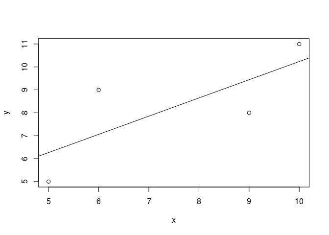

```r
###################################################
### code chunk number 8: R7
###################################################
## Prepare a dataset
## Study ID in the meta-analysis
Study <- c("Author (2012)", "Author (2014)")
## Means of the treatment group
m1i <- c(12, 14)
## SDs of the treatment group
sd1i <- c(4, 5)
## Sample sizes of the treatment group
n1i <- c(40, 50)
## Means of the control group
m2i <- c(10, 11)
## SDs of the control group
sd2i <- c(4, 5)
## Sample sizes of the control groups
n2i <- c(40, 50)

## Create a data frame
( my.df2 <- data.frame(Study=Study, m1i=m1i, sd1i=sd1i, n1i=n1i, 
                       m2i=m2i, sd2i=sd2i, n2i=n2i) )
```

```
##           Study m1i sd1i n1i m2i sd2i n2i
## 1 Author (2012)  12    4  40  10    4  40
## 2 Author (2014)  14    5  50  11    5  50
```

```r
## Calculate the SMD
escalc(measure="SMD", m1i=m1i, sd1i=sd1i, n1i=n1i, 
       m2i=m2i, sd2i=sd2i, n2i=n2i, data=my.df2)
```

```
##           Study m1i sd1i n1i m2i sd2i n2i     yi     vi
## 1 Author (2012)  12    4  40  10    4  40 0.4952 0.0515
## 2 Author (2014)  14    5  50  11    5  50 0.5954 0.0418
```

```r
###################################################
### code chunk number 9: R8 (eval = FALSE)
###################################################
## ## Read the help manual on the log() function
## help(log) 
## ?log
## 
## ## Run the examples in the manual
## example(log)
## 
## ## Search the relevant functions with log()
## help.search("log")
## 
## ## Start the html browser
## help.start()


###################################################
### code chunk number 10: Mx1
###################################################
## Sample covariance matrix
( my.cov <- matrix(c(4.5, 2.0, 2.0, 3.6), nrow=2, ncol=2,
                dimnames=list(c("x","y"), c("x","y"))) )
```

```
##     x   y
## x 4.5 2.0
## y 2.0 3.6
```

```r
## Sample means of the variables
my.means <- c(5, 7)
## Add the names for the means
names(my.means) <- c("x", "y")
my.means
```

```
## x y 
## 5 7
```

```r
## Prepare the matrices in the RAM formulation
## A matrix: asymmetric matrix representing regression coefficients 
##  and factor loadings
## type: type of the matrix; "Full": full matrix                 
## free: whether the parameters are free or fixed
## values: starting values for free parameters and fixed values 
##  for fixed parameters
## labels: labels of the parameters; they are constrained equally 
##  if the labels are the same
## byrow: whether the data are arranged by row (or by column)
## name: name of the matrix
A1 <- mxMatrix(type="Full", nrow=2, ncol=2,
               free=c(FALSE, FALSE,
                      TRUE, FALSE),
               values=0,
               labels=c(NA, NA,
                        "beta1", NA),
               byrow=TRUE,
               name="A1")

## S matrix: symmetric matrix representing variance covariance of 
##  the variables
## type: "Symm" means symmetric matrix                
S1 <- mxMatrix(type="Symm", nrow=2, ncol=2, 
               values=c(1, 0,
                        0, 1),
               free=c(TRUE, FALSE,
                      FALSE, TRUE),
               labels=c("VarX", NA,
                        NA, "ErrorVarY"),
               byrow=TRUE,
               name="S1")
              
## M matrix: mean vector of the variables
M1 <- mxMatrix(type="Full", nrow=1, ncol=2,
               free=c(TRUE, TRUE),
               values=c(0, 0),
               labels=c("meanx", "beta0"),
               name="M1")
               
## F matrix: a selection matrix to select the observed variables          
## type: "Iden" means identity matrix                
F1 <- mxMatrix(type="Iden", nrow=2, ncol=2, name="F1")

## Create a model
## The sample size is 100.
reg.model <- mxModel("Simple Regression",
                     mxData(observed=my.cov, 
                            type="cov", 
                            numObs=100,
                            means=my.means),
                     A1, S1, M1, F1,
                     mxExpectationRAM(A="A1", S="S1", 
                                    F="F1", M="M1",                               
                     dimnames = c("x","y")),
                     mxFitFunctionML())

## Run the analysis                      
reg.fit <- mxRun(reg.model, silent=TRUE)


###################################################
### code chunk number 11: Mx2 
###################################################
## Display the results
summary(reg.fit)
```

```
## Summary of Simple Regression 
##  
## free parameters:
##        name matrix row col  Estimate  Std.Error A
## 1     beta1     A1   2   1 0.4444445 0.07761922  
## 2      VarX     S1   1   1 4.4549999 0.63003535  
## 3 ErrorVarY     S1   2   2 2.6840000 0.37957852  
## 4     meanx     M1   1   x 5.0000000 0.21106868  
## 5     beta0     M1   1   y 4.7777778 0.42125846  
## 
## observed statistics:  5 
## estimated parameters:  5 
## degrees of freedom:  0 
## fit value ( -2lnL units ):  448.1335 
## saturated fit value ( -2lnL units ):  448.1436 
## number of observations:  100 
## chi-square:  X2 ( df=0 ) = -0.01006717,  p = 1
## Information Criteria: 
##       |  df Penalty  |  Parameters Penalty  |  Sample-Size Adjusted
## AIC:    -0.01006717               9.989933                       NA
## BIC:    -0.01006717              23.015784                 7.224528
## CFI: 1.000368 
## TLI: 1   (also known as NNFI) 
## RMSEA:  0  [95% CI (NA, NA)]
## Prob(RMSEA <= 0.05): NA
## timestamp: 2016-04-08 21:50:20 
## Wall clock time (HH:MM:SS.hh): 00:00:00.03 
## optimizer:  SLSQP 
## OpenMx version number: 2.5.2 
## Need help?  See help(mxSummary)
```

```r
###################################################
### code chunk number 13: MA1 (eval = FALSE)
###################################################
## ## Load the library
## library("metaSEM")
## 
## ## Display the current directory
## getwd()
## 
## ## Set the working directory to /mydirectory/R/data/ 
## ##  in Unix-like systems
## # setwd("/mydirectory/R/data/")
## ## Set the working directory to D:\mydirectory\R\data 
## ##  in Windows-like systems
## # setwd("D:\\mydirectory\\R\\data")
## # setwd("/D/mydirectory/R/data")
## 
## ## Read the data in CSV format
## ( my.df3 <- read.csv("Becker83.csv") )
```


```r
###################################################
### code chunk number 14: MA2
###################################################
library("metaSEM")

my.df3 <- read.csv("Becker83.csv")
my.df3
```

```
##    study    di   vi percentage items
## 1      1 -0.33 0.03         25     2
## 2      2  0.07 0.03         25     2
## 3      3 -0.30 0.02         50     2
## 4      4  0.35 0.02        100    38
## 5      5  0.69 0.07        100    30
## 6      6  0.81 0.22        100    45
## 7      7  0.40 0.05        100    45
## 8      8  0.47 0.07        100    45
## 9      9  0.37 0.05        100     5
## 10    10 -0.06 0.03        100     5
```

```r
###################################################
### code chunk number 15: MA3 
###################################################
## Mixed-effects meta-analysis with log(items) as the predictor
summary( meta(y=di, v=vi, x=log(items), data=my.df3) )
```

```
## 
## Call:
## meta(y = di, v = vi, x = log(items), data = my.df3)
## 
## 95% confidence intervals: z statistic approximation
## Coefficients:
##               Estimate   Std.Error      lbound      ubound z value
## Intercept1 -3.2015e-01  1.0981e-01 -5.3539e-01 -1.0492e-01 -2.9154
## Slope1_1    2.1088e-01  4.5084e-02  1.2251e-01  2.9924e-01  4.6774
## Tau2_1_1    1.0000e-10  2.0095e-02 -3.9386e-02  3.9386e-02  0.0000
##             Pr(>|z|)    
## Intercept1  0.003552 ** 
## Slope1_1   2.905e-06 ***
## Tau2_1_1    1.000000    
## ---
## Signif. codes:  0 '***' 0.001 '**' 0.01 '*' 0.05 '.' 0.1 ' ' 1
## 
## Q statistic on the homogeneity of effect sizes: 30.64949
## Degrees of freedom of the Q statistic: 9
## P value of the Q statistic: 0.0003399239
## 
## Explained variances (R2):
##                            y1
## Tau2 (no predictor)    0.0774
## Tau2 (with predictors) 0.0000
## R2                     1.0000
## 
## Number of studies (or clusters): 10
## Number of observed statistics: 10
## Number of estimated parameters: 3
## Degrees of freedom: 7
## -2 log likelihood: -4.208024 
## OpenMx status1: 0 ("0" or "1": The optimization is considered fine.
## Other values may indicate problems.)
```

```r
###################################################
### code chunk number 17: MA5 
###################################################
## Read lower triangle matrices
## no.var: no. of variables for the lower triangle matrices
my.df4 <- readLowTriMat("Hunter83.txt", no.var=4)

## Add the variable names to improve readability
my.df4 <- lapply(my.df4, function(x) 
                 {dimnames(x) <- list(c("A","K","W","S"), 
                                      c("A","K","W","S"))
                  x})

## Sample sizes for the studies                  
my.n4 <- c(443,186,292,233,368,360,380,366,456,78,384,59,160,210)

#### Random-effects model with diagonal elements only
## First stage analysis
random1 <- tssem1(my.df4, my.n4, method="REM", RE.type="Diag")
## rerun to remove error code
## random1 <- rerun(random1)
summary(random1)
```

```
## 
## Call:
## meta(y = ES, v = acovR, RE.constraints = Diag(x = paste(RE.startvalues, 
##     "*Tau2_", 1:no.es, "_", 1:no.es, sep = "")), RE.lbound = RE.lbound, 
##     I2 = I2, model.name = model.name, suppressWarnings = TRUE, 
##     silent = silent, run = run)
## 
## 95% confidence intervals: z statistic approximation
## Coefficients:
##               Estimate   Std.Error      lbound      ubound z value
## Intercept1  5.0580e-01  2.7908e-02  4.5110e-01  5.6050e-01 18.1236
## Intercept2  4.4707e-01  2.4788e-02  3.9849e-01  4.9566e-01 18.0356
## Intercept3  2.1230e-01  2.5240e-02  1.6283e-01  2.6177e-01  8.4111
## Intercept4  5.3063e-01  3.4724e-02  4.6257e-01  5.9869e-01 15.2814
## Intercept5  2.5914e-01  3.9491e-02  1.8174e-01  3.3654e-01  6.5621
## Intercept6  2.4111e-01  1.6891e-02  2.0800e-01  2.7421e-01 14.2742
## Tau2_1_1    6.3867e-03  3.5311e-03 -5.3423e-04  1.3308e-02  1.8087
## Tau2_2_2    4.4668e-03  3.1161e-03 -1.6407e-03  1.0574e-02  1.4335
## Tau2_3_3    4.3270e-03  2.8257e-03 -1.2112e-03  9.8653e-03  1.5313
## Tau2_4_4    1.0239e-02  5.4017e-03 -3.4858e-04  2.0826e-02  1.8954
## Tau2_5_5    1.3870e-02  7.3026e-03 -4.4240e-04  2.8183e-02  1.8994
## Tau2_6_6    2.2879e-05  1.2588e-03 -2.4443e-03  2.4901e-03  0.0182
##             Pr(>|z|)    
## Intercept1 < 2.2e-16 ***
## Intercept2 < 2.2e-16 ***
## Intercept3 < 2.2e-16 ***
## Intercept4 < 2.2e-16 ***
## Intercept5 5.305e-11 ***
## Intercept6 < 2.2e-16 ***
## Tau2_1_1     0.07050 .  
## Tau2_2_2     0.15173    
## Tau2_3_3     0.12569    
## Tau2_4_4     0.05803 .  
## Tau2_5_5     0.05751 .  
## Tau2_6_6     0.98550    
## ---
## Signif. codes:  0 '***' 0.001 '**' 0.01 '*' 0.05 '.' 0.1 ' ' 1
## 
## Q statistic on the homogeneity of effect sizes: 315.8619
## Degrees of freedom of the Q statistic: 60
## P value of the Q statistic: 0
## 
## Heterogeneity indices (based on the estimated Tau2):
##                              Estimate
## Intercept1: I2 (Q statistic)   0.7571
## Intercept2: I2 (Q statistic)   0.6463
## Intercept3: I2 (Q statistic)   0.5725
## Intercept4: I2 (Q statistic)   0.8354
## Intercept5: I2 (Q statistic)   0.8203
## Intercept6: I2 (Q statistic)   0.0070
## 
## Number of studies (or clusters): 14
## Number of observed statistics: 66
## Number of estimated parameters: 12
## Degrees of freedom: 54
## -2 log likelihood: -126.2826 
## OpenMx status1: 0 ("0" or "1": The optimization is considered fine.
## Other values may indicate problems.)
```

```r
A2 <- create.mxMatrix(c(0, 0, 0, 0,
                       "0.1*A2J", 0, 0, 0,
                       "0.1*A2W", "0.1*J2W", 0, 0,
                       0, "0.1*J2S", "0.1*W2S", 0),
                       type="Full", nrow=4, ncol=4, byrow=TRUE)
S2 <- create.mxMatrix(c(1,"0.1*Var_J", 
                       "0.1*Var_W", "0.1*Var_S"), 
                       type="Diag")

## Second stage analysis
## Model without direct effect from Ability to Supervisor
## diag.constraints=TRUE is required as there are mediators 
summary( tssem2(random1, Amatrix=A2, Smatrix=S2, 
                intervals.type="LB", diag.constraints=TRUE) )
```

```
## 
## Call:
## wls(Cov = pooledS, asyCov = asyCov, n = tssem1.obj$total.n, Amatrix = Amatrix, 
##     Smatrix = Smatrix, Fmatrix = Fmatrix, diag.constraints = diag.constraints, 
##     cor.analysis = cor.analysis, intervals.type = intervals.type, 
##     mx.algebras = mx.algebras, model.name = model.name, suppressWarnings = suppressWarnings, 
##     silent = silent, run = run)
## 
## 95% confidence intervals: Likelihood-based statistic
## Coefficients:
##       Estimate Std.Error   lbound   ubound z value Pr(>|z|)
## A2J   0.516314        NA 0.462804 0.569828      NA       NA
## A2W   0.246419        NA 0.163038 0.325545      NA       NA
## J2W   0.396377        NA 0.300078 0.493338      NA       NA
## J2S   0.231336        NA 0.138186 0.325544      NA       NA
## W2S   0.121542        NA 0.054554 0.183114      NA       NA
## Var_J 0.733420        NA 0.675306 0.785808      NA       NA
## Var_W 0.681301        NA 0.616459 0.738094      NA       NA
## Var_S 0.902266        NA 0.863116 0.931479      NA       NA
## 
## Goodness-of-fit indices:
##                                                Value
## Sample size                                3975.0000
## Chi-square of target model                    3.8190
## DF of target model                            1.0000
## p value of target model                       0.0507
## Number of constraints imposed on "Smatrix"    3.0000
## DF manually adjusted                          0.0000
## Chi-square of independence model            937.5524
## DF of independence model                      6.0000
## RMSEA                                         0.0266
## RMSEA lower 95% CI                            0.0000
## RMSEA upper 95% CI                            0.0571
## SRMR                                          0.0220
## TLI                                           0.9818
## CFI                                           0.9970
## AIC                                           1.8190
## BIC                                          -4.4688
## OpenMx status1: 0 ("0" or "1": The optimization is considered fine.
## Other values indicate problems.)
```

The above results were based on the following versions of packages. 

```r
sessionInfo()
```

```
## R version 3.2.4 Revised (2016-03-16 r70336)
## Platform: x86_64-pc-linux-gnu (64-bit)
## Running under: Ubuntu 14.04.4 LTS
## 
## locale:
##  [1] LC_CTYPE=en_SG.UTF-8       LC_NUMERIC=C              
##  [3] LC_TIME=en_SG.UTF-8        LC_COLLATE=en_SG.UTF-8    
##  [5] LC_MONETARY=en_SG.UTF-8    LC_MESSAGES=en_SG.UTF-8   
##  [7] LC_PAPER=en_SG.UTF-8       LC_NAME=C                 
##  [9] LC_ADDRESS=C               LC_TELEPHONE=C            
## [11] LC_MEASUREMENT=en_SG.UTF-8 LC_IDENTIFICATION=C       
## 
## attached base packages:
## [1] parallel  stats     graphics  grDevices utils     datasets  methods  
## [8] base     
## 
## other attached packages:
##  [1] semPlot_1.0.1   metafor_1.9-8   metaSEM_0.9.7-3 OpenMx_2.5.2   
##  [5] Rcpp_0.12.4     Matrix_1.2-4    MASS_7.3-45     digest_0.6.9   
##  [9] lavaan_0.5-20   rmarkdown_0.9.5
## 
## loaded via a namespace (and not attached):
##  [1] jsonlite_0.9.19     splines_3.2.4       ellipse_0.3-8      
##  [4] gtools_3.5.0        Formula_1.2-1       stats4_3.2.4       
##  [7] latticeExtra_0.6-28 d3Network_0.5.2.1   yaml_2.1.13        
## [10] lisrelToR_0.1.4     pbivnorm_0.6.0      lattice_0.20-33    
## [13] quantreg_5.21       quadprog_1.5-5      RColorBrewer_1.1-2 
## [16] ggm_2.3             minqa_1.2.4         colorspace_1.2-6   
## [19] htmltools_0.3.5     plyr_1.8.3          psych_1.5.8        
## [22] XML_3.98-1.4        SparseM_1.7         DiagrammeR_0.8.2   
## [25] corpcor_1.6.8       scales_0.4.0        whisker_0.3-2      
## [28] glasso_1.8          sna_2.3-2           jpeg_0.1-8         
## [31] fdrtool_1.2.15      lme4_1.1-11         MatrixModels_0.4-1 
## [34] huge_1.2.7          arm_1.8-6           rockchalk_1.8.101  
## [37] mgcv_1.8-12         car_2.1-2           ggplot2_2.1.0      
## [40] nnet_7.3-12         pbkrtest_0.4-6      mnormt_1.5-4       
## [43] survival_2.38-3     magrittr_1.5        evaluate_0.8.3     
## [46] nlme_3.1-126        foreign_0.8-66      tools_3.2.4        
## [49] formatR_1.3         stringr_1.0.0       munsell_0.4.3      
## [52] cluster_2.0.3       sem_3.1-6           grid_3.2.4         
## [55] nloptr_1.0.4        rstudioapi_0.5      rjson_0.2.15       
## [58] htmlwidgets_0.6     visNetwork_0.2.1    igraph_1.0.1       
## [61] tcltk_3.2.4         boot_1.3-18         mi_1.0             
## [64] gtable_0.2.0        abind_1.4-3         reshape2_1.4.1     
## [67] qgraph_1.3.2        gridExtra_2.2.1     knitr_1.12.3       
## [70] Hmisc_3.17-2        stringi_1.0-1       matrixcalc_1.0-3   
## [73] rpart_4.1-10        acepack_1.3-3.3     png_0.1-7          
## [76] coda_0.18-1
```
